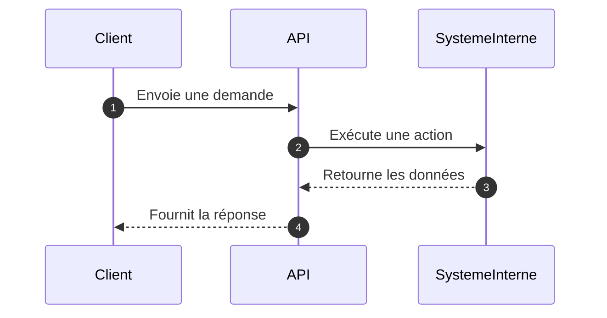
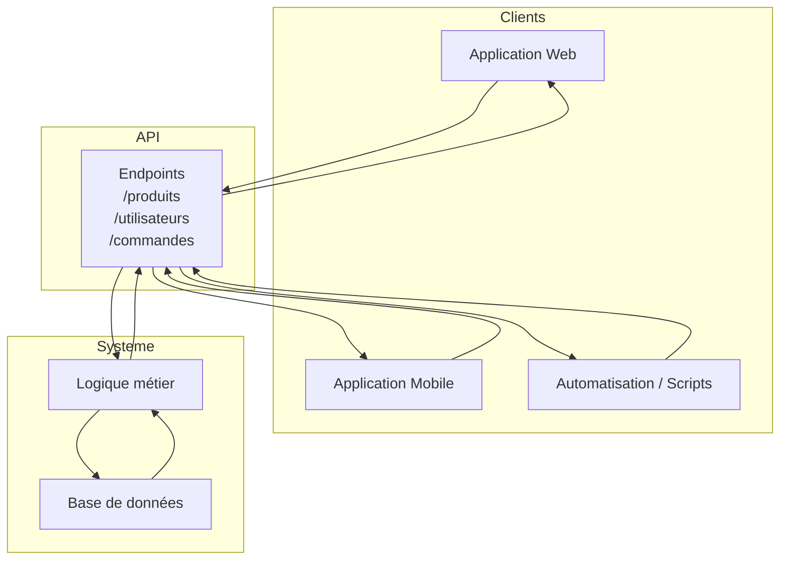

# **1.1 — Qu’est-ce qu’une API ?**

## **Définition générale**

Une **API** (Application Programming Interface) est un **service** qui permet à un logiciel d’en appeler un autre en suivant des règles précises.
Elle sert de **passerelle** entre deux programmes afin qu’ils puissent échanger des informations sans avoir besoin de connaître leur fonctionnement interne.

Une API répond à une question simple :
**“Comment un système peut-il demander quelque chose à un autre système, facilement et de manière contrôlée ?”**

---

## **Pourquoi les API existent**

Dans un système moderne, plusieurs éléments doivent collaborer :

* une application mobile qui doit afficher le profil d’un utilisateur,
* un site web qui doit vérifier un mot de passe,
* un système interne qui doit enregistrer une commande,
* un script qui doit analyser des données.

Ces éléments ne doivent jamais accéder directement aux données sensibles.
Ils passent donc par une **interface maîtrisée** : l’API.
L’API joue le rôle de **gardien**, de **filtre** et de **contrôleur d’accès**.

---

## **Fonctionnement général : Demande → Action → Réponse**

Le fonctionnement d’une API repose sur trois étapes :

1. **Demande** : un client envoie une requête à l’API.
2. **Action** : l’API effectue une opération (lecture, écriture, calcul…).
3. **Réponse** : l’API renvoie un résultat structuré.

Ce cycle peut être représenté ainsi :



---

## **Une comparaison imagée**

Une API peut être comparée à un **serveur dans un restaurant** :

* Le client (l’application) exprime une demande.
* Le serveur (l’API) vérifie que la demande est valide.
* Le serveur transmet la commande à la cuisine (le système interne).
* La cuisine prépare le plat et le renvoie au serveur.
* Le serveur apporte le plat au client.

Le client **ne va jamais directement dans la cuisine**.
L’API remplit exactement ce rôle d’intermédiaire sécurisé.

---

## **Exemple concret**

Une application météo souhaite connaître la température d’une ville.
Elle pose la question suivante à l’API météo :

```
GET /temperature?ville=Paris
```

L’API consulte le système interne, puis répond :

```
{
  "ville": "Paris",
  "temperature": 18
}
```

L’application peut alors afficher la température.
Elle n’a pas eu besoin de comprendre le fonctionnement interne du système météo :
elle s’est simplement servie de l’API.

---

## **L’API comme point central du système**

Une API se situe entre les clients (applications, scripts, objets connectés…) et les systèmes internes (bases de données, logique métier).
Elle agit comme une **barrière protectrice**, une **interface uniforme**, et un **point d’entrée unique**.



---

## **Ce que fournit une API**

### **1. Une interface claire**

Elle définit ce qu’il est possible de faire :
consulter un profil, créer une commande, récupérer une liste de produits, etc.

### **2. Une protection des données**

Les clients n’accèdent jamais directement à la base de données.

### **3. Une séparation des responsabilités**

Le frontend affiche l’information ;
l’API contrôle et sécurise l’accès aux données.

### **4. Une compatibilité universelle**

Un site web, une application mobile ou un script peuvent tous utiliser la même API.

---

## **Résumé du sous-chapitre**

* Une API est un **intermédiaire** entre un client et un système interne.
* Elle suit toujours un schéma **Demande → Action → Réponse**.
* Elle protège les données en évitant les accès directs.
* Elle simplifie la communication entre logiciels différents.
* Elle constitue le **point d’entrée principal** dans les systèmes modernes, ce qui en fait un élément critique à sécuriser.

---