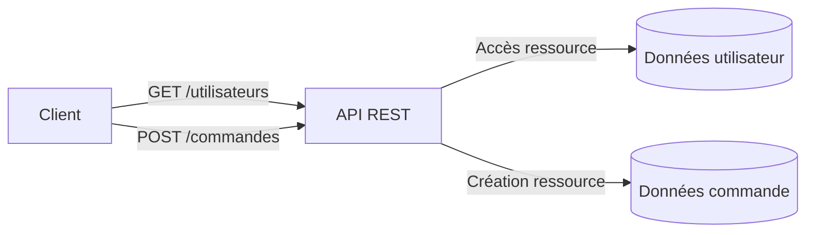
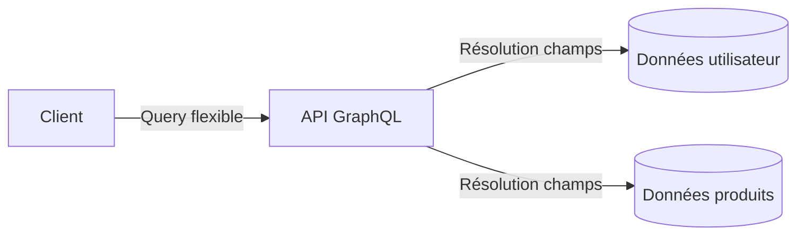
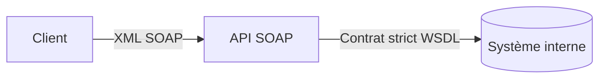

# **1.2 — API REST, GraphQL, SOAP : surfaces d’exposition**

Ce chapitre présente trois grandes familles d’API largement utilisées aujourd’hui : **REST**, **GraphQL** et **SOAP**.
Il explique leurs différences fondamentales, leurs usages, et pourquoi elles constituent des **surfaces d’exposition** importantes qu’il faut comprendre pour les sécuriser.

---

# **1.2.1 — API REST**

## **Principes généraux**

Les API **REST** (Representational State Transfer) sont les plus répandues aujourd’hui.
Elles reposent sur quelques idées simples :

* Les données sont exposées sous forme de **ressources** (ex : `/produits`, `/utilisateurs`, `/commandes`).
* Chaque ressource est identifiée par une **URL**.
* Les opérations s’effectuent via des **méthodes HTTP** :

    * `GET` → lire
    * `POST` → créer
    * `PUT/PATCH` → modifier
    * `DELETE` → supprimer

La réponse est généralement au format **JSON**, facile à lire et à utiliser.

---

## **Exemple simple**

Pour récupérer la liste des produits :

```
GET /produits
```

Pour récupérer un produit en particulier :

```
GET /produits/42
```

Pour créer un produit :

```
POST /produits
```

---

## **Schéma REST simplifié**



---

## **Surface d’exposition REST**

Dans REST, chaque URL est une **porte d’entrée potentielle**.
Plus une API REST a d’endpoints, plus elle augmente :

* le nombre de chemins accessibles,
* la variété des opérations possibles,
* les risques liés aux autorisations manquantes ou incorrectes.

Les API REST sont simples à utiliser…
mais souvent **mal sécurisées** parce qu’elles exposent beaucoup de points d’accès.

---

# **1.2.2 — API GraphQL**

## **Principes généraux**

GraphQL est une technologie plus récente, créée pour résoudre les limites de REST.
Elle permet au client de **définir précisément** :

* quelles données il souhaite,
* dans quel format,
* avec quelle profondeur.

Contrairement à REST, qui utilise plusieurs URLs, GraphQL utilise **un seul point d’entrée** :

```
POST /graphql
```

---

## **Exemple simple**

Pour demander uniquement le nom et l’e-mail d’un utilisateur :

```
query {
  utilisateur(id: 42) {
    nom
    email
  }
}
```

Pour obtenir plusieurs ressources dans une seule requête :

```
query {
  produits {
    nom
    prix
  }
  categories {
    nom
  }
}
```

---

## **Schéma GraphQL simplifié**



---

## **Surface d’exposition GraphQL**

Avec GraphQL, il n’y a qu’un seul endpoint, mais il est **extrêmement puissant**.
Le client peut demander :

* trop de données,
* des champs sensibles,
* des combinaisons complexes,
* des requêtes trop coûteuses.

GraphQL augmente donc les risques :

* d’**exposition excessive de données**,
* d’**épuisement de ressources**,
* de **bypass d’autorisations**,
* de **fuites involontaires de structure interne** (schéma introspectif).

---

# **1.2.3 — API SOAP**

## **Principes généraux**

SOAP (Simple Object Access Protocol) est un standard plus ancien mais encore utilisé dans :

* les systèmes bancaires,
* les services gouvernementaux,
* les entreprises historiques.

SOAP repose sur :

* des messages **XML**,
* des contrats très stricts (WSDL),
* des règles de sécurité intégrées (XML Signature, XML Encryption).

SOAP n’est pas aussi flexible que REST ou GraphQL,
mais il est **extrêmement structuré**.

---

## **Exemple simple**

Un message SOAP ressemble à ceci :

```xml
<soap:Envelope>
  <soap:Body>
    <GetUser>
      <id>42</id>
    </GetUser>
  </soap:Body>
</soap:Envelope>
```

---

## **Schéma SOAP simplifié**



---

## **Surface d’exposition SOAP**

SOAP possède une surface d’exposition particulière :

* chaque service expose un **contrat WSDL** détaillé,
* XML est **plus complexe** et peut présenter :

    * des risques d’injection XML,
    * des attaques XXE,
    * des vecteurs de déni de service via XML expansif.

SOAP est donc robuste mais plus vulnérable aux erreurs de configuration.

---

# **1.2.4 — Comparaison générale**

| Critère              | REST                              | GraphQL                    | SOAP                |
| -------------------- | --------------------------------- | -------------------------- | ------------------- |
| Structure            | Ressources                        | Requêtes flexibles         | Contrats XML        |
| Nombre d’endpoints   | Plusieurs                         | Un seul                    | Plusieurs           |
| Format               | JSON                              | JSON                       | XML                 |
| Surface d’exposition | Large                             | Très flexible              | Très structurée     |
| Risques principaux   | BOLA, fuites, endpoints excessifs | Sur-exposition, coût élevé | XXE, injections XML |

---

# **1.2.5 — Pourquoi ces technologies représentent-elles des surfaces d’exposition ?**

Une API expose un système interne au monde extérieur.
Cela implique :

* des points d’entrée accessibles,
* des paramètres manipulables,
* des opérations exécutables,
* des chemins variés,
* des données sensibles potentiellement transmissibles.

Plus une API est flexible ou riche, plus elle doit être protégée.

---

# **Résumé du sous-chapitre**

* REST expose des **ressources multiples**, ce qui augmente le nombre de points d’accès.
* GraphQL expose **un endpoint unique mais extrêmement puissant**, capable de révéler trop d’informations.
* SOAP expose **des contrats stricts**, souvent complexes et sensibles aux erreurs de configuration.
* Chaque style d’API a une **surface d’exposition spécifique**, mais tous nécessitent une sécurisation rigoureuse.
