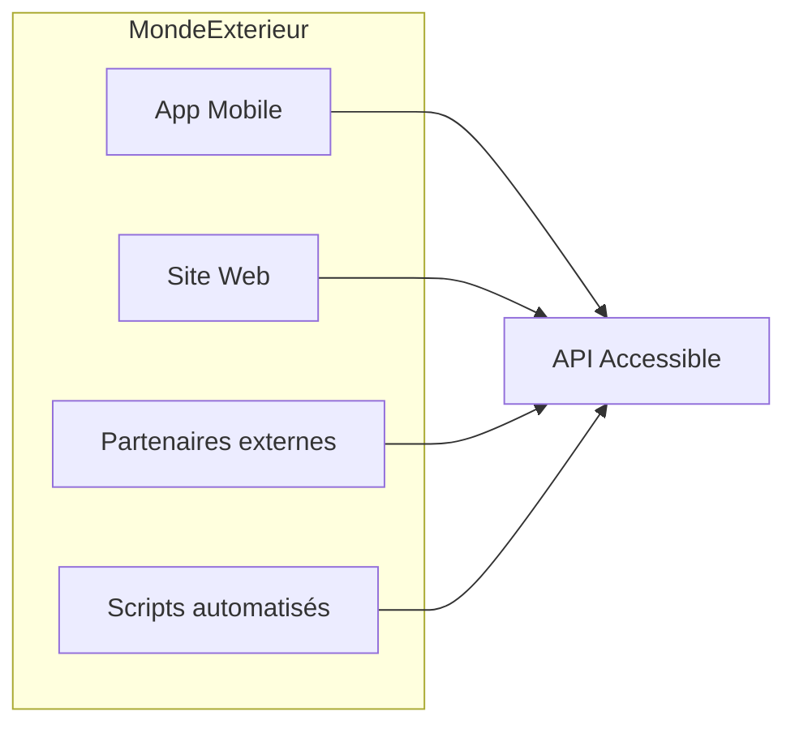
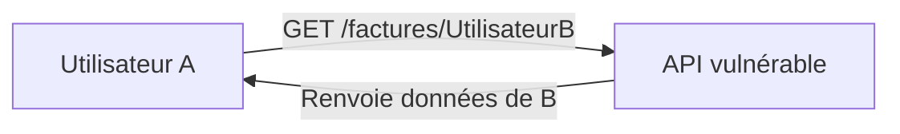

# **1.3 — Pourquoi les API sont la cible n°1 des attaquants**

Les API représentent aujourd’hui la **porte d’entrée principale** vers les données et les fonctionnalités des systèmes modernes.
Elles sont massivement utilisées dans les applications web, les applications mobiles, les objets connectés, les services cloud, l’e-commerce, la banque, la santé, et presque tous les secteurs numériques.

Cette importance en fait une **cible privilégiée pour les attaquants**.
Ce chapitre explique clairement pourquoi.

---

# **1.3.1 — Les API exposent directement les données et les actions**

Une API permet de :

* lire des informations,
* modifier des données,
* créer ou supprimer des objets,
* accéder à des fonctionnalités internes.

Toutes ces opérations sont visibles et accessibles **depuis l’extérieur**.
Contrairement à un site web traditionnel, où l’utilisateur interagit avec un écran, les API exposent directement :

* des actions (ex : `/transfererArgent`, `/creerCommande`),
* des données sensibles (ex : `/utilisateurs/42`),
* des mécanismes métier.

Chaque endpoint est une **porte potentielle** pour un attaquant.

---

# **1.3.2 — Les API sont accessibles depuis partout**

Une API est conçue pour être utilisée :

* par des applications mobiles,
* par des sites web,
* par des services tiers,
* parfois par des partenaires externes.

Cela signifie qu’elle est souvent :

* accessible via Internet,
* documentée,
* testable,
* automatisable.

Cette accessibilité élargit énormément son **exposition**.



Une API ouverte à de nombreux clients est aussi ouverte à de nombreux risques.

---

# **1.3.3 — Les API sont souvent plus visibles que les interfaces web**

Même si une application paraît simple, l’analyse du trafic réseau montre souvent toute la structure interne de l’API.

Un utilisateur peut facilement voir :

* les endpoints,
* les paramètres utilisés,
* la structure des données renvoyées,
* les ressources disponibles.

Exemple :

```
/utilisateurs
/utilisateurs/42
/commandes
/commandes/12345
/produits
```

Cette visibilité aide les attaquants à comprendre le système et à repérer les failles.

---

# **1.3.4 — Les erreurs d’autorisation sont fréquentes**

Lorsqu’une API expose de nombreux endpoints, il devient difficile de s’assurer que :

* chaque utilisateur ne voit que ses données,
* chaque rôle ne réalise que les actions autorisées,
* les règles métier sont correctement appliquées.

L’erreur la plus courante est de laisser un utilisateur accéder aux données d’un autre utilisateur.
C’est ce qu’on appelle une **erreur d’autorisation**.

Ce type de faille est aujourd’hui la **cause principale de fuites de données** dans les API.



Dans ce cas, la vulnérabilité existe parce que l’API ne vérifie pas correctement **“à qui appartiennent les données”**.

---

# **1.3.5 — Les API gèrent une grande quantité de données sensibles**

Une API manipule souvent :

* des profils utilisateurs,
* des adresses email,
* des numéros de carte bancaire,
* des dossiers médicaux,
* des commandes,
* des transactions.

Ce sont des données de **haute valeur**, recherchées par les attaquants.

Une base de données n’est généralement pas exposée ;
l’API, elle, **l’est systématiquement**.

---

# **1.3.6 — Les API sont faciles à tester et à automatiser**

Les API utilisent des standards simples :

* HTTP
* JSON
* URLs

Il existe de nombreux outils gratuits permettant de :

* tester les endpoints,
* rejouer les requêtes,
* modifier les paramètres,
* automatiser l’attaque.

Par exemple :

* Postman
* Curl
* OWASP ZAP
* Burp Suite
* Scripts Python / JavaScript

Un attaquant peut facilement automatiser :

* des millions de requêtes,
* des tests de paramètres,
* des tentatives de découverte,
* des attaques d’énumération.

Les API sont donc des cibles **hautement scriptables**.

---

# **1.3.7 — Une API peut révéler trop d’informations**

Les API REST et GraphQL renvoient souvent :

* des champs inutiles,
* des identifiants internes,
* des métadonnées,
* des structures complètes de données.

Ces informations supplémentaires aident les attaquants à comprendre la structure interne du système.

Ce problème s’appelle l’**exposition excessive**.

---

# **1.3.8 — Les API doivent accepter des entrées variées**

Une API doit gérer :

* des paramètres,
* des identifiants,
* des formats JSON,
* des filtres,
* des champs dynamiques.

Chaque entrée est un **vecteur potentiel d’attaque** :

* injection,
* surcharge,
* manipulation,
* contournement,
* corruption.

Plus l’API est riche, plus elle doit être contrôlée.

---

# **1.3.9 — Les API sont la couche la moins protégée si la sécurité n’est pas pensée dès le départ**

Une interface web fixe peut être testée manuellement.
Une API expose souvent :

* plus d’opérations,
* plus de chemins,
* plus de données.

Si la sécurité n’a pas été intégrée dès la conception, les failles sont nombreuses et difficiles à corriger par la suite.

C’est pourquoi les attaquants ciblent prioritairement les API :
elles contiennent **beaucoup de puissance** et souvent **beaucoup moins de protection que prévu**.

---

# **Résumé du sous-chapitre**

Les API sont la cible principale des attaquants car :

* elles exposent directement les données et les actions,
* elles sont accessibles depuis Internet,
* elles dévoilent leur structure très facilement,
* elles gèrent des informations sensibles,
* elles sont simples à tester et à automatiser,
* les erreurs d’autorisation sont fréquentes,
* les données exposées peuvent être trop détaillées,
* leur surface d’exposition est large,
* elles sont parfois mal sécurisées par défaut.

Les API constituent aujourd’hui la **principale interface entre les utilisateurs et les données**, ce qui explique leur rôle central dans la cybersécurité moderne.

