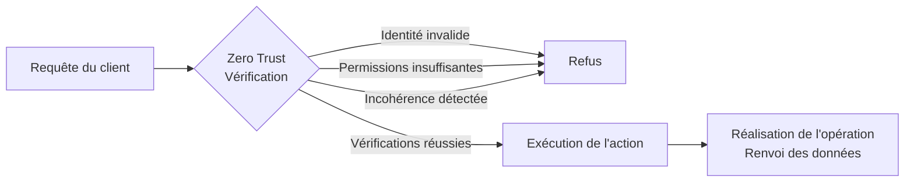

# **1.4 — Principe de Zero Trust appliqué aux APIs**

Le **Zero Trust** est un modèle de sécurité moderne qui repose sur une idée simple :
**ne jamais faire confiance, toujours vérifier**.

Ce principe s’applique particulièrement bien aux API, qui sont exposées à de nombreux utilisateurs, appareils, réseaux et environnements qu’elles ne contrôlent pas.
Ce chapitre présente la logique Zero Trust, puis explique comment elle influence la conception et la sécurisation d’une API.

---

# **1.4.1 — Principe fondamental du Zero Trust**

Le Zero Trust repose sur trois règles centrales :

### **1. Ne jamais faire confiance par défaut**

Aucune requête ne doit être acceptée sans vérification, même si elle semble provenir d’une source connue.

### **2. Toujours vérifier explicitement**

Chaque action doit être validée : identité, permissions, contexte, cohérence.

### **3. Limiter les accès strictement au minimum**

Un client ne doit obtenir que ce qui est absolument nécessaire, rien de plus.

Le Zero Trust considère que :

* le réseau peut être compromis,
* le client peut être modifié,
* les requêtes peuvent être falsifiées,
* les identifiants peuvent être volés,
* un utilisateur peut essayer d’accéder aux données d’un autre.

---

# **1.4.2 — Le client ne doit jamais être considéré comme fiable**

Une API ne doit jamais supposer :

* que l’utilisateur final est honnête,
* que l’application cliente est sécurisée,
* que les données reçues sont valides,
* que le rôle annoncé par le client est vrai,
* que l’origine de la requête garantit la légitimité.

Le Zero Trust part du principe suivant :

> *Tout ce qui provient du client peut être altéré.*

Même une application officielle (mobile, web…) peut être :

* décompilée,
* modifiée,
* imitée,
* réutilisée par un script,
* détournée par un attaquant.

Pour l’API, le client est simplement **une machine qui envoie des données**, rien de plus.

---

# **1.4.3 — Vérifier chaque requête : identité, permissions, contexte**

Pour appliquer Zero Trust, une API doit vérifier trois éléments à chaque appel :

## **L’identité**

Qui envoie la requête ?
Le jeton ou les informations d’accès sont-ils valides ?

## **Les permissions**

Est-ce que ce client est autorisé à effectuer cette action précise ?

Exemple :
un utilisateur peut lire sa facture, mais pas celle d’un autre.

## **Le contexte**

La requête est-elle cohérente ?

* localisation inhabituelle,
* type d’appareil suspect,
* volume trop élevé,
* tentative d’accès rapide à de nombreuses ressources.

---

# **1.4.4 — Isolation stricte des ressources**

Le Zero Trust impose une règle forte :
**un utilisateur ne doit accéder qu’aux données qui lui appartiennent.**

Cela signifie que, même si un client fournit un identifiant :

```
GET /factures/1234
```

L’API doit vérifier :

* à qui appartient la ressource 1234,
* si l’utilisateur courant possède les droits d’accès,
* si la ressource est cohérente avec son profil.

Le Zero Trust empêche l’API d’accepter aveuglément les identifiants fournis par un client.

---

# **1.4.5 — Représentation Zero Trust appliquée à une API**



L’API ne passe à l’étape d’exécution **qu’après** validation stricte.

---

# **1.4.6 — Minimalisme des permissions**

Le Zero Trust encourage le **principe du moindre privilège**.

Chaque client ou utilisateur doit disposer uniquement :

* des ressources nécessaires,
* des fonctionnalités dont il a besoin,
* des permissions correspondant à son rôle,
* des données strictement indispensables.

Une API doit éviter :

* les réponses trop volumineuses,
* les champs inutiles,
* les informations internes,
* les options avancées non nécessaires.

---

# **1.4.7 — Le Zero Trust n'est pas une option : c'est une nécessité pour les API**

Les API modernes sont utilisées dans des environnements divers :

* navigateurs web,
* smartphones,
* réseaux publics,
* machines compromises,
* scripts automatisés.

L’API ne contrôle pas l’environnement dans lequel elle est appelée.
Elle doit donc considérer **toutes les requêtes comme potentiellement hostiles**.

Sans Zero Trust, une API devient très vulnérable à :

* l’usurpation,
* les contournements d’autorisation,
* les fuites de données,
* les attaques basées sur la logique métier,
* les manipulations de paramètres.

---

# **1.4.8 — Résumé du sous-chapitre**

* Le Zero Trust signifie **ne jamais faire confiance**, même aux applications officielles.
* L’API doit **vérifier l’identité, les permissions et le contexte** à chaque requête.
* Les clients peuvent être modifiés ou compromis.
* Les identifiants fournis par un client ne doivent jamais être acceptés automatiquement.
* Seules les données strictement nécessaires doivent être exposées.
* Le Zero Trust protège les API contre les attaques les plus courantes.

