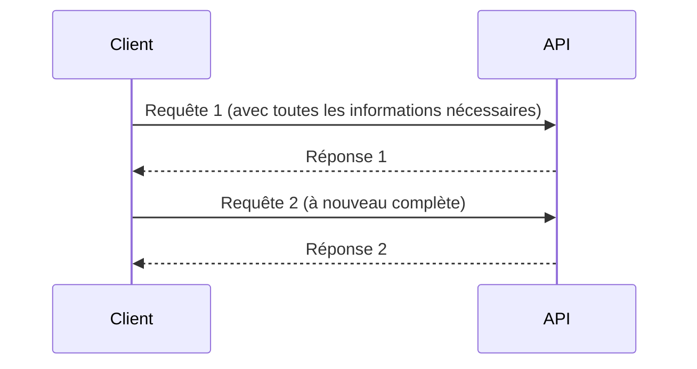
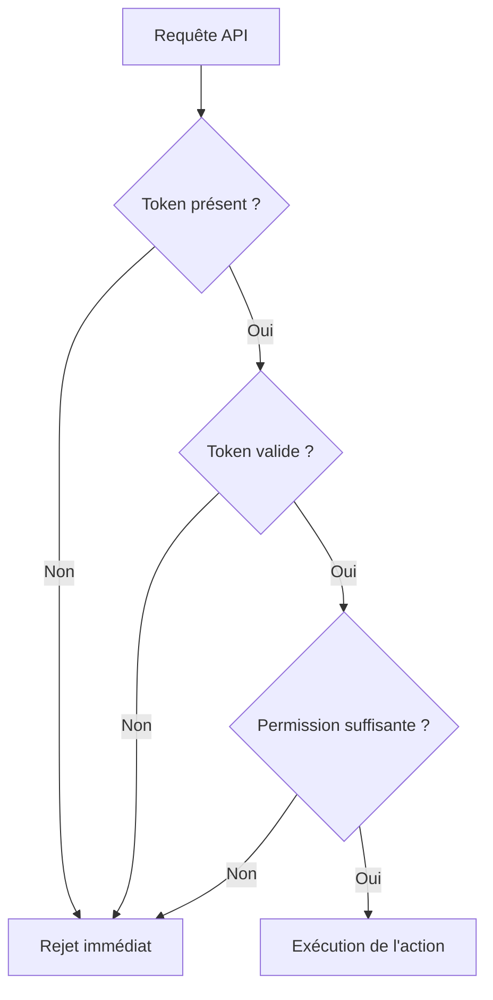

# **1.5 — API stateless et implications sécurité**

Les API modernes sont généralement **stateless**, c’est-à-dire “sans état”.
Ce principe est fondamental, car il influence totalement la manière dont une API doit être sécurisée.
Ce chapitre explique ce qu’est le stateless, pourquoi il est utilisé, et quelles en sont les conséquences directes en matière de sécurité.

---

# **1.5.1 — Définition : qu’est-ce qu’une API stateless ?**

Une API est dite **stateless** lorsqu’elle ne garde **aucune information** entre deux requêtes.
Chaque requête envoyée par un client doit contenir **toutes les données nécessaires** à son traitement.

L’API ne se rappelle pas :

* qui a envoyé la requête précédente,
* si le client est connecté,
* ce qu’il a déjà demandé,
* quel était son état précédent.

L’API traite chaque requête comme un **événement indépendant**.

---

# **1.5.2 — Illustration stateless**



L’API ne stocke rien entre les deux échanges.
Elle recommence à zéro pour chaque requête.

---

# **1.5.3 — Pourquoi les API sont stateless ?**

Les systèmes modernes sont distribués, c’est-à-dire :

* plusieurs serveurs traitent les requêtes,
* les utilisateurs se connectent depuis des appareils variés,
* le trafic peut être intense et imprévisible.

Le fait d’être stateless permet :

### **1. Scalabilité**

N’importe quel serveur peut traiter n’importe quelle requête.
On peut ajouter des machines sans reconfigurer la logique interne.

### **2. Résilience**

Si une machine tombe, rien n’est perdu.
Une autre prend le relais.

### **3. Simplicité de conception**

Moins d’état signifie moins d’ambiguïté, moins de stockage intermédiaire, et moins de dépendances.

---

# **1.5.4 — Exemple simple**

Un site web traditionnel peut garder en mémoire :

* “Cet utilisateur est connecté”
* “Il a 3 articles dans son panier”
* “Il a visité cette page il y a 2 minutes”

Une API stateless, en revanche, ne conserve rien.
Si le client veut accéder à son profil, il doit fournir à chaque requête :

* un moyen de prouver son identité (token, clé…),
* le contexte nécessaire (ex : identifiant de ressource).

Exemple :

```
GET /profil
Authorization: Bearer xyz123
```

Si le token n’est pas présent, l’API considère la requête comme **non authentifiée**, même si la requête précédente venait du même utilisateur.

---

# **1.5.5 — Implications sécurité du stateless**

Le stateless impose des contraintes importantes :

---

## **1. Chaque requête doit être authentifiée**

Puisque l’API ne garde pas l’état d’une session, elle ne peut pas “se souvenir” qu’un utilisateur est connecté.

Elle doit donc :

* vérifier l’identité *à chaque requête*,
* rejeter toute requête sans preuve d’identité,
* valider les permissions indépendamment de l’historique.

C’est un principe fondamental de la sécurité API.

---

## **2. Les identifiants de session disparaissent**

Les API n’utilisent pas de :

* cookies de session côté serveur,
* états stockés en mémoire,
* mécanismes dépendants de connexions persistantes.

L’authentification repose sur :

* des API Keys,
* des tokens porteurs (JWT, PASETO…),
* des mécanismes d’autorisation stateless.

---

## **3. Le client doit stocker les données nécessaires**

Le serveur n’ayant aucun état, c’est le client qui doit :

* garder son token,
* envoyer à nouveau les informations importantes,
* re-préciser le contexte à chaque échange.

Cela augmente la responsabilité du client, mais simplifie le côté serveur.

---

## **4. Le traitement du token devient critique**

Puisque chaque requête contient les informations nécessaires, ces données doivent être :

* signées,
* protégées,
* vérifiées,
* limitées dans le temps.

Le serveur doit valider la signature et le contenu du token à chaque appel.

---

# **1.5.6 — Schéma des implications sécurité**



Ce schéma illustre qu’une API stateless doit effectuer
**une vérification complète à chaque appel**.

---

# **1.5.7 — Statless ≠ sans sécurité**

Il pourrait être tentant de croire que “stateless” signifie “moins sécurisé”.
C’est l’inverse.

Une API stateless :

* ne garde pas d’informations compromettables entre les requêtes,
* réduit les risques liés aux sessions capturées,
* limite l’impact d’un serveur compromis,
* réduit la surface d’attaque côté serveur,
* force une vérification stricte et systématique.

---

# **1.5.8 — Résumé du sous-chapitre**

* Une API stateless ne retient rien entre deux requêtes.
* Chaque requête doit contenir toutes les informations nécessaires.
* L’authentification doit être vérifiée à **chaque** appel.
* Les tokens remplacent les sessions traditionnelles.
* Le modèle stateless facilite la scalabilité et la robustesse.
* Ce fonctionnement impose une sécurité plus rigoureuse sur chaque requête.

