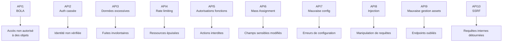
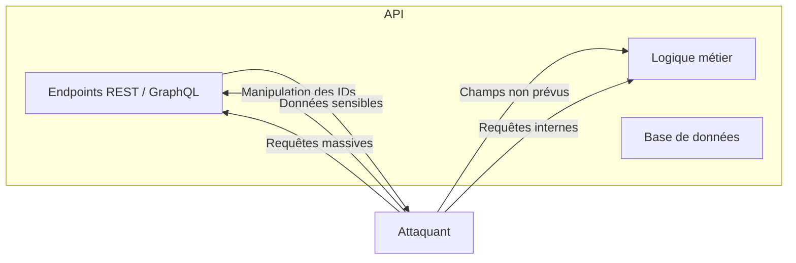

# **2.1 — Présentation du OWASP API Security Top 10**

Le **OWASP API Security Top 10** est un classement des risques de sécurité les plus fréquents et les plus dangereux dans les API modernes.
Il est établi par l’OWASP (Open Web Application Security Project), une organisation reconnue mondialement pour ses travaux sur la sécurité applicative.

Ce classement fournit une base essentielle pour comprendre :

* les vulnérabilités les plus courantes,
* comment les attaquants exploitent les API,
* comment concevoir une API de manière plus sûre.

---

# **2.1.1 — Pourquoi un Top 10 spécifique aux API ?**

Les API ont des caractéristiques différentes des applications web traditionnelles :

* elles exposent directement la logique métier,
* elles manipulent des données structurées (souvent sensibles),
* elles sont faciles à automatiser,
* elles fonctionnent en stateless,
* elles sont massivement utilisées par les applications mobiles et cloud.

Ces particularités génèrent des risques spécifiques qui ne sont pas bien couverts par le Top 10 généraliste des applications web.

Le OWASP API Top 10 est donc un classement **entièrement dédié aux API**, basé sur des milliers d’incidents réels.

---

# **2.1.2 — Liste complète du OWASP API Security Top 10**

Voici les dix risques classés par ordre d’importance :

1. **API1 — Broken Object Level Authorization (BOLA)**
2. **API2 — Broken Authentication**
3. **API3 — Excessive Data Exposure**
4. **API4 — Lack of Resources & Rate Limiting**
5. **API5 — Broken Function Level Authorization**
6. **API6 — Mass Assignment**
7. **API7 — Security Misconfiguration**
8. **API8 — Injection**
9. **API9 — Improper Assets Management**
10. **API10 — Server-Side Request Forgery (SSRF)**

Ce Top 10 permet d’identifier les zones d’attention prioritaires lors de la conception, du test ou de l’audit d’une API.

---

# **2.1.3 — Illustration du classement sous forme de tableau**

---

# **2.1.4 — Une vision orientée risques réels**

Le OWASP API Top 10 n’est pas théorique.
Il s’appuie sur :

* des études de failles trouvées dans des API publiques et privées,
* des rapports de bug bounty,
* des incidents réels ayant entraîné des fuites de données massives,
* des analyses de chercheurs en cybersécurité.

La majorité des compromissions d’API provient de **mauvaises implémentations d’autorisations et de contrôles d’accès**, ce qui explique la position dominante de BOLA (API1).

---

# **2.1.5 — Pourquoi ce classement est essentiel pour un développeur ou un concepteur d’API ?**

Comprendre ces 10 risques permet de :

* éviter les erreurs les plus fréquentes,
* structurer sa pensée lors du design d’une API,
* appliquer les bonnes pratiques dès le début,
* analyser une API existante avec une grille claire,
* prioriser les efforts de sécurisation.

Ce Top 10 sert de **référence universelle** dans la sécurité des API, au même titre qu’un dictionnaire des risques.

---

# **2.1.6 — Vision globale des risques dans un système API**

Ce schéma montre que les attaques visent principalement :

* les identifiants d’objets,
* les autorisations,
* la gestion des données,
* la configuration du système.

---

# **2.1.7 — Résumé du sous-chapitre**

* Le OWASP API Top 10 est un classement **spécifique aux API**, fondé sur les risques réellement observés.
* Il identifie les vulnérabilités les plus fréquentes, telles que BOLA, l’authentification cassée ou la surexposition des données.
* Chaque point du classement correspond à une **erreur courante de conception ou d’implémentation**.
* Ce Top 10 constitue un **outil essentiel** pour comprendre, prévenir et corriger les vulnérabilités des API.

