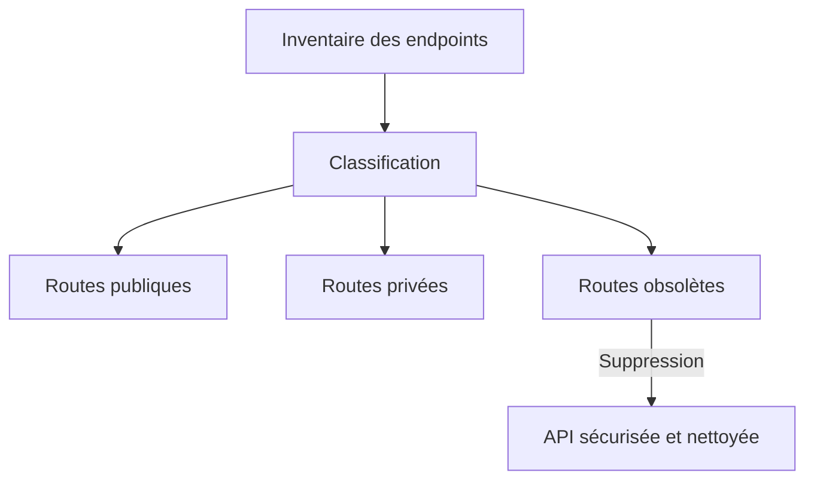

# **2.10 — API9 : Improper Assets Management (Mauvaise gestion des actifs)**

La mauvaise gestion des actifs survient lorsque des ressources de l’API — anciennes versions, endpoints oubliés, environnements de test, documentations internes, routes non référencées — restent **accessibles**, parfois sans aucune sécurité.
Cette vulnérabilité est l’une des plus sournoises : elle ne provient pas d’un bug de code, mais d’un manque de contrôle sur **tout ce que l’API expose réellement**.

Elle permet souvent d'accéder à des endpoints que l’équipe croyait supprimés… mais qui sont encore en production.

---

# **2.10.1 — Définition**

Une API est vulnérable lorsque :

* elle expose des **anciennes versions** non maintenues,
* elle laisse accessibles des **routes de test, dev ou staging**,
* elle conserve des endpoints qui ne sont plus utilisés,
* elle possède des documentations internes exposées,
* elle n’a pas d’inventaire complet de ses endpoints,
* la nomenclature n’est pas maîtrisée,
* plusieurs versions de l’API coexistent sans règles claires.

Cela augmente la surface d’attaque, parfois de manière massive.

---

# **2.10.2 — Exemple simple**

Imagine une API qui possède :

* `/v3/...` — version actuelle
* `/v2/...` — ancienne version, officiellement retirée
* `/v1/...` — version historique, censée être supprimée

Mais en réalité, un attaquant tente :

```
GET /v1/utilisateurs
```

et l’API répond :

```
200 OK
[ ... données ... ]
```

Cette version n’a plus de correctifs, plus de règles d’autorisation modernes, plus de contrôles de sécurité.
C’est une **porte oubliée**, mais encore ouverte.

---

# **2.10.3 — Schéma d’une architecture avec actifs non maîtrisés**

```mermaid
flowchart LR
    A[Attaquant] -->|Découverte endpoints| B["API v1<br>(obsolète)"]
    A -->|Test brut force| C["API v2<br>(faiblement protégée)""]
    A -->|Utilisation normale| D["API v3<br>(sécurisée)""]
    
    B -->|Fuite de données| A
    C -->|Actions non protégées| A
```

Les anciennes versions deviennent des **raccourcis vers l'exploitation**.

---

# **2.10.4 — Types d’actifs mal gérés le plus souvent observés**

### **1. Versions anciennes d’API encore actives**

Elles n’ont plus :

* de correctifs,
* d'audit,
* de règles de sécurité à jour.

---

### **2. Endpoints oubliés**

Endpoints créés pour :

* tester une fonctionnalité,
* debugging,
* migration,

et jamais supprimés.

---

### **3. Documentations publiques**

Swagger, OpenAPI, GraphQL introspection laissés ouverts.

---

### **4. Environnements exposés**

* `/dev`
* `/staging`
* `/test`
* `/debug`

Ces environnements sont souvent **peu sécurisés**.

---

### **5. Sous-domaines oubliés**

Exemple :

* api.example.com
* **old-api.example.com**
* **beta-api.example.com**

Ces sous-domaines peuvent révéler des versions anciennes ou non protégées.

---

# **2.10.5 — Pourquoi cette vulnérabilité est-elle fréquente ?**

### **1. Les équipes ne tiennent pas toujours un inventaire complet**

La documentation est souvent partielle ou obsolète.

---

### **2. Les API évoluent rapidement**

De nouvelles versions sortent, les anciennes “devraient” être retirées.

---

### **3. Les routes internes n'ont pas été désactivées**

Beaucoup d’équipes oublient de supprimer les endpoints de développement.

---

### **4. Le code mort continue de fonctionner**

Même s’il n’est plus utilisé par le frontend, un endpoint peut toujours être accessible.

---

### **5. Multiplication des microservices**

Plus il y a de services, plus il y a de surfaces d’exposition.

---

# **2.10.6 — Comment un attaquant trouve les actifs oubliés ?**

Un attaquant peut :

### **1. Scanner les versions courantes**

```
/v1/
/v2/
/v3/
/old/
/beta/
/test/
```

### **2. Utiliser l’introspection GraphQL**

Si activée, elle révèle TOUT le schéma.

### **3. Inspecter Swagger ou OpenAPI**

Si accessible publiquement, il donne la carte complète de l’API.

### **4. Regarder les anciennes apps mobiles**

Elles contiennent parfois les anciennes URLs.

### **5. Scraper des noms “classiques”**

Exemples :

* `/backup`
* `/admin-old`
* `/api_old`
* `/deprecated`

Ces chemins sont étonnamment courants.

---

# **2.10.7 — Exemple d’exploitation**

Une API expose toujours ce endpoint :

```
GET /v1/exportAllUsers
```

Il n’est plus documenté, plus utilisé.
Mais il fonctionne encore… sans authentification.

Un attaquant obtient :

```
[
  { "nom": "Alice", ... },
  { "nom": "Bob", ... },
  ...
]
```

Une fuite totale due à un simple “oubli”.

---

# **2.10.8 — Impacts d’une gestion d’actifs défaillante**

* exposition de données via des endpoints oubliés,
* accès à d’anciennes versions non sécurisées,
* exécution d’actions internes,
* contournement des protections de la version actuelle,
* augmentation massive de la surface d’attaque,
* accès à des fichiers sensibles (logs, backups, configs).

Une seule route oubliée peut compromettre tout le système.

---

# **2.10.9 — Stratégies de prévention**

---

## **1. Maintenir un inventaire complet des endpoints**

Chaque route doit être :

* listée,
* documentée,
* classifiée (publique / restreinte / interne),
* gérée dans un registre.

---

## **2. Désactiver les anciennes versions**

Les API doivent avoir :

* un plan de dépréciation,
* une date d’expiration,
* un retrait automatisé.

---

## **3. Désactiver Swagger / GraphQL Playground en production**

Ou les protéger par authentification.

---

## **4. Restreindre les environnements**

Dev / Test / Staging ne doivent **jamais** être publics.

---

## **5. Surveiller les sous-domaines et endpoints oubliés**

Utiliser des outils d’analyse automatique.

---

## **6. Effectuer des scans réguliers**

Identifier :

* routes non documentées,
* endpoints morts,
* versions obsolètes.

---

# **2.10.10 — Schéma d’une API correctement gérée**



La gestion des actifs devient un processus actif, continu et contrôlé.

---

# **2.10.11 — Résumé du sous-chapitre**

* La mauvaise gestion des actifs survient lorsque des endpoints oubliés restent accessibles.
* Les anciennes versions d’API ou les environnements de test exposés sont des portes d’entrée majeures.
* Les attaques exploitent ces surfaces cachées mais non protégées.
* Les impacts incluent des fuites de données, des actions critiques et un contournement complet des protections.
* La prévention repose sur l’inventaire, la suppression des versions obsolètes, la désactivation des outils de test et le contrôle des environnements.