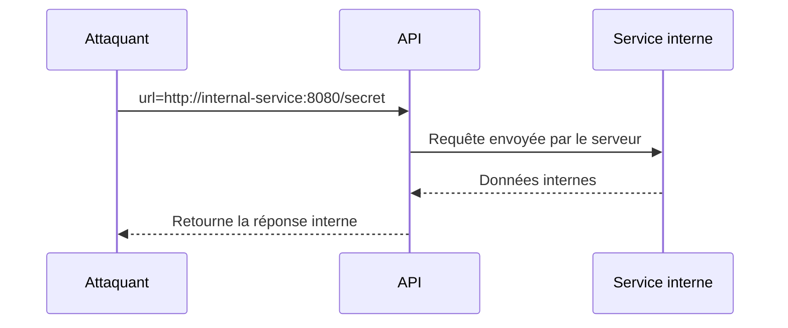
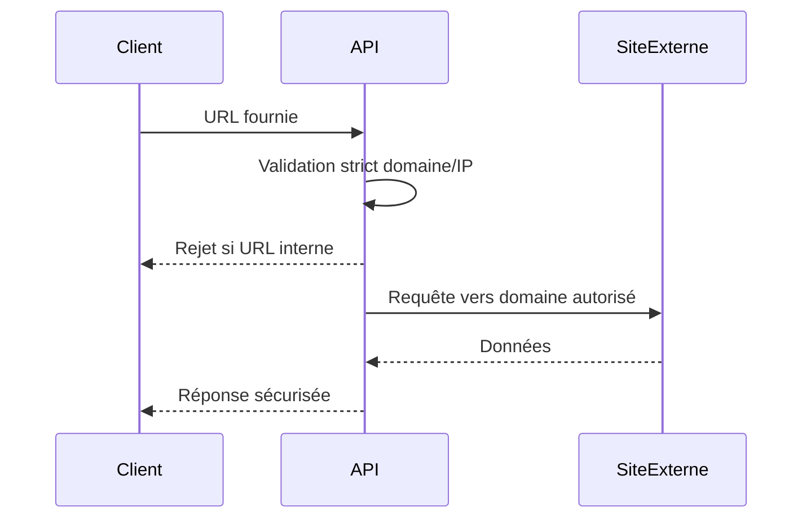

# **2.11 — API10 — SSRF : Server-Side Request Forgery (Falsification de requête côté serveur)**

La SSRF est une vulnérabilité qui permet à un attaquant de tromper le serveur afin de lui faire **envoyer des requêtes HTTP à d’autres systèmes**, souvent internes ou protégés, auxquels l’attaquant n’a normalement pas accès.

C’est l’une des vulnérabilités les plus dangereuses dans les API modernes, car elle permet de transformer le serveur en **proxy d’attaque**, ouvrant la porte à l’exploration du réseau interne, l’accès à des métadonnées cloud, des systèmes de gestion internes, ou même l’exfiltration de données.

---

# **2.11.1 — Définition**

Une SSRF se produit lorsqu’une API accepte une URL fournie par le client et l’utilise pour :

* télécharger un fichier,
* charger une ressource externe,
* effectuer une requête HTTP,
* accéder à un service tiers,
* envoyer une notification,
* générer un aperçu (preview) d’un lien.

Si cette URL n’est pas strictement filtrée, un attaquant peut forcer le serveur à envoyer une requête vers :

* un service interne (`http://localhost:8080/admin`),
* un autre service du réseau privé,
* une API de métadonnées cloud (`http://169.254.169.254/latest/meta-data`),
* un outil interne non exposé.

Le serveur devient alors un **outil d’accès indirect**.

---

# **2.11.2 — Illustration simple**

Une API permet de générer une prévisualisation d’un site web :

```
POST /preview
{
  "url": "https://example.com"
}
```

L’API fait :

```
serveur télécharge la page -> retourne un résumé
```

Un attaquant peut envoyer :

```
POST /preview
{
  "url": "http://localhost:8080/admin"
}
```

Le serveur accède alors **à une interface interne**, inaccessible depuis l’extérieur.

---

# **2.11.3 — Schéma d’une attaque SSRF**



Le serveur agit comme un **agent involontaire** de l’attaquant.

---

# **2.11.4 — Pourquoi la SSRF est dangereuse ?**

Parce qu’elle permet :

### **1. D’accéder au réseau interne**

Applications internes, bases de données, dashboards…

### **2. D’accéder aux métadonnées cloud**

Exemple : sur AWS, l’URL suivante contient des informations critiques :

```
http://169.254.169.254/latest/meta-data
```

Cette simple requête peut donner :

* clés IAM,
* tokens temporaires,
* informations sensibles.

### **3. De contourner les firewalls externes**

Le serveur a accès à des ressources non accessibles au public.

### **4. D’effectuer des attaques à rebond**

Le serveur peut être utilisé pour scanner le réseau interne.

---

# **2.11.5 — Pourquoi cette vulnérabilité apparaît ?**

### **1. L’API accepte des URLs sans validation**

C’est la cause principale.

### **2. Les développeurs veulent “télécharger un fichier distant”**

Sans penser aux risques internes.

### **3. Les services internes ne sont pas protégés car “ils ne sont pas publics”**

Mais le serveur peut y accéder.

### **4. Les outils cloud exposent des endpoints sensibles**

Les métadonnées cloud sont particulièrement dangereuses.

### **5. Les API d’intégration (webhooks, previews) sont très courantes**

Et acceptent souvent des URLs comme entrée.

---

# **2.11.6 — Exemples typiques d’API vulnérables**

### **1. API d’aperçu d’un lien (OpenGraph parser)**

Extrait les métadonnées d’une page web.

### **2. API d’import de fichier via URL**

Télécharge un fichier depuis une URL fournie.

### **3. API de webhook**

Appelle une URL fournie par l’utilisateur.

### **4. API qui vérifie le statut d’un service**

Si l’utilisateur peut fournir la cible, SSRF possible.

---

# **2.11.7 — Types d’attaques SSRF**

### **1. SSRF externe → interne**

Attaquant → API → services internes

### **2. SSRF interne → cloud metadata**

Attaquant → API → `169.254.169.254` (méta cloud)

### **3. SSRF interne → scan réseau**

Attaquant teste des ports internes :

```
http://10.0.0.5:22
http://10.0.1.12:3306
http://127.0.0.1:8080
```

### **4. SSRF aveugle**

La réponse n’est pas renvoyée,
mais l’attaquant observe des effets indirects (temps, erreurs).

---

# **2.11.8 — Impact d’une SSRF**

Les conséquences peuvent être extrêmes :

* exfiltration de secrets cloud,
* accès à des interfaces administratives internes,
* scan du réseau interne,
* compromission d’autres services,
* prise de contrôle de l’infrastructure,
* pivot vers la base de données interne,
* récupération de tokens temporaires (AWS IAM…),
* contournement complet des protections réseau.

La SSRF est souvent un **point de départ d’un piratage total**.

---

# **2.11.9 — Stratégies de prévention**

La prévention repose sur la **validation stricte des URLs** et des destinations.

---

## **1. Interdire l’accès aux IP locales ou internes**

L’API doit refuser :

* `127.0.0.1`,
* `localhost`,
* `10.x.x.x`,
* `192.168.x.x`,
* `172.16.x.x`,
* les IP cloud metadata.

---

## **2. Utiliser une liste blanche (whitelist)**

Ne permettre que les domaines autorisés :

```
https://exemple.com
https://partenaire.com
```

---

## **3. Ne jamais laisser le serveur accéder directement à l’URL fournie**

Utiliser un **proxy sécurisé** qui filtre les requêtes.

---

## **4. Résoudre les DNS puis revalider l'adresse IP**

Car un attaquant peut utiliser un nom de domaine trompeur qui résout vers une IP interne.

---

## **5. Limiter les méthodes HTTP**

Interdire :

* POST,
* DELETE,
* PUT,

pour les requêtes sortantes.

---

## **6. Timeout et limitation de taille**

Une protection essentielle pour éviter les scans internes automatisés.

---

# **2.11.10 — Schéma d’une API correctement protégée**



L’API filtre **avant** d’effectuer la requête.

---

# **2.11.11 — Résumé du sous-chapitre**

* La SSRF permet de forcer un serveur à envoyer des requêtes vers des services internes.
* Très dangereuse : accès au réseau interne, métadonnées cloud, interfaces admin.
* Souvent liée à des API qui acceptent des URLs en entrée (webhooks, previews…).
* La prévention repose sur des validations strictes, les listes blanches, le filtrage d’IP internes et l’utilisation de proxys sécurisés.