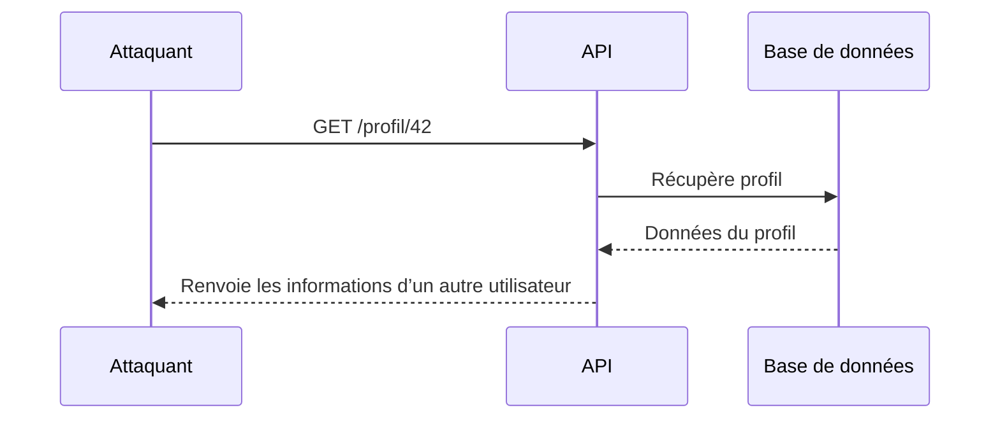
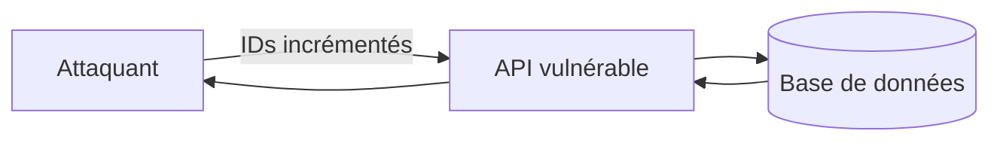
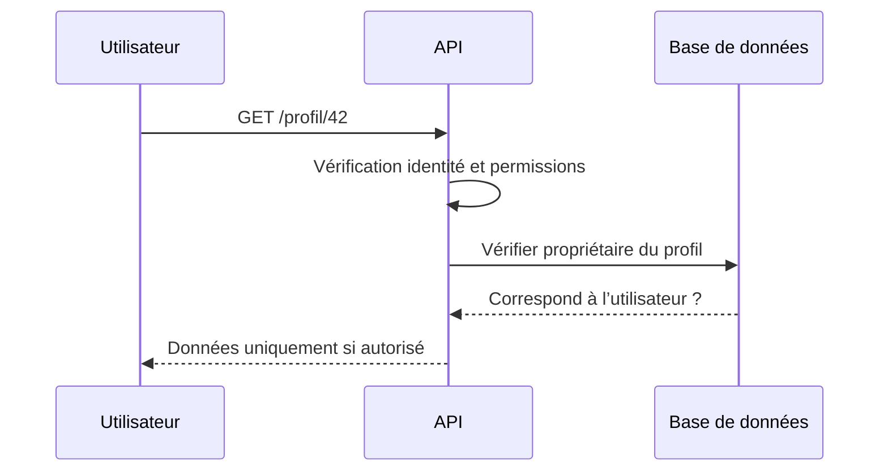

# **2.2 — API1 : Broken Object Level Authorization (BOLA)**

**Broken Object Level Authorization (BOLA)** est la vulnérabilité numéro 1 du OWASP API Security Top 10.
Elle est responsable de la majorité des fuites de données et des compromissions d’API observées dans le monde.

BOLA se produit lorsqu’une API permet à un utilisateur d’accéder à des **objets** (données, documents, profils, commandes…) qui **ne lui appartiennent pas**, simplement en modifiant un identifiant dans la requête.

Ce chapitre explique clairement ce que c’est, comment cela arrive, comment l’identifier, et pourquoi c’est si dangereux.

---

# **2.2.1 — Définition**

Une vulnérabilité BOLA apparaît lorsqu’une API :

* accepte un identifiant fourni par le client (ID d’objet),
* ne vérifie pas **à qui appartient l’objet**,
* exécute l’action demandée sans contrôle d’autorisation,
* renvoie des données ou permet une action interdite.

En d’autres termes :
**l’API fait confiance à l’identifiant transmis par le client.**

---

# **2.2.2 — Exemple simple**

Un utilisateur souhaite consulter sa propre facture.
Il envoie :

```
GET /factures/123
```

Si l’API retourne la facture n°123 **sans vérifier** si l’utilisateur en est le propriétaire, alors un attaquant peut simplement essayer une autre valeur :

```
GET /factures/124
GET /factures/125
GET /factures/126
```

L’API renverra alors des factures appartenant à d’autres personnes.

C’est une faille BOLA.

---

# **2.2.3 — Schéma du fonctionnement d’une API vulnérable à BOLA**



L’attaque fonctionne parce que **aucune vérification d’autorisation n’a eu lieu**.

---

# **2.2.4 — Pourquoi BOLA est-elle si fréquente ?**

Plusieurs raisons expliquent sa domination dans les compromis d’API :

### **1. Les API exposent des identifiants en clair**

Exemples :

```
/utilisateurs/42
/commandes/5121
/messages/8004
```

Ces identifiants sont faciles à modifier.

---

### **2. Le backend suppose souvent que “si l’utilisateur demande un objet, c’est qu’il y a droit”**

Ce raisonnement est faux :
**l’utilisateur peut mentir ou manipuler la requête.**

---

### **3. Les frameworks modernes génèrent des routes sans inclure automatiquement des contrôles d’autorisation**

Ce qui crée des endpoints vulnérables si le développeur oublie un contrôle.

---

### **4. Les tests se concentrent sur les “cas normaux”**

Souvent, on teste l’accès à ses propres données…
mais pas l’accès à celles des autres.

---

# **2.2.5 — Ce qu’un attaquant voit lorsqu’il identifie un modèle BOLA**

Un attaquant peut deviner que l’API est vulnérable si :

* les identifiants sont séquentiels (`1, 2, 3, 4…`),
* l’API retourne un objet sans contrôle d’accès,
* les erreurs d’autorisation sont rares ou inexistantes,
* les réponses sont cohérentes avec un schéma simple.

---

# **2.2.6 — Impact d’une vulnérabilité BOLA**

Les conséquences peuvent être très importantes :

* accès à des données personnelles,
* exposition de dossiers médicaux,
* consultation de commandes d’autres clients,
* lecture ou modification de messages,
* accès à des documents sensibles,
* extraction complète de la base de données via itération automatique.

Dans de nombreux incidents, une API vulnérable à BOLA permet d’extraire **des millions d’enregistrements**.

---

# **2.2.7 — Exemple illustratif d’une exploitation automatique**

Lorsqu’une API ne vérifie pas la propriété d’un objet, un attaquant peut itérer :

```
GET /utilisateurs/1
GET /utilisateurs/2
GET /utilisateurs/3
...
GET /utilisateurs/1000000
```



En quelques secondes, un script peut récupérer une grande quantité d’informations.

---

# **2.2.8 — Comment prévenir une attaque BOLA**

La protection repose sur un principe simple :

### **Ne jamais faire confiance à l’identifiant fourni par le client.**

L’API doit obligatoirement vérifier :

* **qui** fait la demande (authentification),
* si l’objet **appartient** à cet utilisateur,
* si l’utilisateur a le **droit** d’exécuter cette action.

Même si l’utilisateur fournit `/utilisateurs/42`, l’API doit vérifier que :

* l’utilisateur est réellement le propriétaire de l’objet 42,
* l’opération demandée est autorisée pour lui.

Cette vérification doit être présente dans **chaque endpoint** manipulant un identifiant d’objet.

---

# **2.2.9 — Illustration d’une API correctement protégée**



L’objet n’est retourné **que** si l’utilisateur est réellement autorisé.

---

# **2.2.10 — Résumé du sous-chapitre**

* BOLA signifie qu’une API laisse accéder à un objet appartenant à quelqu’un d’autre.
* Il s’agit de la vulnérabilité la plus grave et la plus courante dans les API.
* Elle survient lorsque l’API fait confiance aux identifiants envoyés par le client.
* Elle peut entraîner des fuites massives de données.
* La prévention repose sur la vérification systématique de l’identité et de la propriété des objets.
