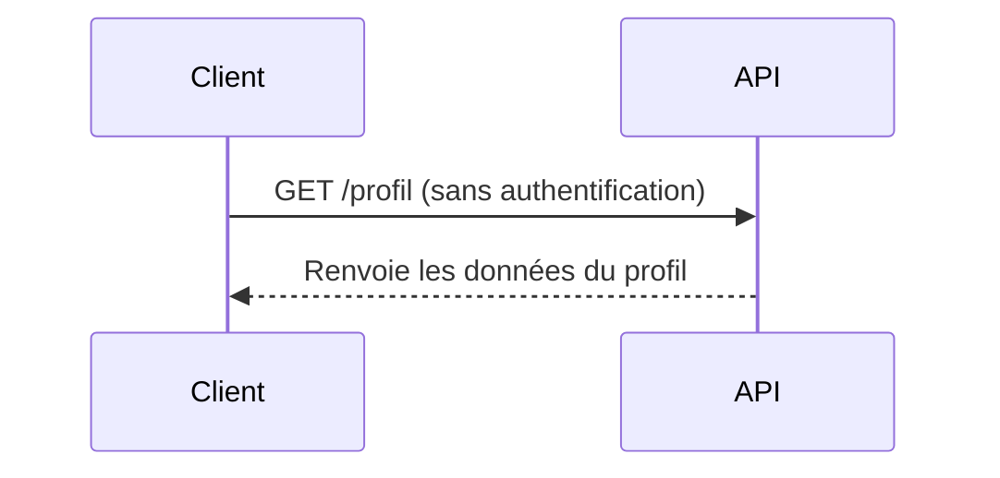
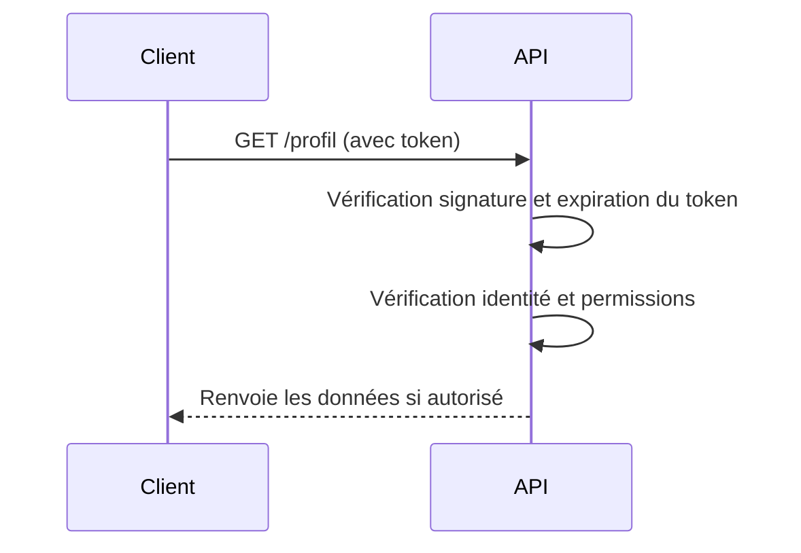

# **2.3 — API2 : Broken Authentication (Authentification défaillante)**

L’authentification défaillante (Broken Authentication) est la **deuxième vulnérabilité la plus critique** du OWASP API Security Top 10.
Elle concerne toutes les situations où une API ne parvient pas à **identifier correctement** ses utilisateurs, ou permet à un attaquant de **se faire passer** pour quelqu’un d’autre.

Ce chapitre présente les mécanismes, les causes, les exemples concrets, les schémas explicatifs et les impacts possibles.

---

# **2.3.1 — Définition**

Une API souffre d’un problème d’authentification défaillante lorsque :

* un attaquant peut s’authentifier à la place d’un autre utilisateur,
* un utilisateur peut accéder aux données sans être authentifié,
* les mécanismes d’identification sont faibles ou mal configurés,
* les tokens peuvent être volés, devinés, réutilisés ou forgés,
* l’API n’applique pas correctement les règles de sécurité de l’authentification.

Le résultat :
**l’identité numérique n’est plus fiable**, ce qui ouvre la porte à de nombreuses attaques.

---

# **2.3.2 — Pourquoi c’est critique dans une API**

Les API sont souvent **stateless** : chaque requête doit prouver l’identité du client.
Si l’authentification peut être contournée :

* l’attaquant peut envoyer des milliers de requêtes,
* l’accès non autorisé peut être massif,
* l’API ne peut plus distinguer l’ami de l’ennemi.

Une API sans authentification fiable devient **incontrôlable**.

---

# **2.3.3 — Situations typiques d’authentification défaillante**

Voici les situations les plus courantes :

### **1. Absence d’authentification**

Une API renvoie des données sans aucun contrôle.

```
GET /profil → renvoie des données sans token
```

---

### **2. Authentification contournable**

L’API autorise certaines opérations même si le token est invalide ou absent.

---

### **3. Identifiants faibles ou prédictibles**

Exemple : API Key simple, non expirante, facile à deviner.

---

### **4. Tokens non vérifiés correctement**

L’API accepte un token :

* expiré,
* forgé,
* non signé,
* signé avec un mauvais algorithme.

---

### **5. Gestion incorrecte des sessions API**

Même si API = stateless, des erreurs existent :

* absence d’expiration,
* absence de rotation du token,
* tokens valides trop longtemps.

---

### **6. Absence de limitations sur l’authentification**

Tentatives illimitées → brute force possible.

---

# **2.3.4 — Exemple simple d’authentification défaillante**

Un endpoint permet d’accéder au profil d’un utilisateur :

```
GET /profil
```

Si l’API ne vérifie pas le token correctement, elle peut renvoyer :

```
{
  "nom": "Alice",
  "email": "alice@example.com"
}
```

même si la requête ne contient pas d’autorisation, ou un token invalide.

---

# **2.3.5 — Schéma d’une API vulnérable**



Le problème ici n’est pas l’accès au profil d’une autre personne (BOLA),
mais l’absence ou l’échec de **la vérification de l’identité**.

---

# **2.3.6 — Conséquences d’une authentification défaillante**

Les impacts sont immédiats :

* prise de contrôle de comptes,
* accès à des données privées,
* modification ou suppression de données,
* transactions frauduleuses,
* détournement de services,
* attaque en cascade sur d’autres endpoints.

Dans de nombreux incidents, l’attaquant obtient simplement un token valide… et l’API lui ouvre tout l’accès.

---

# **2.3.7 — Modes d’attaque fréquents**

Les attaquants exploitent différents mécanismes :

---

### **1. Deviner ou voler un token**

Les tokens trop longs à expirer, non sécurisés ou mal stockés sont vulnérables.

---

### **2. Réutiliser un token expiré**

Si l’API ne vérifie pas la date d’expiration.

---

### **3. Faux tokens acceptés**

Certains serveurs acceptent des tokens non signés ou avec un algorithme faible.

---

### **4. Brute force d'identifiants**

L'absence de limitation des tentatives rend l’attaque simple.

---

### **5. API Key exposée**

Une clé intégrée dans une application mobile peut être récupérée et utilisée librement.

---

# **2.3.8 — Prévention d’une authentification défaillante**

Pour sécuriser une API, il est essentiel de :

### **1. Exiger une authentification sur chaque endpoint sensible**

Ne jamais considérer un endpoint comme “inoffensif”.

---

### **2. Vérifier correctement les tokens**

* signature valide,
* non altéré,
* non expiré,
* émis par la bonne source.

---

### **3. Utiliser des jetons à durée limitée**

Un token valide trop longtemps augmente le risque.

---

### **4. Protéger les identifiants contre le brute force**

* limitation du nombre de tentatives,
* délais progressifs,
* captchas si nécessaire.

---

### **5. Ne jamais stocker de mots de passe en clair**

Toujours utiliser un algorithme de hachage robuste.

---

# **2.3.9 — Schéma d’une API correctement protégée**



---

# **2.3.10 — Résumé du sous-chapitre**

* L’authentification défaillante permet à un attaquant de se faire passer pour un autre utilisateur.
* Elle survient lorsque l’API ne vérifie pas correctement l’identité du client.
* Les causes fréquentes : tokens mal gérés, absence de contrôle, identifiants faibles.
* Les conséquences sont graves : accès non autorisé, fraude, fuite de données.
* La prévention repose sur une authentification stricte et systématique.
