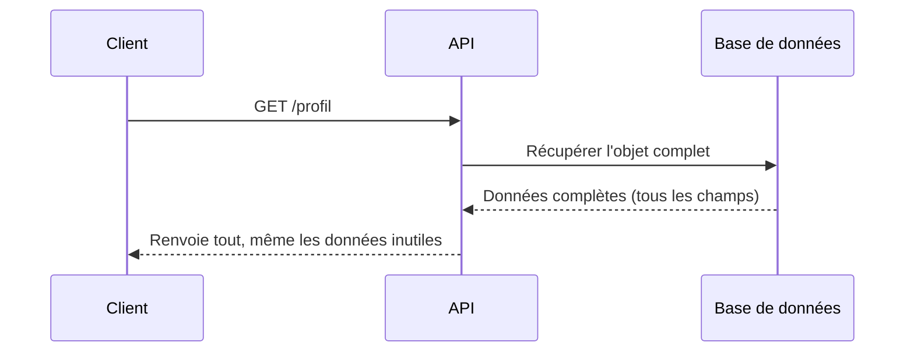
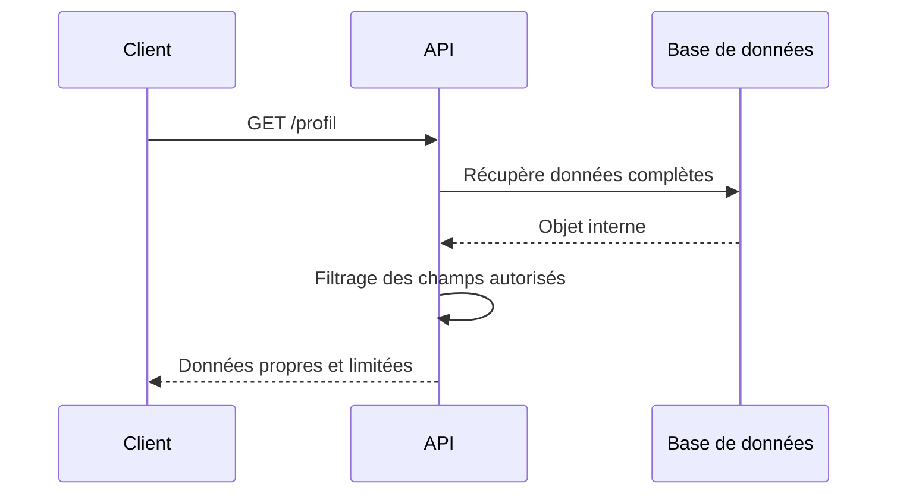

# **2.4 — API3 : Excessive Data Exposure (Exposition excessive de données)**

L’exposition excessive de données est une vulnérabilité courante dans les API.
Elle se produit lorsque l’API renvoie **plus d’informations que nécessaire**, souvent involontairement.
Même si l’accès est correctement authentifié et autorisé, l’API peut divulguer des données sensibles simplement parce qu’elle répond trop largement.

Ce chapitre explique comment cette faille apparaît, pourquoi elle est dangereuse, et comment l’éviter.

---

# **2.4.1 — Définition**

Une API est vulnérable à l’exposition excessive de données lorsqu’elle :

* renvoie plus de champs que nécessaire,
* expose des informations internes ou sensibles,
* laisse l’application cliente (frontend) filtrer les données au lieu de filtrer côté serveur,
* ne valide pas quels champs doivent être visibles.

Les données envoyées sont souvent **correctes**, mais **trop nombreuses**.

---

# **2.4.2 — Exemple simple**

Supposons qu’une API fournisse les informations d’un utilisateur à une application mobile.

L’application n’a besoin que de :

* nom,
* prénom,
* email.

Mais l’API renvoie :

```
{
  "id": 42,
  "nom": "Durand",
  "prenom": "Alice",
  "email": "alice@example.com",
  "mot_de_passe_hache": "af8972cc...",
  "role_interne": "admin_backoffice",
  "derniere_connexion": "2025-12-02T09:00",
  "adresse_ip_confidentielle": "10.0.0.5"
}
```

Même si la partie visible dans l’application se limite à *nom / prénom / email*,
le reste des données est toujours **transmis** au client.

Ces informations peuvent être capturées, analysées et exploitées.

---

# **2.4.3 — Pourquoi cette faille est-elle fréquente ?**

### **1. Le frontend filtre les données au lieu du backend**

Le serveur envoie tout, et le client n’affiche que ce qui est utile.
Mais l’attaquant reçoit *tout*.

---

### **2. Les objets renvoyés correspondent directement aux objets internes**

Un objet interne contient souvent :

* des champs métiers,
* des champs techniques,
* des identifiants internes,
* des données sensibles.

Les API renvoient l’objet tel quel, sans le nettoyer.

---

### **3. Les développeurs pensent parfois que “puisque c’est pour le frontend, c’est sûr”**

Mais toute donnée envoyée **quitte** le serveur et peut être lue.

---

### **4. GraphQL augmente naturellement le risque**

Car le client peut demander trop d’informations d’un coup.

---

# **2.4.4 — Schéma d’une API vulnérable**



Le client reçoit ainsi des informations qu’il ne devrait jamais voir.

---

# **2.4.5 — Types d'informations souvent exposées par erreur**

Les API révèlent fréquemment :

* des hachages de mots de passe,
* des rôles internes,
* des fichiers de logs,
* des champs techniques (timestamps internes, IDs système),
* des informations liées à la sécurité (IP, clés partielles),
* des données appartenant à d’autres systèmes,
* des drapeaux internes (isAdmin, isSuperUser…),
* des chemins ou noms de fichiers internes.

Même si ces champs ne semblent pas critiques au premier regard,
ils peuvent être exploités pour d’autres attaques.

---

# **2.4.6 — Comment un attaquant exploite l’exposition excessive**

Un attaquant analyse les réponses API à la recherche de :

* champs permettant d’identifier la structure interne,
* informations utiles pour des attaques futures,
* relations entre objets,
* données sensibles directement.

Il peut procéder ainsi :

```
GET /utilisateurs
GET /utilisateurs/1
GET /utilisateurs/2
...
```

Puis extraire tous les champs qu’il trouve.

---

# **2.4.7 — Impact de cette vulnérabilité**

L’impact dépend des données exposées.
Les conséquences peuvent inclure :

* fuite de données personnelles,
* augmentation du risque d'usurpation de compte,
* fuite de données confidentielles internes,
* aide au contournement des autorisations (ex : rôle = admin),
* exposition de secrets techniques,
* montage d’une attaque plus profonde basée sur les informations obtenues.

Une petite information technique peut suffire à fragiliser tout le système.

---

# **2.4.8 — Principes de prévention**

### **1. Toujours filtrer côté backend**

Le serveur doit décider ce qui est permis,
le client ne doit jamais filtrer ou masquer des données venant du backend.

---

### **2. Utiliser des “objets de sortie” spécifiques**

Créer des objets dédiés, contenant uniquement les champs autorisés à sortir.

---

### **3. Ne jamais exposer d’informations techniques**

Exemples :

* hachages,
* rôles internes,
* adresses IP internes,
* identifiants système.

---

### **4. Mettre en place un contrôle systématique des champs**

Ne renvoyer *que* ce qui est strictement nécessaire.

---

### **5. Dans GraphQL : limiter les champs accessibles**

Définir des schémas propres, éviter l’introspection en production.

---

# **2.4.9 — Schéma d’une API correctement sécurisée**



---

# **2.4.10 — Résumé du sous-chapitre**

* Une API peut renvoyer des données correctes, mais trop nombreuses.
* Le client n’affiche que certains champs, mais reçoit *tout*, y compris ce qui est sensible.
* Cette vulnérabilité est très répandue car les objets internes sont souvent renvoyés tels quels.
* Elle peut révéler des informations personnelles, techniques ou internes.
* La solution consiste à filtrer les données **côté backend**, en contrôlant explicitement les champs renvoyés.
