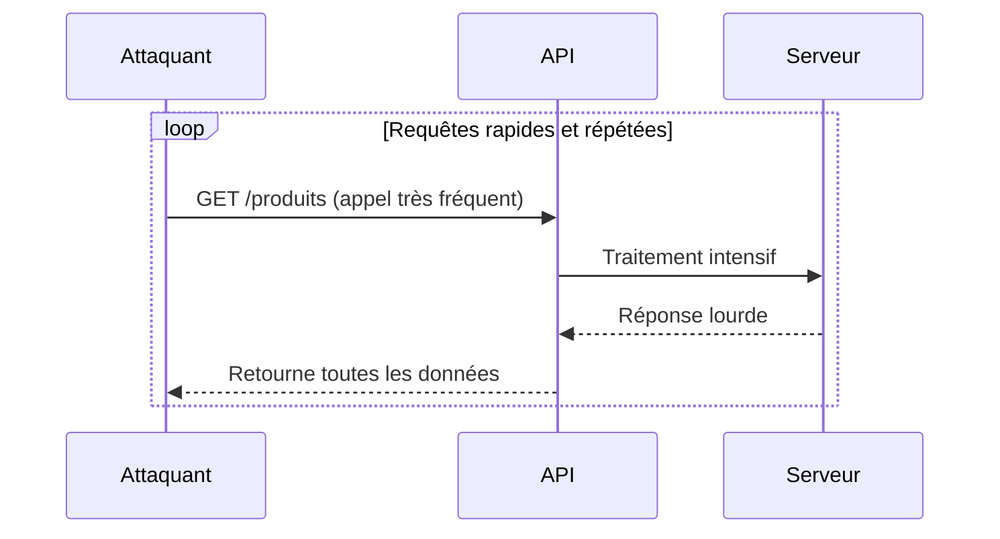
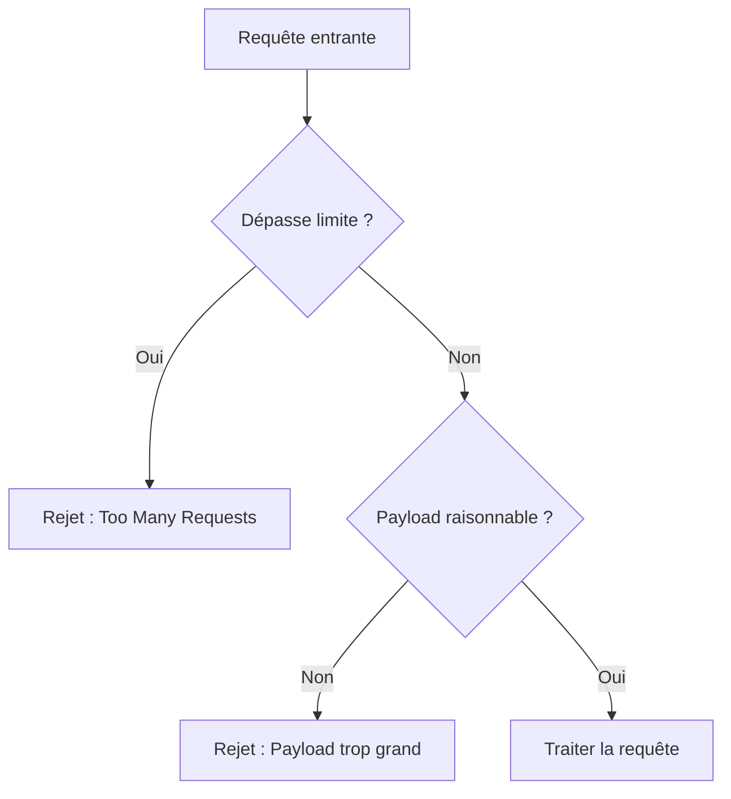

# **2.5 — API4 : Lack of Resources & Rate Limiting (Absence de limitation de ressources)**

L’absence de limitation de ressources est une vulnérabilité qui concerne la manière dont une API gère les **quantités** :
quantité de requêtes, quantité de données, quantité de travail à effectuer.

Une API vulnérable à ce problème accepte trop de demandes, trop rapidement, ou trop lourdes, sans contrôle.
Cela peut entraîner un **ralentissement**, un **épuisement des ressources**, voire un **arrêt complet du service**.

---

# **2.5.1 — Définition**

Une API est vulnérable lorsqu’elle :

* ne limite pas le **nombre de requêtes** qu’un utilisateur peut envoyer,
* ne limite pas la **taille** des données entrantes,
* ne limite pas la **complexité** des requêtes,
* ne limite pas la **profondeur** des réponses (REST, GraphQL),
* ne limite pas les **appels simultanés**,
* permet des opérations **trop coûteuses** sans protection.

Cette absence de contrôle rend l’API vulnérable aux attaques de surcharge :
**DoS (Denial of Service)**, **DDoS**, ou épuisement ciblé d’une fonctionnalité.

---

# **2.5.2 — Illustration simple**

Si une API permet d’appeler :

```
GET /produits
```

et renvoie l’intégralité du catalogue (par exemple 100 000 produits) sans limitation :

* la réponse sera lourde,
* la base sera fortement sollicitée,
* l’API sera ralentie.

Si un attaquant répète cet appel *de nombreuses fois*, le service peut devenir inutilisable.

---

# **2.5.3 — Typologie des attaques liées à l’absence de limite**

Il existe trois grandes familles d’attaques qui exploitent ce problème.

---

## **1. Abus de fréquence (Rate Abuse)**

L’attaquant envoie trop de requêtes en peu de temps.

Effet :

* surcharge CPU,
* saturation réseau,
* indisponibilité du service.

---

## **2. Abus de taille (Payload Abuse)**

L’attaquant envoie des requêtes contenant :

* des fichiers très volumineux,
* des objets JSON gigantesques,
* des paramètres trop longs.

Cela augmente :

* la mémoire utilisée,
* le temps de traitement,
* les risques de crash.

---

## **3. Abus de complexité (Resource Intensive Operations)**

Certaines requêtes sont coûteuses :

* recherche avancée,
* tri complexe,
* agrégation lourde,
* profondeur d’objet importante (surtout en GraphQL).

Si elles ne sont pas limitées, un attaquant peut épuiser les ressources du serveur en répétant ces appels.

---

# **2.5.4 — Schéma d’une API vulnérable à la surcharge**



Sans limitation, le serveur continue à traiter toutes les demandes jusqu’à l’épuisement.

---

# **2.5.5 — Pourquoi cette vulnérabilité est-elle fréquente ?**

### **1. Les développeurs testent avec peu de données**

Une API qui fonctionne bien avec 10 utilisateurs peut s’effondrer avec 100 000.

---

### **2. Par défaut, le backend accepte tout**

La plupart des frameworks n’appliquent **aucune limite** automatique.

---

### **3. La logique métier peut être lourde**

Certaines opérations nécessitent beaucoup de calculs.

---

### **4. L’absence de pare-feu logique**

Sans API Gateway ou reverse proxy, l’API est exposée directement.

---

# **2.5.6 — Exemple concret de surcharge**

Une API GraphQL permet de demander la liste des utilisateurs avec tous leurs messages :

```
query {
  utilisateurs {
    id
    nom
    messages {
      contenu
    }
  }
}
```

Si elle contient :

* 50 000 utilisateurs,
* chacun avec 500 messages,

alors une seule requête peut générer des millions d’objets en réponse.

Sans limitation, cette requête peut “mettre à genoux” l’ensemble du système.

---

# **2.5.7 — Impacts d'une absence de limitation**

Les impacts sont souvent sévères :

* **ralentissement** pour tous les utilisateurs,
* **augmentation des coûts** (CPU, mémoire, bande passante),
* **indisponibilité du service**,
* possibilité de **DoS volontaire**,
* fuites de données si des mécanismes deviennent instables,
* attaques coordonnées (DDoS) plus difficiles à contenir.

Un attaquant n’a pas besoin de casser l’authentification :
il lui suffit d’épuiser les ressources.

---

# **2.5.8 — Stratégies de prévention**

La prévention repose sur plusieurs mécanismes complémentaires.

---

## **1. Rate Limiting**

Limiter le nombre de requêtes par :

* minute,
* seconde,
* utilisateur,
* appareil,
* adresse IP.

Cela évite les abus de fréquence.

---

## **2. Limitation de taille**

Définir des limites :

* sur la taille des corps de requête,
* sur le nombre de paramètres,
* sur la taille des fichiers.

---

## **3. Pagination obligatoire**

Ne jamais permettre des réponses “illimitées”.

Chaque liste doit exiger :

```
?page=1&limit=50
```

Avec un maximum strict (ex : 100).

---

## **4. Limitation de profondeur (GraphQL)**

Limiter :

* la complexité des requêtes,
* les champs accessibles,
* les résolutions récursives.

---

## **5. Timeout**

Après un temps défini, l’API arrête le traitement.

---

## **6. Mise en cache**

Éviter de recalculer des résultats coûteux lorsque ce n’est pas nécessaire.

---

## **7. API Gateway**

Placer une couche de contrôle en amont :

* AWS API Gateway
* Kong
* Apigee
* NGINX
* Traefik

Elle applique automatiquement de nombreuses protections.

---

# **2.5.9 — Schéma d’une API correctement protégée**



---

# **2.5.10 — Résumé du sous-chapitre**

* Une API doit limiter les quantités : fréquence, taille, complexité.
* Sans limite, un attaquant peut facilement provoquer une surcharge ou un DoS.
* Les attaques exploitent l’absence de protection sur les requêtes lourdes ou répétées.
* Les impacts peuvent être graves : ralentissement, indisponibilité, coûts élevés.
* La prévention repose sur le rate limiting, la pagination, les limitations de taille et l’usage d’un API Gateway.