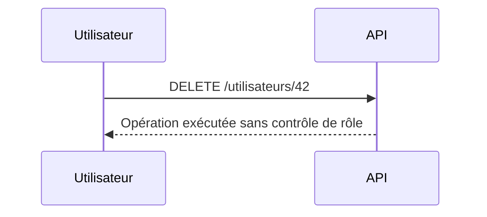
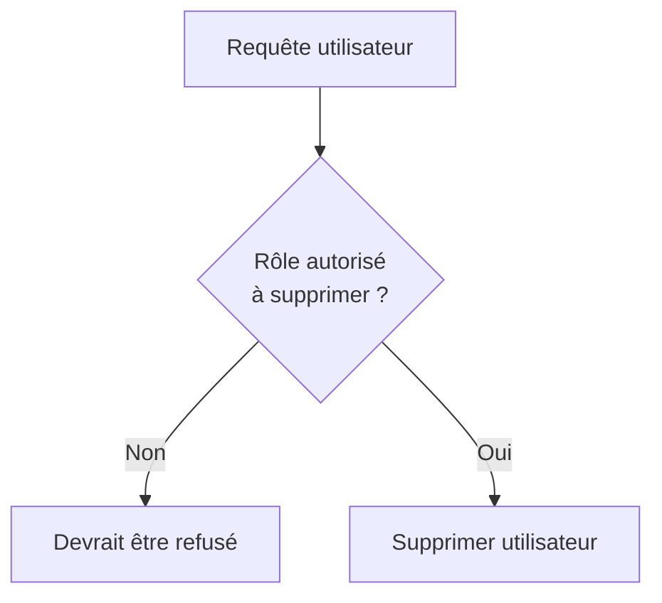
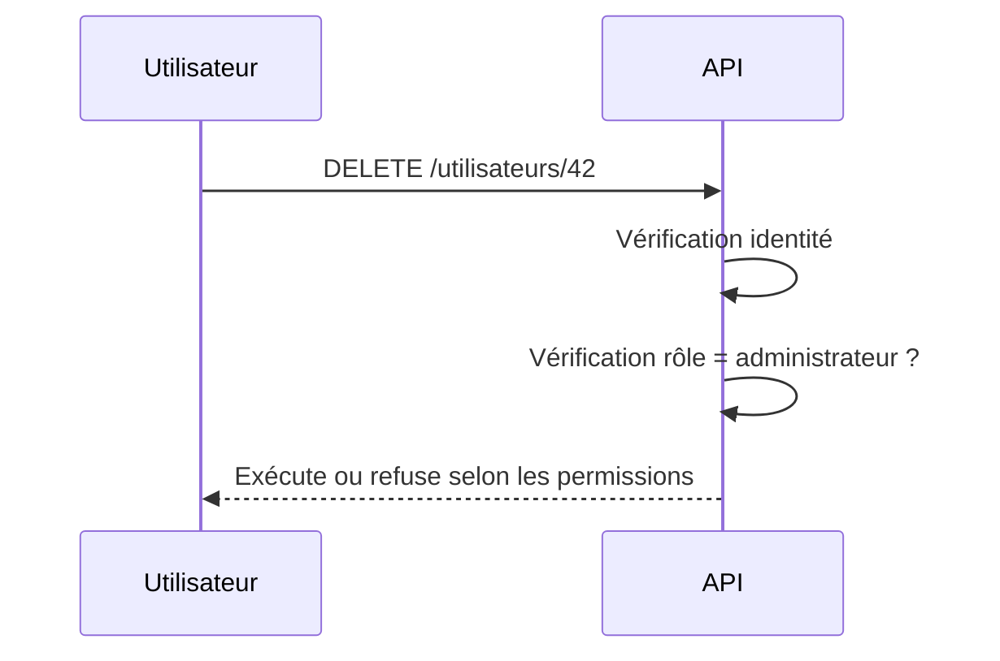

# **2.6 — API5 : Broken Function Level Authorization (Autorisation de fonction défaillante)**

L’autorisation de fonction défaillante survient lorsqu’une API autorise un utilisateur à accéder à **des actions ou fonctionnalités** qui ne devraient pas lui être accessibles.
Contrairement à BOLA (API1), qui concerne l’accès à des **objets**, cette vulnérabilité concerne l’accès à des **opérations**.

Une API vulnérable ne contrôle pas correctement **ce que chaque type d’utilisateur a le droit de faire**.

---

# **2.6.1 — Définition**

Cette vulnérabilité apparaît lorsque :

* un utilisateur standard peut exécuter une action réservée aux administrateurs,
* un utilisateur authentifié peut accéder à des fonctions non prévues pour lui,
* des endpoints internes ou avancés sont exposés sans vérification,
* l’API ne vérifie pas les **rôles** ou les **permissions** avant d’exécuter une opération.

Elle permet donc à un attaquant d’exécuter des actions interdites, souvent sensibles ou destructrices.

---

# **2.6.2 — Exemple simple**

Supposons qu’un système possède deux types d’utilisateurs :

* **Utilisateur standard**
* **Administrateur**

L’API possède un endpoint pour supprimer un compte utilisateur :

```
DELETE /utilisateurs/42
```

Si l’API n’effectue pas une vérification stricte du rôle, un utilisateur standard pourrait essayer :

```
DELETE /utilisateurs/42
```

et si l’API répond :

```
200 OK — Utilisateur supprimé
```

alors elle souffre d’une autorisation de fonction défaillante.

Dans cet exemple, **l’API a permis à un utilisateur non autorisé d’exécuter une action administrative**.

---

# **2.6.3 — Schéma d’une API vulnérable**



L’API ne pose aucune question concernant les permissions de l’utilisateur.

---

# **2.6.4 — Fonction vs Objet : clarification importante**

| Vulnérabilité                            | Enjeu                                                                  |
| ---------------------------------------- | ---------------------------------------------------------------------- |
| **BOLA (API1)**                          | L’utilisateur accède à un **objet** qui ne lui appartient pas          |
| **Broken Function Authorization (API5)** | L’utilisateur exécute une **action** qu’il n’a pas le droit d’exécuter |

Ces deux vulnérabilités sont différentes, mais complémentaires.
Une API doit protéger **les objets** et **les actions**.

---

# **2.6.5 — Exemples d’actions sensibles mal protégées**

Voici des actions qui nécessitent toujours un contrôle strict :

* modifier le rôle d’un utilisateur,
* supprimer un compte,
* valider une transaction,
* accéder au tableau de bord admin,
* gérer les permissions d’autres utilisateurs,
* créer ou supprimer des ressources critiques,
* accéder à des statistiques internes,
* déclencher un remboursement,
* bannir un utilisateur.

Si l’une de ces opérations est accessible sans vérification stricte, l’API est vulnérable.

---

# **2.6.6 — Pourquoi cette faille est-elle fréquente ?**

### **1. Les endpoints “admin” ressemblent aux endpoints normaux**

Exemple :

```
GET /produits
GET /admin/produits
```

Si l’API ne vérifie pas les permissions,
la simple connaissance de l’URL suffit pour accéder à la fonction.

---

### **2. La logique de rôle est parfois appliquée uniquement dans le frontend**

Le backend doit toujours valider les permissions,
même si l’interface masque certains boutons.

---

### **3. Certains endpoints internes restent activés pour des raisons de test**

Ils deviennent exposés en production.

---

### **4. Les permissions sont parfois mal conçues**

Un rôle trop permissif peut accéder à des fonctionnalités inattendues.

---

# **2.6.7 — Illustration des permissions manquantes**



Dans une API vulnérable, cette vérification est absente.

---

# **2.6.8 — Impact d'une autorisation de fonction défaillante**

Les conséquences peuvent être très graves :

* suppression de données sensibles,
* escalade de privilèges,
* modification non autorisée de rôles,
* accès aux outils de gestion internes,
* actions critiques effectuées par des utilisateurs malveillants,
* fraude ou sabotage,
* déstabilisation totale du système.

Ce type de faille permet souvent un **contrôle complet** du système par un attaquant.

---

# **2.6.9 — Stratégies de prévention**

Pour sécuriser l’accès aux fonctions, il est indispensable de :

---

## **1. Vérifier les permissions sur chaque endpoint**

Avant toute action, l’API doit vérifier :

* qui est l’utilisateur ?
* quel est son rôle ?
* a-t-il la permission spécifique d’exécuter cette action ?

Cette vérification doit être explicite et systématique.

---

## **2. Ne jamais dépendre du frontend**

Même si un bouton n’est pas visible,
un attaquant peut toujours appeler l’API directement.

Le backend doit imposer lui-même les restrictions.

---

## **3. Isoler physiquement les fonctionnalités admin**

Utiliser :

* des routes distinctes (ex : `/admin/...`),
* des permissions séparées,
* des mécanismes de sécurité supplémentaires.

---

## **4. Utiliser un modèle d’autorisations structuré**

Comme :

* **RBAC** (Role-Based Access Control),
* **ABAC** (Attribute-Based Access Control),
* **PBAC** (Policy-Based Access Control).

---

# **2.6.10 — Schéma d’une API correctement protégée**



---

# **2.6.11 — Résumé du sous-chapitre**

* Cette vulnérabilité concerne l’accès à des **fonctions**, non des objets.
* Elle permet à un utilisateur d’exécuter des opérations interdites.
* Elle survient si l’API ne vérifie pas correctement les rôles et permissions.
* Les impacts peuvent être critiques (suppression, modification, actions admin).
* La prévention repose sur une vérification stricte et systématique des autorisations.