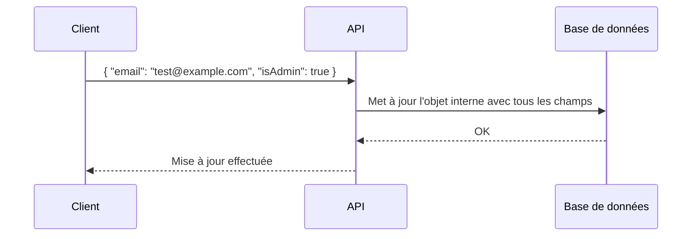
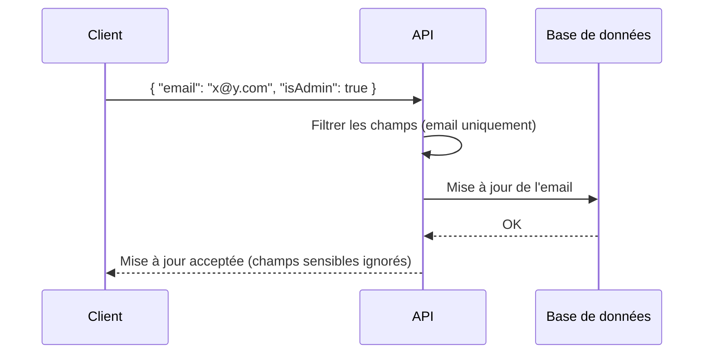

# **2.7 — API6 : Mass Assignment (Affectation massive)**

L’affectation massive (Mass Assignment) est une vulnérabilité qui apparaît lorsque l’API laisse un utilisateur **modifier des champs qu’il ne devrait pas pouvoir modifier**, simplement en les ajoutant dans la requête.

Ce problème survient lorsque l’API copie automatiquement les champs reçus dans le corps de la requête vers un objet interne, **sans filtrage**.
L’attaquant peut alors injecter des champs supplémentaires et modifier des informations sensibles.

Cette vulnérabilité est très courante dans les API modernes, en particulier celles développées avec des frameworks qui automatisent la gestion des objets.

---

# **2.7.1 — Définition**

Une API est vulnérable au Mass Assignment lorsqu’elle :

* reçoit un objet JSON,
* copie automatiquement tous ses champs dans un objet interne,
* ne contrôle pas quels champs sont modifiables par l’utilisateur.

L’attaquant peut alors envoyer des champs supplémentaires non prévus.

---

# **2.7.2 — Exemple simple**

L’API permet à un utilisateur de modifier son profil :
nom, prénom, email.

La requête attendue est :

```
PATCH /profil
{
  "prenom": "Alice",
  "email": "alice@example.com"
}
```

Cependant, l’objet interne de l’utilisateur contient aussi :

* `role`
* `isAdmin`
* `credits`
* `status`

Si l’API copie automatiquement **tous** les champs reçus sans filtrage,
un attaquant peut envoyer :

```
PATCH /profil
{
  "prenom": "Alice",
  "isAdmin": true
}
```

Si l’API applique cela directement, l’attaquant devient administrateur.

---

# **2.7.3 — Illustration d’une API vulnérable**



L’API n’a pas filtré les champs sensibles.

---

# **2.7.4 — Pourquoi cette faille apparaît ?**

Elle apparaît pour plusieurs raisons :

### **1. Automatisation excessive des frameworks**

De nombreux frameworks permettent de faire :

```pseudo
objet.update(requete_json)
```

Sans vérification des champs.

---

### **2. Les développeurs supposent que le client n’enverra que ce qui est nécessaire**

Hypothèse fausse :
**un attaquant peut toujours fabriquer sa requête.**

---

### **3. Mauvaise séparation entre “données affichées” et “données modifiables”**

Un utilisateur peut voir certains champs (ex. son rôle), mais ne devrait jamais pouvoir les modifier.

---

### **4. Confiance excessive dans le frontend**

Le frontend n’affiche pas le champ “isAdmin”,
mais la requête API peut tout de même l’envoyer.

---

# **2.7.5 — Champs sensibles typiquement exposés par erreur**

Les champs suivants ne doivent jamais être modifiables par un utilisateur :

* `role`
* `isAdmin`
* `status`
* `createdAt`
* `updatedAt`
* `credits`
* `price`
* `permissions`
* `isVerified`

Si l’API copie aveuglément les champs du client,
tous ces champs peuvent être détournés.

---

# **2.7.6 — Cas réels typiques**

Voici des scénarios classiques :

---

### **Création de compte avec rôle forcé**

Un attaquant ajoute `"role": "admin"` lors de l'inscription.

---

### **Modification du statut d’un ticket**

L’attaquant change `"status": "validé"`.

---

### **Augmentation de crédit ou de balance**

L’attaquant envoie `"credits": 1000000"`.

---

### **Modification de “ownerId”**

Il devient propriétaire d’une ressource.

---

# **2.7.7 — Impact d’un Mass Assignment**

Les conséquences peuvent être dramatiques :

* prise de contrôle de comptes,
* escalade de privilèges,
* accès à des fonctionnalités administratives,
* modification de données critiques,
* contournement des mécanismes de sécurité,
* fraude, manipulation de prix, modification de transactions.

Le Mass Assignment transforme une simple étoile (*) dans un costume… en supervillain numérique.

---

# **2.7.8 — Stratégies de prévention**

La prévention repose sur un principe simple :
**ne jamais faire confiance aux champs envoyés par le client.**

Trois stratégies sont essentielles :

---

## **1. Utiliser un “whitelist” de champs autorisés**

Définir explicitement quels champs peuvent être modifiés :

```
autorises = ["email", "prenom"]
```

L’API n’utilise que ces champs.

---

## **2. Séparer les objets internes et les objets exposés**

Créer des modèles distincts :

* **UserInternal** (avec tous les champs)
* **UserPublic** ou **UserUpdate** (avec les champs autorisés)

---

## **3. Validation stricte des données reçues**

Ne jamais faire :

```
update(user, requestBody)
```

Toujours filtrer et valider.

---

## **4. Interdiction des champs sensibles dans les requêtes entrantes**

Si un champ sensible apparaît :
→ rejeter directement la requête.

---

# **2.7.9 — Schéma d’une API correctement protégée**



L’API protège automatiquement les champs dangereux, même s’ils sont envoyés.

---

# **2.7.10 — Résumé du sous-chapitre**

* L’affectation massive survient lorsqu’une API copie automatiquement tous les champs reçus.
* Un attaquant peut ajouter des champs sensibles (ex : `isAdmin`).
* Cela peut mener à l’escalade de privilèges ou à des manipulations de données critiques.
* La prévention repose sur le filtrage explicite des champs autorisés, la validation et la séparation des objets internes/exposés.
* Le backend doit toujours contrôler quelles données un utilisateur est autorisé à modifier.
