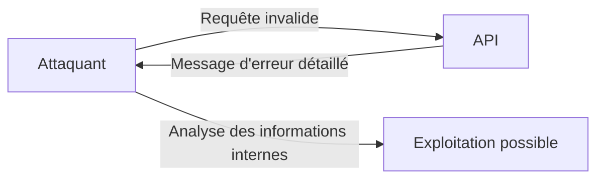
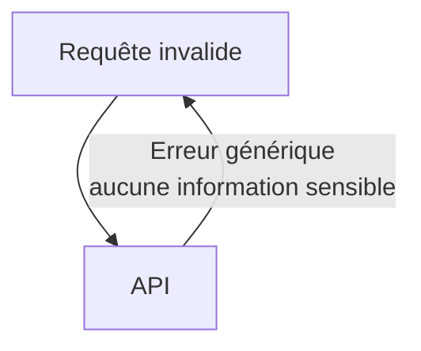

# **2.8 — API7 : Security Misconfiguration (Mauvaise configuration de sécurité)**

La mauvaise configuration de sécurité est une des vulnérabilités les plus répandues dans les API modernes.
Elle survient lorsque le système, le serveur, l’API, les dépendances ou les composants techniques **ne sont pas configurés correctement**, laissant ouvertes des failles exploitables.

Cette vulnérabilité ne provient pas d’un problème de logique métier, mais d’un **manque de rigueur dans la configuration**, ce qui peut suffire pour compromettre toute une API.

---

# **2.8.1 — Définition**

Une API souffre d’une mauvaise configuration de sécurité lorsque :

* des fonctionnalités non nécessaires sont activées,
* des permissions par défaut sont trop larges,
* des fichiers internes sont exposés,
* la configuration du serveur est incomplète,
* les environnements de test sont accessibles publiquement,
* les erreurs sont trop détaillées,
* les en-têtes de sécurité sont absents,
* les ports ou endpoints “cachés” sont accessibles.

Ce ne sont pas des « bugs » : ce sont **des oublis**, **des erreurs humaines** ou **des défauts de configuration**.

---

# **2.8.2 — Exemple simple**

Une API retourne une erreur détaillée :

```
GET /produits/abc
```

Réponse :

```
Erreur interne : NullPointerException dans ProductService.java:42
Chemin du fichier : /srv/api/services/ProductService.java
```

Ce message révèle :

* l’architecture interne,
* les fichiers utilisés,
* la technologie (Java),
* l’endroit exact où une erreur se produit.

Ces informations peuvent être exploitées par un attaquant.

---

# **2.8.3 — Schéma d’une API mal configurée**



---

# **2.8.4 — Symptômes courants d’une mauvaise configuration**

Voici les situations les plus fréquentes.

---

## **1. Messages d’erreur trop détaillés**

Les APIs révèlent souvent :

* chemins internes,
* noms de fichiers,
* structures d’objets,
* détails des exceptions,
* traces de stack trace.

---

## **2. Fichiers internes accessibles**

Comme :

* `/config`,
* `/logs`,
* `/backup`,
* `/admin`,
* `/test`.

---

## **3. Interfaces d’administration exposées**

Exemples :

* Swagger en production,
* GraphQL Playground accessible publiquement,
* panneaux de monitoring sans authentification.

---

## **4. Paramètres par défaut**

* mots de passe par défaut,
* ports standards ouverts,
* endpoints internes non désactivés.

---

## **5. Mauvaise gestion des CORS**

CORS ouvert :

```
Access-Control-Allow-Origin: *
```

→ n’importe quel site peut envoyer des requêtes à l’API.

---

## **6. Absence d’en-têtes de sécurité**

Comme :

* `X-Frame-Options`,
* `Content-Security-Policy`,
* `Strict-Transport-Security`.

Ils protègent contre des attaques classiques (XSS, clickjacking…).

---

## **7. Environnements “staging” ou “dev” accessibles**

Les environnements de test contiennent souvent :

* des endpoints supplémentaires,
* des fonctionnalités non sécurisées,
* des configurations permissives.

Si un attaquant découvre :

```
https://api.example.com/dev/
```

il peut exploiter des endpoints ouverts.

---

# **2.8.5 — Comment un attaquant exploite ces erreurs ?**

Un attaquant cherche :

### **Des indices techniques**

Nom de serveur, versions, noms de bibliothèques, fichiers internes.

### **Des accès oubliés**

Un login admin laissé ouvert, un port inutilisé, une route de debug.

### **Des configurations laxistes**

CORS * ouvert, logs accessibles, endpoints internes.

### **Des environnements exposés**

Les environnements non sécurisés sont souvent la porte d’entrée.

---

# **2.8.6 — Exemple concret d’exploitation**

### **Étape 1 — L’attaquant teste une URL incorrecte**

```
GET /api/---test---
```

### **Étape 2 — L’API renvoie :**

```
Erreur: Impossible de charger le fichier config.yaml
Chemin: /home/app/config/prod/config.yaml
```

L’attaquant sait :

* le nom du fichier de config,
* le chemin,
* le type d’environnement.

### **Étape 3 — L’attaquant tente une lecture directe**

```
GET /config/prod/config.yaml
```

### **Étape 4 — Si accessible, la configuration fuit**

→ potentiellement des secrets, des mots de passe, des clés API.

---

# **2.8.7 — Impact d’une mauvaise configuration**

Une mauvaise configuration peut entraîner :

* fuite de secrets,
* divulgation de fichiers internes,
* accès non autorisé aux environnements admin,
* exécution de fonctionnalités internes,
* contournement des restrictions CORS,
* exposition d’outils de debug,
* attaques plus avancées basées sur les informations récoltées.

Souvent, une mauvaise configuration est **la première étape** d’un piratage complet.

---

# **2.8.8 — Stratégies de prévention**

---

## **1. Masquer les erreurs**

Ne jamais afficher de stack trace en environnement de production.
Utiliser des messages génériques :

```
Erreur : une erreur interne est survenue.
```

---

## **2. Désactiver les fonctionnalités inutiles**

Supprimer :

* Swagger public,
* routes de test,
* endpoints de debug,
* ports non utilisés.

---

## **3. Appliquer des configurations strictes**

* limiter CORS,
* configurer TLS correctement,
* restreindre les autorisations.

---

## **4. Ajouter des en-têtes de sécurité**

Par exemple :

* `Strict-Transport-Security`,
* `X-Frame-Options`,
* `X-Content-Type-Options`.

---

## **5. Sécuriser les environnements de test**

Ils doivent être :

* isolés,
* protégés,
* jamais exposés publiquement.

---

## **6. Vérifier les permissions par défaut**

Ne jamais laisser des mots de passe par défaut ou des accès élargis.

---

# **2.8.9 — Schéma d’une API correctement configurée**



---

# **2.8.10 — Résumé du sous-chapitre**

* La mauvaise configuration est l’une des vulnérabilités les plus fréquentes.
* Elle provient d’erreurs simples : réglages par défaut, endpoints oubliés, messages d’erreur trop détaillés.
* Elle peut révéler des informations techniques, ouvrir des accès, et faciliter une prise de contrôle.
* La prévention repose sur une configuration stricte, la réduction des surfaces d’exposition, et des environnements isolés.
