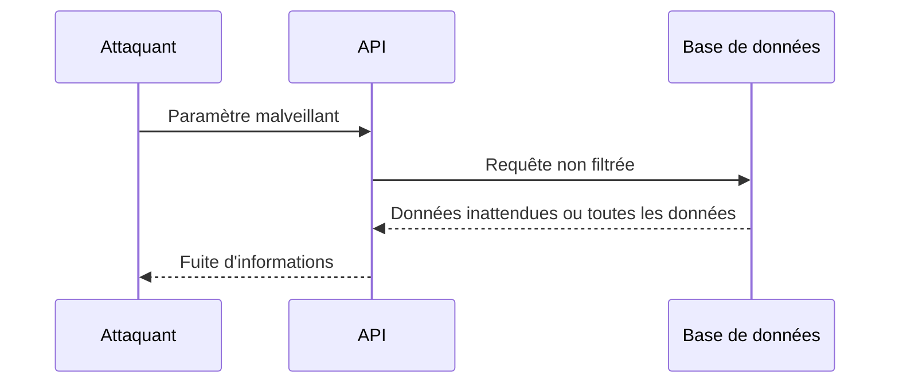
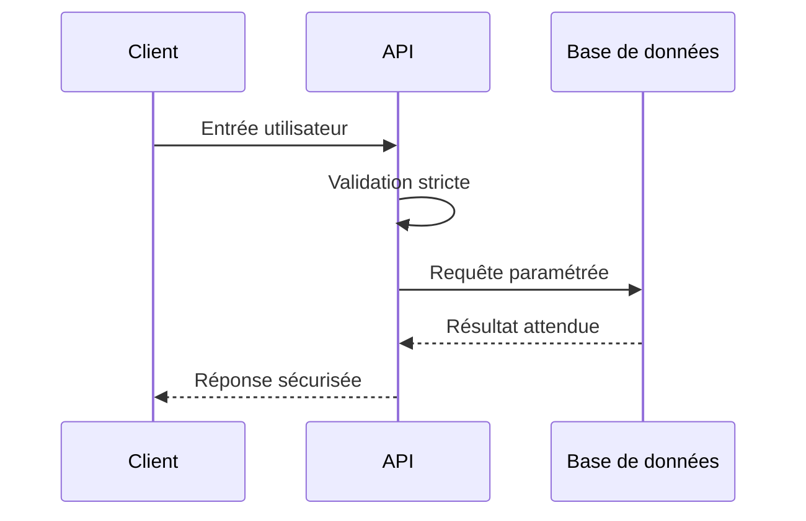

# **2.9 — API8 : Injection**

L’injection est une vulnérabilité classique qui touche les systèmes depuis des décennies, mais elle reste très présente dans les API modernes.
Elle survient lorsqu’une API insère des données **non contrôlées** provenant d’un utilisateur dans une commande, une requête ou une instruction interne.

Les API, par leur nature, reçoivent et traitent des données structurées (souvent au format JSON). Si ces données ne sont pas correctement validées, elles peuvent altérer le comportement du système.

---

# **2.9.1 — Définition**

Une vulnérabilité d’injection apparaît lorsqu’un attaquant réussit à faire interpréter ses données comme **une commande**, **du code**, ou **une instruction**, et non comme un simple texte.

L’injection peut toucher de nombreux composants :

* Base de données
* Moteur de recherche
* Interpréteur de commandes
* Langages embarqués
* Système de templates
* ORM insuffisamment protégé
* Deserialisation non sécurisée

---

# **2.9.2 — Formes courantes d’injection dans les API**

Les formes les plus fréquentes sont :

### **1. Injection SQL**

Manipulation des requêtes SQL via des paramètres non filtrés.

### **2. Injection NoSQL**

Manipulation des requêtes MongoDB, Elasticsearch, Redis, etc.

### **3. Injection de commandes système**

Exécution de commandes sur le serveur.

### **4. Injection de template**

Manipulation de moteurs de templates (ex : Mustache, Twig).

### **5. Injection dans des frameworks ou ORM**

Manipulation d’objets ou de filtres internes.

Les API, en acceptant des entrées complexes, sont particulièrement exposées.

---

# **2.9.3 — Exemple simple : Injection SQL**

Une API attend un paramètre `id` :

```
GET /utilisateur?id=1
```

Si l’API génère la requête SQL suivante :

```
SELECT * FROM utilisateurs WHERE id = 1;
```

L’attaquant peut tenter :

```
GET /utilisateur?id=1 OR 1=1
```

Ce qui devient :

```
SELECT * FROM utilisateurs WHERE id = 1 OR 1=1;
```

`1=1` est toujours vrai → toute la table est renvoyée.

---

# **2.9.4 — Schéma d’une API vulnérable**



---

# **2.9.5 — Exemple simple : Injection NoSQL**

Certaines API transmettent directement des objets JSON à la base NoSQL.

Requête prévue :

```
{
  "nom": "Alice"
}
```

Requête malveillante :

```
{
  "nom": { "$ne": null }
}
```

Cela permettrait par exemple de récupérer tous les utilisateurs.

---

# **2.9.6 — Exemple simple : Injection de commandes**

```
POST /convertir
{
  "fichier": "image.png",
  "format": "jpg"
}
```

Un attaquant peut injecter :

```
{
  "fichier": "image.png; rm -rf /"
}
```

Si l’API concatène ces valeurs dans une commande système,
elle exécute des commandes sur le serveur.

---

# **2.9.7 — Pourquoi les API sont-elles particulièrement vulnérables ?**

### **1. Elles reçoivent beaucoup de données du client**

Les API manipulent souvent des payloads volumineux.

### **2. Les objets JSON donnent une illusion de sécurité**

Mais les champs peuvent être manipulés.

### **3. Les frameworks modernes cachent parfois les requêtes**

L’ORM peut être mal utilisé.

### **4. Les API NoSQL sont exposées à des syntaxes avancées**

Les opérateurs (`$gt`, `$ne`, `$regex`) peuvent être abusés.

---

# **2.9.8 — Impacts de l’injection**

Une injection peut permettre :

* d’accéder à toutes les données,
* de supprimer ou modifier des données,
* de contourner les mécanismes d’authentification,
* de faire crasher le serveur,
* d’exécuter des commandes système,
* d’accéder à d’autres services internes.

C’est l’une des vulnérabilités les plus dangereuses.

---

# **2.9.9 — Stratégies de prévention**

---

## **1. Toujours valider et filtrer les entrées**

* types (string, nombre, booléen),
* formats,
* longueurs.

Aucune donnée utilisateur ne doit être “acceptée comme elle”.

---

## **2. Utiliser des requêtes paramétrées**

Pour éviter que les valeurs soient interprétées comme du code.

---

## **3. Éviter la construction dynamique de requêtes**

Ne pas faire :

```
"... WHERE nom = '" + input + "'"
```

---

## **4. Filtrer les opérateurs dangereux (NoSQL)**

Interdire les opérateurs `$ne`, `$gt`, `$regex`, sauf cas très contrôlés.

---

## **5. Ne jamais exécuter de commandes système avec des entrées directes**

Utiliser des API sécurisées au lieu d’appels shell.

---

## **6. Ne jamais exposer les logs internes directement**

Les erreurs SQL ne doivent jamais apparaître dans les réponses.

---

# **2.9.10 — Schéma d’une API correctement protégée**



---

# **2.9.11 — Résumé du sous-chapitre**

* Une injection survient lorsque des données utilisateur sont interprétées comme du code ou une commande.
* Les API y sont particulièrement exposées car elles acceptent souvent des données complexes.
* Les impacts sont graves : accès total, modification, destruction, exécution de commandes.
* La protection repose sur la validation stricte, les requêtes paramétrées et l’interdiction des constructions dynamiques.
