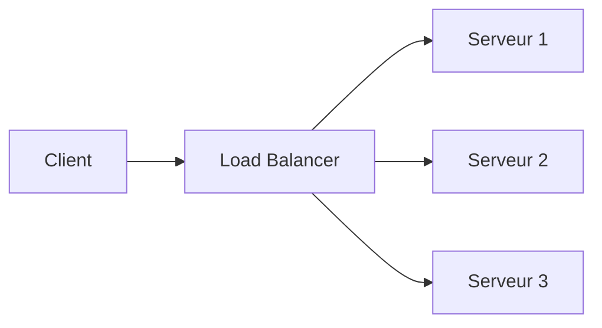
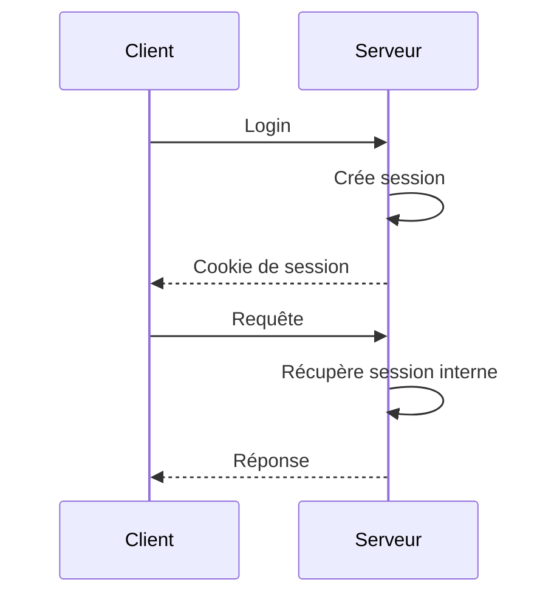
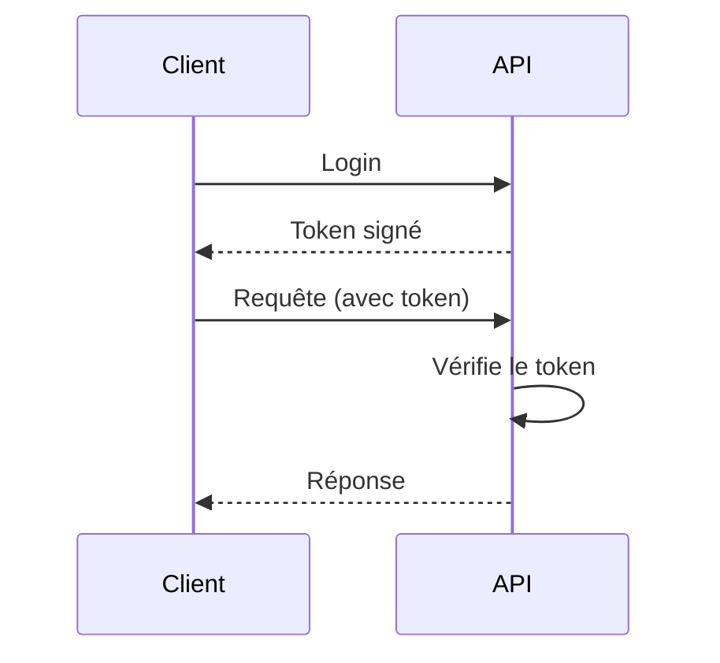

# **3.1 — Pourquoi les APIs n’utilisent pas de sessions ?**

Dans les applications web classiques (avant l’ère des API), la gestion de l’authentification reposait sur un principe simple : **les sessions serveur**.
L’utilisateur se connectait, le serveur créait une session en mémoire, et toutes les requêtes suivantes utilisaient cette session.

Mais les API modernes **n’utilisent presque jamais de sessions serveur**.
Elles utilisent d’autres mécanismes, principalement basés sur des **tokens**.

Ce chapitre explique pourquoi.

---

# **3.1.1 — Rappel : comment fonctionne une session classique ?**

Dans un site web traditionnel :

### 1. L’utilisateur se connecte

→ Le serveur vérifie son mot de passe.

### 2. Le serveur crée une session

→ Il stocke l’identité de l’utilisateur dans sa mémoire interne (ou base Redis).

### 3. Le serveur renvoie un cookie de session

→ Le navigateur l’enverra à chaque requête.

### 4. Chaque nouvelle requête récupère la session stockée côté serveur

→ Le serveur “se souvient” de l’utilisateur.

Ce système fonctionne bien… **pour un navigateur web**, dans un contexte simple.

Mais il ne convient pas aux API modernes.

---

# **3.1.2 — Pourquoi ce modèle ne fonctionne pas pour les APIs ?**

Les API ont des contraintes spécifiques que les sessions ne peuvent pas gérer efficacement.

---

## **1. Les API doivent être stateless**

Comme vu en section 1.5, une API est conçue pour :

* traiter chaque requête indépendamment,
* ne rien stocker en mémoire entre les appels,
* être capable de fonctionner sur plusieurs serveurs en parallèle.

Les sessions introduisent de l'état (“stateful”), ce qui casse ce principe.

---

## **2. Les API doivent être scalables**

Un système API moderne ressemble à ceci :

Si un utilisateur envoie 10 requêtes successives, elles peuvent aller :

* une fois au serveur 1,
* deux fois au serveur 3,
* cinq fois au serveur 2, etc.

Avec des sessions serveur :

* chaque serveur doit partager la session avec les autres,
* ou le client doit toujours aller au même serveur (sticky session),
* ce qui rend l’infrastructure complexe et moins performante.

→ Les tokens résolvent ce problème car **ils transportent l'identité dans la requête**.

---

## **3. Les API doivent être utilisables par différents types de clients**

Une API n’est pas faite uniquement pour un navigateur web.

Elle peut être utilisée par :

* une application mobile,
* un script Python,
* un service backend,
* un IoT,
* un service partenaire.

Ces clients n'utilisent pas toujours :

* des cookies,
* un état persistant,
* une session navigateur.

Le modèle session-cookie est donc **inadapté**.

---

## **4. Les API doivent autoriser la communication entre machines**

Les services internes doivent parfois s'appeler entre eux.
Un service A peut appeler le service B via API.

Une session serveurs → inapplicable.
Les machines doivent s’authentifier **avec des tokens**, pas avec des sessions.

---

## **5. Les API nécessitent souvent des permissions granulaires**

Les systèmes modernes utilisent :

* des scopes,
* des permissions,
* des rôles dynamiques,
* des durées de vie courtes.

Gérer cela via des sessions serait complexe et peu flexible.

---

# **3.1.3 — Schéma comparatif**

### **Session serveur (web traditionnel)**

Le serveur conserve l'état.

---

### **API stateless avec tokens**

Le serveur ne stocke rien : le token contient l'identité.

---

# **3.1.4 — Les limites fondamentales des sessions pour les API**

| Problème                            | Pourquoi c’est un souci pour une API       |
| ----------------------------------- | ------------------------------------------ |
| Session stockée côté serveur        | Rend l’API stateful → anti-scalabilité     |
| Besoin de sticky sessions           | Empêche une répartition efficace du trafic |
| Cookies obligatoires                | Incompatibles avec beaucoup de clients     |
| Difficulté d’autoriser des machines | Les robots ne gèrent pas les cookies       |
| Sessions longues et persistantes    | Risque accru de détournement               |

La plupart des architectures modernes **refusent volontairement** les sessions serveur pour éviter ces problèmes.

---

# **3.1.5 — Les API modernes utilisent donc des tokens**

À la place des sessions, les API utilisent :

* API Keys,
* JWT,
* opaque tokens,
* HMAC signatures,
* OAuth2 access tokens.

Ces mécanismes permettent :

* un modèle 100% stateless,
* une meilleure scalabilité,
* une compatibilité multi-clients,
* un contrôle granulaire des permissions,
* une expiration simple et prévisible.

---

# **3.1.6 — Résumé du sous-chapitre**

* Les sessions classiques reposent sur un état côté serveur.
* Les API modernes doivent être stateless, scalables et accessibles par divers clients.
* Le modèle session-cookie est incompatible avec ces contraintes.
* Les API utilisent des tokens car ils transportent l'identité sans nécessiter d’état serveur.
* Le modèle token-based est mieux adapté à la sécurité, la performance et la flexibilité des API.