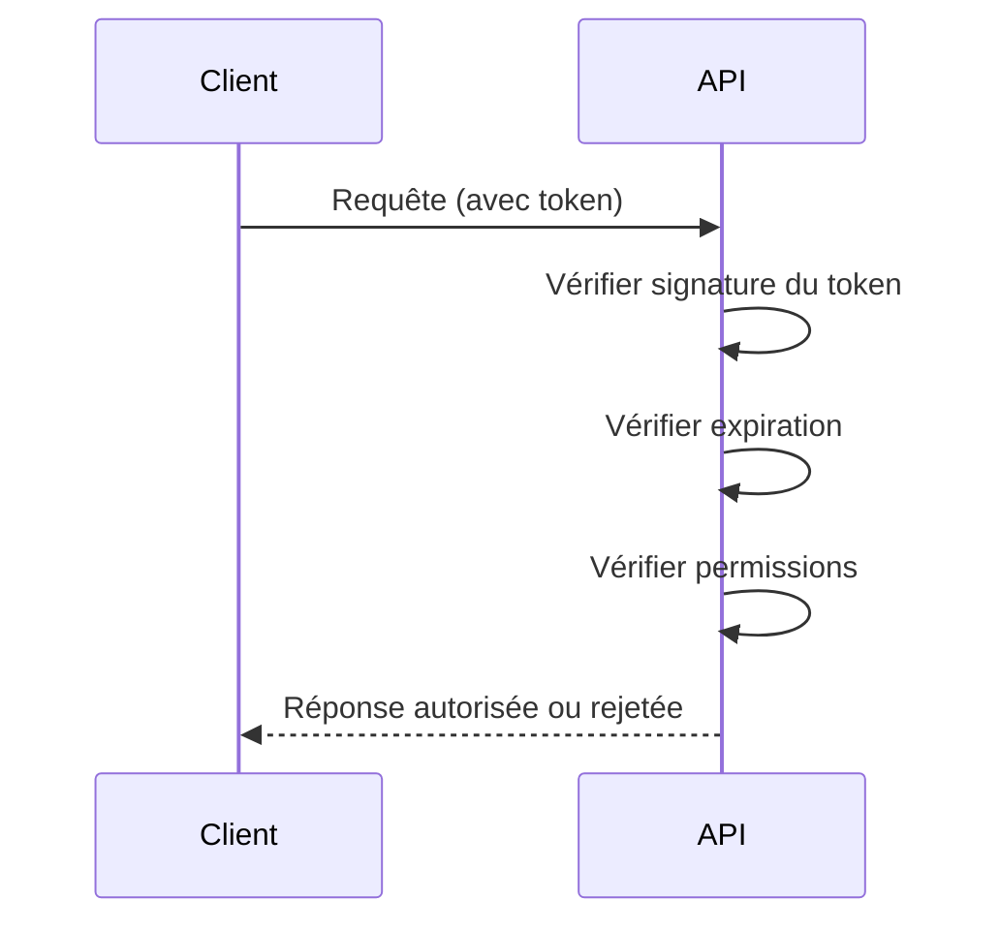
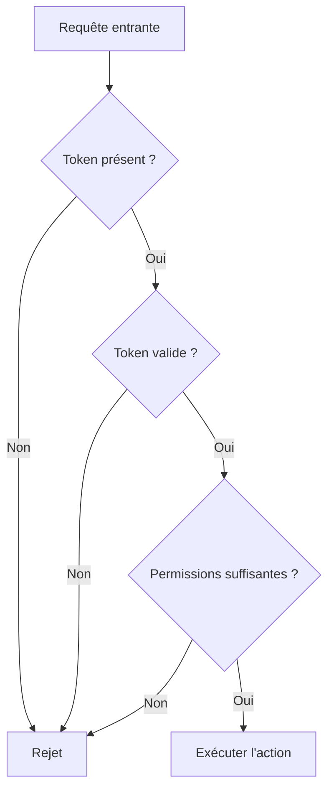

# **3.2 — API stateless : implications sur la sécurité**

Le caractère **stateless** d’une API (absence d’état côté serveur) n’est pas seulement une décision technique :
c’est un élément fondamental qui influence profondément la manière d’authentifier, d’autoriser et de sécuriser chaque requête.

Dans ce chapitre, nous allons voir en détail les implications de ce modèle sur la sécurité.

---

# **3.2.1 — Rappel : que signifie “stateless” ?**

Une API stateless :

* **ne conserve aucune session côté serveur**,
* ne mémorise rien entre deux requêtes,
* ne retient pas quel utilisateur a fait quoi précédemment,
* traite chaque requête comme indépendante.

L’identité, les permissions et le contexte doivent donc être fournis **à chaque appel**.

---

# **3.2.2 — Implication n°1 : l’authentification doit être systématique**

Dans une API stateless :

* **chaque requête doit contenir un token valide**,
* l’API doit obligatoirement vérifier ce token à chaque appel,
* une requête sans authentification → rejet immédiat.

Ce mécanisme rend l’API beaucoup plus prévisible et sécurisée.

### Exemple

```
GET /profil
Authorization: Bearer <token>
```

Le token *remplace* la session.

---

# **3.2.3 — Implication n°2 : l’autorisation doit être revalidée à chaque requête**

Même si l’authentification est valide, l’autorisation doit également l’être.

L’API doit vérifier :

* **qui est l’utilisateur ?**
* **à quel rôle appartient-il ?**
* **quelle action demande-t-il ?**
* **sur quelle ressource ?**

Et ce, **à chaque requête**, car le serveur ne stocke aucune session.

---

# **3.2.4 — Implication n°3 : les tokens deviennent extrêmement importants**

Les tokens (ex : JWT, opaque tokens) deviennent :

* la preuve d’identité,
* la preuve des permissions,
* l’élément central de la sécurité API.

Si un token est :

* volé,
* mal signé,
* trop permissif,
* trop long à expirer,

→ **toute la sécurité s’effondre**.

Le modèle stateless donne énormément de pouvoir au token.

---

# **3.2.5 — Schéma : vérification dans une API stateless**



Le serveur ne stocke rien, il **revalide tout** à chaque appel.

---

# **3.2.6 — Implication n°4 : pas de persistance = moins de surface d’attaque**

Une API stateless :

* ne stocke pas d’informations sensibles côté serveur (comme les sessions),
* n’a pas de “session hijacking”,
* n’a pas de “session fixation”,
* n’a pas besoin de synchroniser des sessions entre serveurs,
* est plus résiliente en cas de panne.

→ Moins de surfaces, moins de risques.

---

# **3.2.7 — Implication n°5 : les attaques deviennent 100% centrées sur les tokens**

Dans une API stateless, l’attaquant ne ciblera plus :

* une session stockée côté serveur (elle n’existe pas),
* un identifiant de session en cookie,
* un mécanisme persistant.

Il tentera plutôt de voler ou manipuler :

* un JWT,
* une API Key,
* un token OAuth2,
* une signature HMAC.

Le modèle stateless déplace les risques **du serveur vers le token transporté**.

---

# **3.2.8 — Implication n°6 : la gestion de l’expiration devient cruciale**

Une session serveur peut être invalidée immédiatement.
Mais un token stateless… **ne peut pas être “désactivé” par le serveur**, car il est auto-porteur.

C’est pourquoi :

* les tokens doivent avoir une **durée de vie très courte**,
* les tokens doivent pouvoir être **rotés** (renouvellement),
* on doit avoir un mécanisme pour gérer l’invalidation forcée (blacklist, rotation clé, etc.).

---

# **3.2.9 — Implication n°7 : le serveur doit être très strict sur la validation des données**

Parce que l’API n’a aucun état, elle ne doit **jamais** faire confiance aux données entrant dans une requête.

Elle doit vérifier :

* les paramètres,
* les IDs,
* les objets JSON,
* les types,
* les tailles,
* les permissions.

Cela découle naturellement du Zero Trust.

---

# **3.2.10 — Exemple : mauvaise gestion dans une API stateless**

Une API naïve :

1. vérifie seulement si le token est signé,
2. ne vérifie pas l’expiration du token,
3. ne vérifie pas les permissions par endpoint.

Résultat :

* un token volé reste valable longtemps,
* un utilisateur peut accéder à des endpoints admin,
* une simple fuite de token suffit pour prendre la main sur l’API.

---

# **3.2.11 — Exemple : API stateless sécurisée**

### Requête reçue → l’API effectue :

* Vérification de la signature du token
* Vérification de l’algorithme de signature
* Vérification de l’expiration
* Vérification du public/issuer
* Vérification des permissions (claims)
* Vérification de la ressource demandée
* Vérification du contexte (optionnel)

Si tout est OK → accès.
Sinon → rejet.

---

# **3.2.12 — Schéma global des implications sécurité**



Ce schéma illustre que **tout dépend du token**, car l’API ne stocke rien.

---

# **3.2.13 — Résumé du sous-chapitre**

* Le modèle stateless impose de vérifier **authentification + autorisation** à chaque requête.
* Le token devient l’élément central de sécurité.
* Le backend n’ayant aucune session, il revalide tout à chaque appel.
* Le modèle stateless réduit les surfaces d’attaque côté serveur mais augmente l’importance du token.
* L’expiration courte et la rotation des tokens sont indispensables.
* Zero Trust + Stateless = la base de la sécurité API moderne.