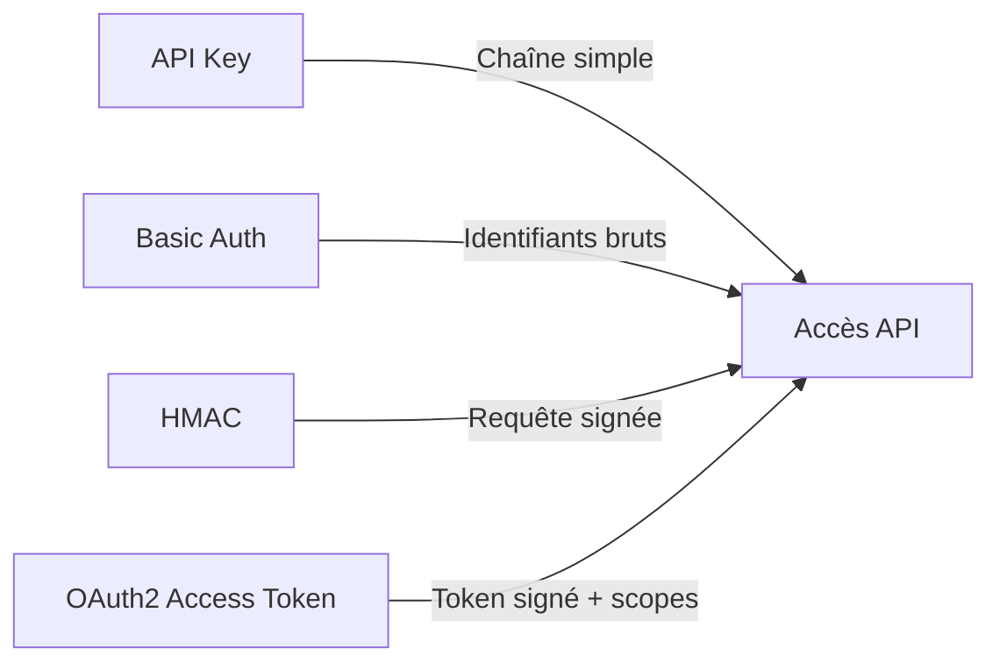

# **3.3 — Les différents mécanismes d’authentification API (API Key, Basic Auth, HMAC, OAuth2)**

Les API modernes peuvent utiliser plusieurs méthodes pour authentifier un client.
Chaque méthode répond à des besoins différents : simplicité, sécurité, compatibilité, résistance aux attaques, etc.

Ce chapitre présente clairement les quatre mécanismes les plus utilisés :

* **API Key**
* **Basic Auth**
* **HMAC**
* **OAuth2 (vue high-level, sans Identity Provider)**

Objectif : comprendre **quand choisir quoi**.

---

# **3.3.1 — API Key**

## **Principe**

Une API Key est un identifiant unique, généralement une chaîne de caractères, fournie au client.
Le client doit la transmettre à chaque requête, souvent dans un en-tête :

```
GET /donnees
X-API-Key: abcdef123456
```

## **Caractéristiques**

* Simple à utiliser
* Facile à partager
* Idéale pour des services machine-to-machine simples
* Ne porte **aucune information** (ce n’est pas un token signé)

## **Limites**

* Si elle est volée → accès complet
* Pas de permissions granulaires (souvent tout ou rien)
* Pas d’expiration par défaut
* Impossible de vérifier son intégrité (ce n’est pas signé)

## **Usage typique**

* APIs publiques
* Intégrations simples
* API de services externes (ex : météo, géolocalisation)

---

# **3.3.2 — Basic Auth**

## **Principe**

La Basic Auth transmet un couple :

```
username:password
```

encodé en Base64 dans l’en-tête HTTP :

```
Authorization: Basic dXNlcjpwYXNz
```

## **Caractéristiques**

* Très simple
* Peu adapté aux API modernes
* À utiliser **uniquement sur HTTPS**

## **Limites**

* Le mot de passe circule à chaque requête (même si chiffré par HTTPS)
* Pas de permissions fines
* Pas d’expiration
* Très vulnérable en cas de fuite

## **Usage typique**

* Tests
* Scripts internes simples
* Services très basiques (jamais en production ouverte)

---

# **3.3.3 — HMAC (Hash-Based Message Authentication Code)**

## **Principe**

HMAC utilise :

* une **clé secrète partagée** entre le client et le serveur,
* un **algorithme de hachage**,
* un **message** (la requête elle-même).

Le client signe la requête :

```
signature = HMAC( secret, requete )
```

Et envoie cette signature au serveur :

```
X-Signature: <signature>
```

Le serveur recrée la même signature et compare.

## **Caractéristiques**

* Très sécurisé pour les appels machine-to-machine
* Empêche la falsification de requêtes
* Résistant aux attaques de relecture (si timestamp ou nonce)
* Pas besoin de partager un mot de passe, mais un secret

## **Limites**

* Complexité plus élevée
* Impossible pour les navigateurs (sécurité du secret)
* Doit être synchronisé (clé partagée)

## **Usage typique**

* Webhooks sécurisés
* APIs financières / bancaires
* Communication entre microservices
* Services internes nécessitant une forte sécurité

---

# **3.3.4 — OAuth2 (vision high-level)**

OAuth2 est un **standard moderne d’autorisation**, utilisé par les plus grandes plateformes (Google, Microsoft, GitHub…).
Il permet d’obtenir des **access tokens** et, parfois, des **refresh tokens**.

Il ne s’agit pas d’authentification à proprement parler, mais d’un **cadre d’autorisation**.

Nous allons ici en rester à une vision simple.

## **Principe simplifié**

1. Un utilisateur s’authentifie auprès d’un serveur d’autorisation (non couvert ici).
2. Ce serveur délivre un **access token**.
3. Le client envoie ce token à chaque requête API :

```
Authorization: Bearer <access_token>
```

4. L’API vérifie le token (signature, expiration, permissions).

## **Caractéristiques**

* Très sécurisé
* Scalabilité excellente (stateless)
* Permet des permissions granulaires via les **scopes**
* Compatible avec la plupart des architectures modernes

## **Limites**

* Complexe à implémenter soi-même
* Requiert une infrastructure d'identité (Keycloak, Auth0…)
* Requiert la gestion des tokens (expiration, rotation)

## **Usage typique**

* APIs web et mobiles
* Applications nécessitant des permissions granulaires
* Communication inter-services via tokens JWT
* Applications distribuées

---

# **3.3.5 — Comparaison simple**

| Méthode        | Sécurité       | Complexité  | Permissions fines  | Expiration          | Idéal pour                  |
| -------------- | -------------- | ----------- | ------------------ | ------------------- | --------------------------- |
| **API Key**    | Faible ↘       | Très simple | Non                | Non                 | Services simples            |
| **Basic Auth** | Faible ↘       | Très simple | Non                | Non                 | Tests, outils internes      |
| **HMAC**       | Élevée ↑       | Moyenne     | Oui (côté serveur) | Oui (via timestamp) | Services internes, webhooks |
| **OAuth2**     | Très élevée ↑↑ | Élevée      | Oui                | Oui                 | APIs modernes, web/mobile   |

---

# **3.3.6 — Schéma comparatif**



---

# **3.3.7 — Quand choisir quelle méthode ?**

### **API Key**

→ Quand la simplicité prime sur la sécurité.
Exemple : API météo, intégration partenaire basique.

### **Basic Auth**

→ À éviter en production.
Utile pour tests ou services internes très simples.

### **HMAC**

→ Pour de la sécurité élevée entre deux serveurs maîtrisés.
Exemple : webhook Stripe.

### **OAuth2**

→ Pour toutes les APIs professionnelles modernes nécessitant :

* utilisateurs humains,
* apps mobiles,
* permissions fines,
* tokens courts,
* bonne scalabilité.

---

# **3.3.8 — Résumé du sous-chapitre**

* L'authentification API peut être simple (API Key) ou très robuste (OAuth2, HMAC).
* Chaque mécanisme répond à un besoin différent.
* Les API modernes utilisent principalement OAuth2 ou HMAC.
* Les API Key et Basic Auth doivent être réservées à des contextes limités.
* Le bon choix dépend du niveau de sécurité, du type de client et du besoin de permission fine.