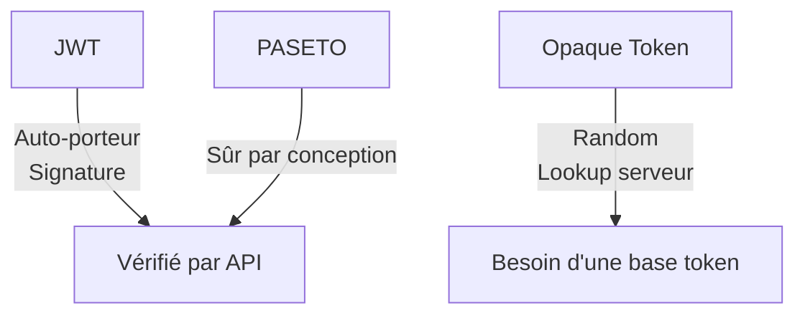

# **3.4 — Tokens porteurs (JWT, opaque tokens, PASETO)**

Les API modernes s’appuient sur des **tokens porteurs** pour gérer l’authentification et l’autorisation dans un modèle stateless.
Un *token porteur* (bearer token) est un jeton qui donne des droits à celui qui le possède.
Si quelqu’un l’obtient, il peut agir comme le véritable utilisateur.

Ce sous-chapitre explique :

* ce qu’est un token porteur,
* les différences entre **JWT**, **opaque tokens**, et **PASETO**,
* leurs avantages et limites,
* leurs implications sécurité.

---

# **3.4.1 — Qu’est-ce qu’un token porteur ?**

Un **bearer token** est un jeton transmis par le client à chaque requête :

```
Authorization: Bearer <token>
```

L’API vérifie ce token pour :

* identifier l’utilisateur,
* connaître ses permissions,
* s’assurer qu’il est toujours valide.

**Si le token est volé → l’attaquant devient l’utilisateur.**
D’où la nécessité de bien le protéger.

---

# **3.4.2 — Trois grandes familles de tokens**

Nous allons explorer :

* **JWT (JSON Web Token)**
* **Opaque Tokens**
* **PASETO (Platform-Agnostic SEcurity TOkens)**

---

# **3.4.3 — JWT (JSON Web Token)**

Le JWT est le token le plus utilisé aujourd’hui.

### **Structure**

Il contient 3 parties encodées en Base64 :

```
header.payload.signature
```

### **Header**

Indique l’algorithme de signature, ex :

```
{ "alg": "RS256", "typ": "JWT" }
```

### **Payload**

Contient des informations (claims) :

* `sub`: identifiant utilisateur
* `exp`: expiration
* `roles`: permissions
* autres données métier si nécessaire

Exemple :

```
{
  "sub": "123",
  "roles": ["user"],
  "exp": 1712345678
}
```

### **Signature**

Permet de vérifier :

* que le token n’a pas été modifié,
* qu’il vient de la bonne autorité.

---

## **Avantages des JWT**

* **Stateless** : aucune session à gérer
* **Signature vérifiable** par l’API
* Contient des informations utiles
* Compatible avec OAuth2
* Très utilisé dans l’industrie

---

## **Limites des JWT**

* Trop d’informations peuvent être stockées dedans → fuite possible
* Ils **ne peuvent pas être révoqués facilement** (token auto-porteur)
* S’ils ont une longue durée de vie → très dangereux en cas de vol
* L’algorithme HS256 peut créer des failles si mal configuré

---

# **3.4.4 — Opaque Tokens**

Un opaque token est une simple chaîne aléatoire :

```
x83jJdk292jsla9221qodmA==
```

Le serveur ne peut pas l’interpréter :
il doit consulter un **stockage interne** (token store) pour trouver :

* l’utilisateur,
* les permissions,
* l’expiration.

### **Avantages**

* Rien à décoder → pas de fuite de données
* Très facile à révoquer (il suffit de supprimer l’entrée du store)
* Très simple

### **Limites**

* Nécessite un serveur d’autorisation connecté pour valider le token
* Moins adapté aux architectures massivement distribuées (need central storage)

---

# **3.4.5 — PASETO (moderne et plus sécurisé)**

PASETO est une alternative moderne aux JWT.
Il vise à corriger les principaux problèmes des JWT.

Différences majeures :

* Pas d’algorithme faible (pas de HS256 mal configuré)
* Standard plus simple et plus strict
* Moins d’ambiguïté → moins d’erreurs d’implémentation
* Conçu pour éviter les pièges des JWT

### Deux formats :

* **`local`** → chiffré
* **`public`** → signé (comme un JWT mais plus sûr)

### Avantages

* Plus sûr par conception
* Moins de risques de mauvaise configuration
* Plus simple à utiliser correctement

### Limites

* Moins largement adopté que les JWT
* Moins supporté par les bibliothèques et plateformes

---

# **3.4.6 — Comparaison visuelle des trois types**



---

# **3.4.7 — Quand choisir quoi ?**

### **JWT**

✔ Token stateless
✔ Systèmes distribués
✔ OAuth2 standard
✘ Faible révocation
✘ Attention aux mauvaises pratiques

**→ Meilleur choix par défaut**, si bien configuré.

---

### **Opaque Token**

✔ Facile à révoquer
✔ Pas de fuite de données dans le token
✘ Nécessite un token store central
✘ Pas totalement stateless

**→ Idéal si la révocation fréquente est cruciale.**

---

### **PASETO**

✔ Plus sûr que JWT
✔ Conception moderne
✘ Peu répandu
✘ Moins d’outils disponibles

**→ Parfait si l’équipe maîtrise et si l’écosystème le permet.**

---

# **3.4.8 — Implications sécurité**

### **1. Désactivation immédiate difficile (JWT)**

Le client peut continuer à utiliser un token expirant dans 1h.

### **2. Un token est un secret : il doit être protégé comme un mot de passe**

Jamais :

* dans le localStorage,
* dans une URL,
* dans les logs.

### **3. Le token porte les permissions**

Un vol de token → prise de contrôle.

### **4. L’algorithme de signature doit être choisi avec soin**

RS256 préféré à HS256 pour JWT.

### **5. Le token doit être court**

Durée recommandée : **5 à 15 minutes**.

---

# **3.4.9 — Résumé du sous-chapitre**

* Un bearer token donne accès à l’API → il doit être protégé.
* Trois types : JWT (le plus courant), opaque tokens (révocables), PASETO (plus moderne).
* Les JWT sont auto-porteurs : ils contiennent des informations utiles mais difficiles à révoquer.
* Les opaque tokens nécessitent une base mais offrent un meilleur contrôle.
* Les PASETO simplifient la sécurité grâce à un design plus strict.
* Le token est au cœur de la sécurité de l’API : s’il est compromis, l’utilisateur est compromis.
