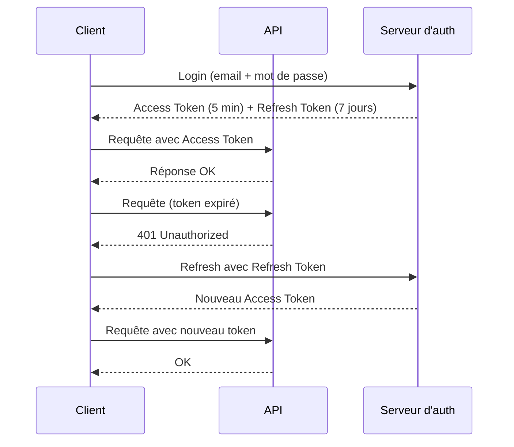
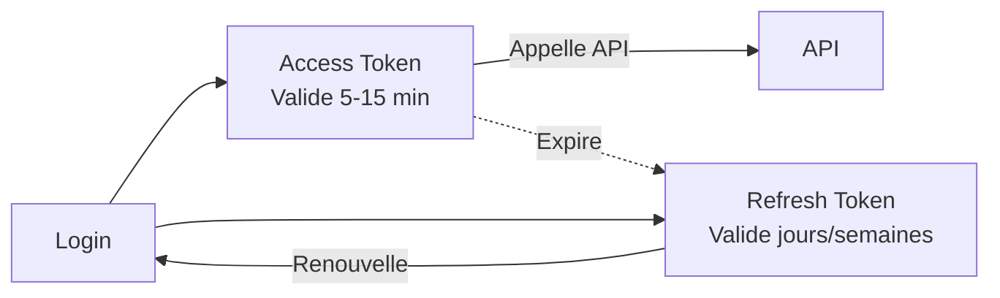

# **3.5 — Access Tokens vs Refresh Tokens**

Les API modernes utilisent presque toujours **deux types de tokens distincts** :

* **Access Token** → permet d'appeler l’API
* **Refresh Token** → permet d’obtenir un nouveau Access Token

Cette séparation est essentielle pour la sécurité, la scalabilité et la bonne gestion de l’expiration dans un environnement stateless.

Ce chapitre explique clairement :

* pourquoi deux tokens sont nécessaires,
* comment ils fonctionnent,
* quels risques ils couvrent,
* comment ils interagissent,
* comment les API modernes les utilisent.

---

# **3.5.1 — Access Token : le passe d’accès court terme**

L’**Access Token** est le jeton utilisé pour accéder aux endpoints API.

```
Authorization: Bearer <access_token>
```

C’est lui qui contient (selon le type de token) :

* l’identité de l’utilisateur,
* les rôles,
* les permissions,
* les scopes,
* l’expiration.

### **Caractéristiques essentielles**

| Critère      | Access Token                 |
| ------------ | ---------------------------- |
| Durée de vie | Très courte (5 à 15 minutes) |
| Utilisation  | Appels API                   |
| Révocation   | Difficile (si JWT)           |
| Risques      | Un vol = un accès immédiat   |
| Contenu      | Claims + permissions         |

Pourquoi très court ?
Parce qu’un accès prolongé augmente le risque en cas de vol.

---

# **3.5.2 — Refresh Token : le ticket longue durée**

Le **Refresh Token** n’est **jamais utilisé pour appeler l’API principale**.

Il sert uniquement à obtenir **un nouveau Access Token** quand celui-ci expire.

Le client fait :

```
POST /auth/refresh
{
  "refresh_token": "<refresh_token>"
}
```

Et reçoit un nouveau :

```
access_token
```

### **Caractéristiques**

| Critère      | Refresh Token                          |
| ------------ | -------------------------------------- |
| Durée de vie | Longue (jours ou semaines)             |
| Stockage     | Très sécurisé (jamais en localStorage) |
| Utilisation  | Renouveler l’Access Token              |
| Révocation   | Possible côté serveur                  |
| Risques      | S’il fuit → accès continu (danger)     |

Le Refresh Token agit comme une **clé de rechargement**.

---

# **3.5.3 — Pourquoi séparer les deux ?**

Pourquoi ne pas avoir un token unique, valable longtemps ?

Parce que ce serait **très dangereux**.

## **Raison 1 : réduire l’impact d’un vol**

Un Access Token volé est valide **seulement quelques minutes**.

Un Refresh Token, lui, reste toujours côté client, dans un espace sécurisé.

---

## **Raison 2 : permettre une révocation plus propre**

Les Access Tokens sont stateless → difficilement révoquables.
Les Refresh Tokens sont stockés dans une base → révocation immédiate possible.

---

## **Raison 3 : éviter de réauthentifier l’utilisateur trop souvent**

Re-demander le mot de passe toutes les 15 minutes serait impraticable.

Le Refresh Token permet :

* sessions longues,
* sans stockage de session serveur,
* tout en restant sécurisé.

---

## **Raison 4 : améliorer la sécurité du cycle de vie**

En séparant :

* accès court = Access Token
* identité longue durée = Refresh Token

→ On réduit fortement les risques d’escalade.

---

# **3.5.4 — Schéma : cycle Access/Refresh**



Ce cycle est le fonctionnement standard des API modernes.

---

# **3.5.5 — Règles de sécurité essentielles**

### **Règle 1 — L’Access Token doit être très court**

5 à 15 minutes.

Plus il vit longtemps, plus la surface d’attaque augmente.

---

### **Règle 2 — Le Refresh Token doit être extrêmement protégé**

Il doit être stocké :

* dans un **cookie httpOnly** sécurisé,
* jamais dans `localStorage`,
* jamais dans la mémoire JavaScript.

---

### **Règle 3 — Le Refresh Token doit être révoquable**

Le serveur doit pouvoir :

* invalider un Refresh Token,
* révoquer tous les tokens d’un utilisateur,
* gérer la rotation (voir section 3.8 plus tard).

---

### **Règle 4 — Rotation du Refresh Token**

À chaque renouvellement, un nouveau Refresh Token doit être délivré.

Pourquoi ?

* empêcher les attaques par vol silencieux
* “tuer” la session si un ancien token est réutilisé

---

# **3.5.6 — Différence fondamentale**

### **Access Token = “carte d’embarquement”**

Valable quelques minutes.
Non révoquable facilement.
Simple à vérifier.

### **Refresh Token = “passeport”**

Durée de vie longue.
Stockage protégé.
Révoquable côté serveur.

---

# **3.5.7 — Analogie pédagogique**

Imagine un cinéma :

* **Access Token** = ton ticket d’entrée (valable pour une séance)
* **Refresh Token** = ta carte d’abonnement (valable plusieurs mois)

La carte permet d’obtenir de nouveaux tickets,
mais le ticket ne permet jamais d’obtenir une carte.

---

# **3.5.8 — Schéma comparatif**



---

# **3.5.9 — Résumé du sous-chapitre**

* Les API modernes utilisent deux types de tokens : Access Token (court) et Refresh Token (long).
* L’Access Token est utilisé pour les appels API ; il expire vite.
* Le Refresh Token sert à obtenir un nouvel Access Token quand celui-ci expire.
* Cette séparation augmente fortement la sécurité.
* Le Refresh Token doit être stocké dans un environnement extrêmement sécurisé.
* Le cycle Access/Refresh est standard dans OAuth2 et la plupart des architectures modernes.