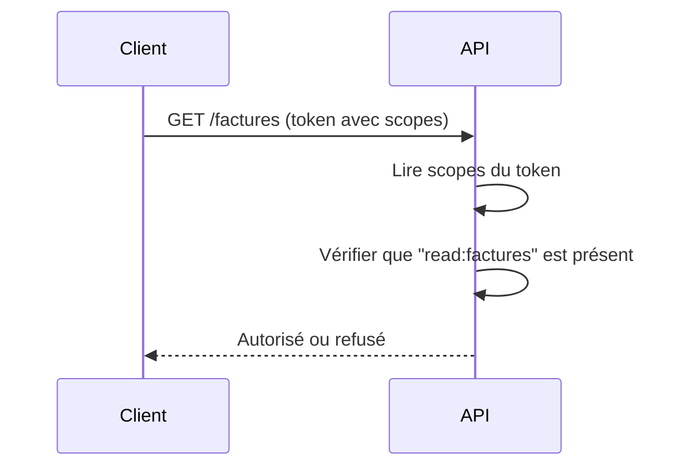
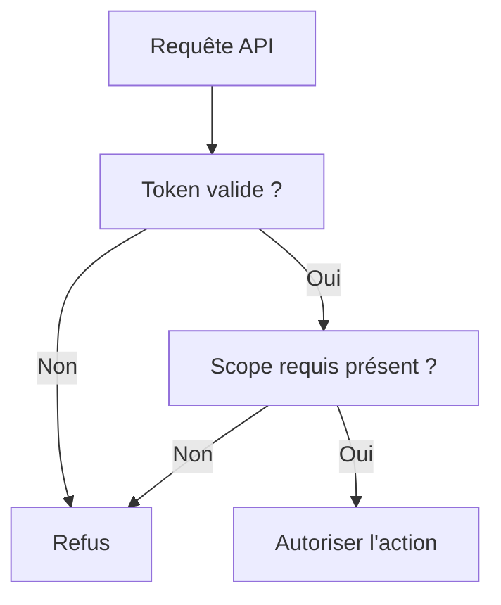

# **3.6 — Scopes & Permissions**

Les **scopes** et les **permissions** définissent *ce qu’un utilisateur ou une application a le droit de faire* lorsqu’ils appellent une API.
Ils constituent la base de l’autorisation moderne — et sans eux, une API ne peut pas contrôler de manière fine les accès.

Ce chapitre explique :

* la différence entre identité et permissions,
* ce que sont les scopes,
* comment ils fonctionnent,
* comment ils se combinent avec les tokens,
* comment les API les utilisent pour sécuriser leurs endpoints.

---

# **3.6.1 — Identité ≠ Permissions**

L’erreur la plus fréquente consiste à croire que connaître l’identité d’un utilisateur suffit.

**Non.**

Identité = *Qui est l’utilisateur ?*
Permissions = *Qu’a-t-il le droit de faire ?*

Exemple :

* Alice est **utilisatrice**
  → identité

* Alice peut **voir ses factures mais pas celles des autres**
  → permissions

---

# **3.6.2 — Qu’est-ce qu’un scope ?**

Un **scope** est une *autorisation granularisée* que l’on associe à un token.

Exemple :

```
read:profil
write:profil
read:factures
delete:factures
admin:users
```

Un Access Token peut contenir une liste de scopes, par exemple :

```
{
  "sub": "123",
  "scopes": ["read:profil", "read:factures"]
}
```

Cela définit **ce que le détenteur du token peut faire**, indépendamment de son identité.

---

# **3.6.3 — Pourquoi utiliser des scopes ?**

Les scopes permettent :

### ✔ Finette des autorisations

Un utilisateur peut lire un document mais pas le modifier.

### ✔ Séparation des responsabilités

Une application mobile peut lire des données mais pas créer des administrateurs.

### ✔ Modèle Zero Trust

Chaque requête indique clairement ce qui est permis.

### ✔ Compatibilité avec tous les clients (web, mobile, machine-to-machine)

---

# **3.6.4 — Exemple simple d’utilisation des scopes**

### Un utilisateur a ce token :

```
{
  "sub": "123",
  "scopes": ["read:profil"]
}
```

Il tente :

```
GET /profil          → OK
POST /profil/update  → REFUSÉ (scope manquant)
GET /factures        → REFUSÉ (scope manquant)
```

Le serveur **ne se fie pas au rôle**,
mais à la liste précise des permissions dans le token.

---

# **3.6.5 — Difference entre rôles et scopes**

| Concept   | Définition              | Exemple                  |
| --------- | ----------------------- | ------------------------ |
| **Rôle**  | Catégorie d’utilisateur | admin, user, manager     |
| **Scope** | Permission précise      | read:profil, delete:user |

### Analogie

* Rôle = boîte à outils
* Scopes = outils individuels

Un rôle contient des scopes.
Mais un scope peut être attribué sans changer le rôle.

---

# **3.6.6 — Schéma : validation d’un scope**



---

# **3.6.7 — Exemple concret d’erreur à éviter**

### Mauvaise pratique :

L’API vérifie seulement si l’utilisateur est authentifié.

→ Un utilisateur peut appeler :

```
DELETE /users/42
```

Et l’API n’a pas vérifié s’il possède la permission `delete:users`.

---

# **3.6.8 — Exemple de bonne pratique**

L’API vérifie :

* identité (token valide),
* autorisation (scope correspondant),
* cohérence métier (l’utilisateur peut-il supprimer cet élément ?).

C’est le modèle complet d’autorisation API.

---

# **3.6.9 — Portée des scopes**

Les scopes peuvent être :

### **1. Globaux**

Exemples :

* `admin:*`
* `read:*`

### **2. Ressource-spécifiques**

Exemples :

* `read:profil`
* `write:profil`

### **3. Action-spécifiques**

Exemples :

* `delete:user`
* `refund:order`

### **4. Contexte-dépendants**

Exemples :

* `read:document:123` (document précis)
* `write:project:42`

De plus en plus d’APIs adoptent un modèle très granulaire.

---

# **3.6.10 — Où les scopes apparaissent-ils ?**

Dans le token → généralement dans le **payload** d’un JWT :

```
{
  "sub": "42",
  "scope": "read:profil write:commandes"
}
```

Ou sous forme de tableau :

```
"scopes": ["read:profil", "write:commandes"]
```

---

# **3.6.11 — Relation scopes → endpoints**

Chaque endpoint doit déclarer les scopes nécessaires :

| Endpoint           | Scope requis    |
| ------------------ | --------------- |
| `GET /profil`      | `read:profil`   |
| `POST /profil`     | `write:profil`  |
| `GET /factures`    | `read:factures` |
| `POST /admin/user` | `admin:user`    |

Une API non documentée est difficile à sécuriser.

---

# **3.6.12 — Exemples visuels : décision d’autorisation**



L’autorisation est un filtre strict, indépendant de l’identité seule.

---

# **3.6.13 — Résumé du sous-chapitre**

* Les scopes définissent précisément *ce qu’un client peut faire*.
* Ils apportent une granularité fine, indispensable pour les API modernes.
* Les scopes sont stockés dans les tokens (souvent JWT).
* Les rôles donnent un cadre global ; les scopes contrôlent les actions exactes.
* La validation des scopes doit être systématique → Zero Trust.
* Une API sécurisée documente les scopes requis pour chaque endpoint.