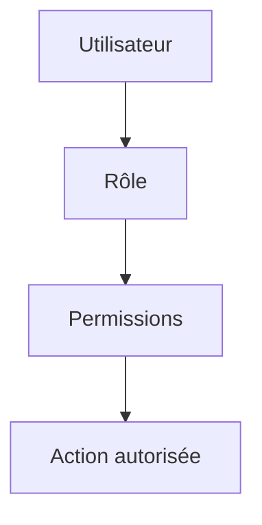

# **4.1 — RBAC : Role-Based Access Control (Contrôle d’accès basé sur les rôles)**

Le RBAC est le modèle d’autorisation le plus répandu dans les applications et les APIs.
Il repose sur une idée simple : **chaque utilisateur appartient à un ou plusieurs rôles**, et ces rôles déterminent ce que l’utilisateur peut faire.

Ce chapitre constitue la première brique du modèle d’autorisation.

---

# **4.1.1 — Principe général**

Dans le modèle RBAC :

1. **On attribue des rôles aux utilisateurs**
   Exemples : `admin`, `manager`, `user`, `support`.

2. **Chaque rôle possède des permissions**
   Exemples :

    * `admin` → tout gérer
    * `manager` → lire/écrire sur certaines ressources
    * `user` → accès limité à ses propres données

3. **Lors d’un appel API, le serveur vérifie le rôle dans le token**
   Pour décider si l’action demandée est autorisée.

---

# **4.1.2 — Structure conceptuelle**



Un utilisateur hérite automatiquement des permissions de son rôle.

---

# **4.1.3 — Exemple simple et pédagogique**

Imaginons une API de gestion d’entreprise avec trois rôles :

* **admin**
  → peut créer, modifier, supprimer n’importe quelle donnée

* **manager**
  → peut voir les données de son équipe, mais ne peut pas supprimer des utilisateurs

* **user**
  → peut voir uniquement son propre profil

Un utilisateur avec le rôle **manager** ne pourra jamais appeler :

```
DELETE /utilisateurs/42
```

car cette action n’appartient pas aux permissions du rôle `manager`.

---

# **4.1.4 — Pourquoi le RBAC est-il populaire ?**

Parce qu’il est :

### ✔ simple à comprendre

Les équipes métier comprennent facilement la notion de rôle.

### ✔ simple à appliquer

Un champ “role” dans la base ou dans le token suffit.

### ✔ suffisant dans beaucoup de cas

Systèmes internes, SaaS simples, APIs REST basiques.

---

# **4.1.5 — Où stocke-t-on les rôles ?**

Deux endroits possibles :

## **1. Dans la base de données utilisateur**

```
{
  "id": 42,
  "email": "alice@example.com",
  "role": "manager"
}
```

## **2. Dans le token JWT**

```
{
  "sub": "42",
  "role": "manager",
  "exp": 1710000000
}
```

⚠️ Attention : si le rôle change, le JWT reste valide jusqu’à expiration.
C’est une limite inhérente aux tokens auto-porteurs (stateless).

---

# **4.1.6 — Vérification des rôles côté API**

À chaque requête, l’API doit vérifier que :

* l’utilisateur a un rôle reconnu,
* ce rôle possède bien la permission demandée.

```mermaid
flowchart TD
    A[Requête API] --> B[Lire rôle dans le token]
    B --> C{Ce rôle\npeut-il effectuer l'action ?}
    C -->|Non| Z[Refus (403 Forbidden)]
    C -->|Oui| D[Autoriser]
```

---

# **4.1.7 — Exemple concret d’un endpoint protégé par RBAC**

Endpoint :

```
DELETE /factures/42
```

Permissions requises :

* `admin` → OUI
* `manager` → NON
* `user` → NON

Si le token contient :

```
{
  "role": "manager"
}
```

Le serveur doit renvoyer :

```
403 Forbidden
```

---

# **4.1.8 — Avantages du RBAC**

### **1. Simple à comprendre et à maintenir**

Les équipes techniques et métier l’adoptent facilement.

### **2. Rapide à implémenter**

Quelques vérifications sur les rôles suffisent.

### **3. Adapté aux structures hiérarchiques**

Sociétés, applications internes, outils SaaS simples.

---

# **4.1.9 — Limites du RBAC**

Malgré sa popularité, RBAC a des limites importantes :

### ❌ Pas assez granulaire dans les systèmes complexes

Un rôle `user` ne suffit pas toujours.

### ❌ Pas adapté aux permissions contextuelles

Exemples :

* “un manager peut modifier *ses* employés, mais pas ceux d’une autre équipe”
* “un utilisateur peut voir un document seulement si son statut est `public`”

RBAC ne gère pas la condition “*ses* employés”.

### ❌ Explosion du nombre de rôles

Pour pallier le manque de granularité, certaines équipes créent des dizaines de rôles :

* `manager_europe_lire`
* `manager_europe_rediger`
* `manager_usa_rediger`

→ Le système devient ingérable.

Ces limites amènent aux modèles **ABAC** et **PBAC**, présentés dans les sections suivantes.

---

# **4.1.10 — Résumé du sous-chapitre**

* Le RBAC attribue des rôles fixes aux utilisateurs.
* Chaque rôle correspond à une liste de permissions.
* L’API vérifie le rôle du client dans chaque requête.
* Simple, efficace, très utilisé.
* Mais limité : pas de prise en compte fine du contexte ou des attributs.
* Pour des besoins plus complexes, on utilise ABAC ou PBAC.