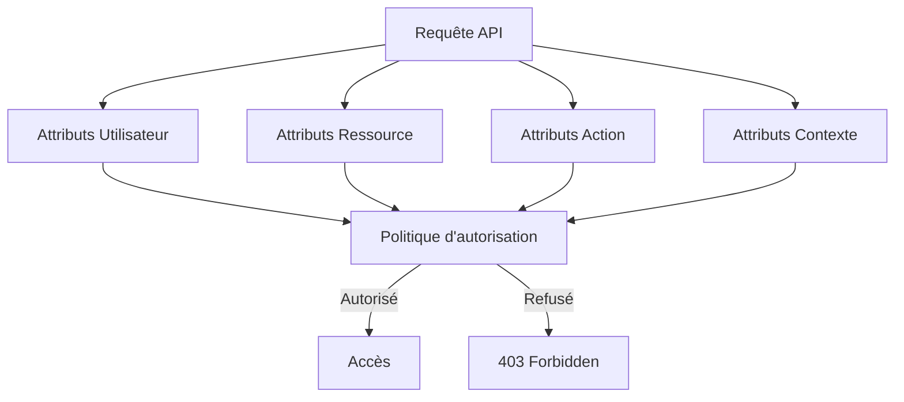
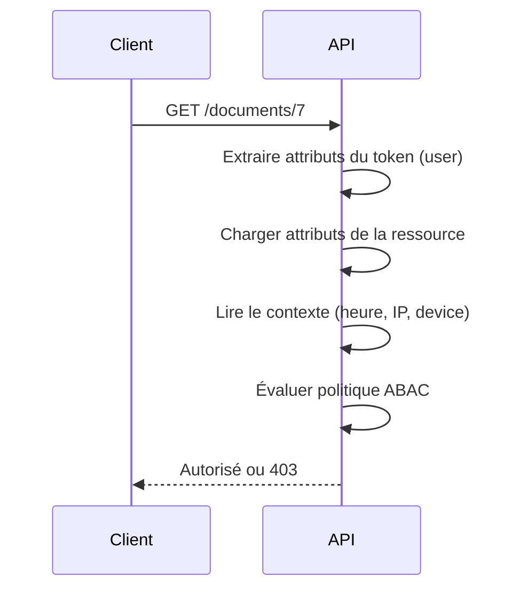

# **4.2 — ABAC : Attribute-Based Access Control (Contrôle d’accès basé sur les attributs)**

Le modèle ABAC étend largement les capacités du RBAC.
Au lieu de se baser uniquement sur des **rôles**, il repose sur un ensemble d’**attributs** concernant :

* **l’utilisateur**,
* **la ressource**,
* **l’action**,
* **le contexte**.

Grâce à ces attributs, l’API peut prendre des décisions d’autorisation **beaucoup plus fines**, flexibles et dynamiques.

---

# **4.2.1 — Principe général**

Dans le modèle ABAC, une requête est autorisée ou refusée selon une **politique** qui analyse des attributs.

Exemple d’attributs :

### **Attributs utilisateur**

* âge
* pays
* département
* rôle
* ancienneté
* clearance (niveau de sécurité)

### **Attributs ressource**

* propriétaire du document
* classification (public, interne, secret)
* type de donnée

### **Attributs action**

* lecture
* écriture
* suppression
* téléchargement

### **Attributs contexte**

* heure de la journée
* localisation du client
* type de device
* niveau de confiance (risk score)

Le serveur examine ces attributs et applique une règle.

---

# **4.2.2 — Illustration pédagogique**

Imagine une API de ressources internes.
ABAC permet d’exprimer des règles comme :

> **« Un manager peut accéder aux documents de son équipe, mais seulement pendant les heures de bureau, et seulement si le document est classé comme *interne*. »**

Voici comment ABAC traite cette règle :

* utilisateur.role = manager
* utilisateur.equipe = “équipe A”
* ressource.equipe = “équipe A”
* ressource.classification = interne
* contexte.heure ∈ [08:00, 18:00]

Si toutes les conditions sont vraies → autorisé.

RBAC seul ne pourrait pas gérer cette logique complexe.

---

# **4.2.3 — Schéma conceptuel ABAC**



L’autorisation résulte d’une **décision logique**, pas d’un simple rôle.

---

# **4.2.4 — Exemple concret**

Utilisateur :

```
{
  "id": 42,
  "role": "manager",
  "team": "A"
}
```

Ressource :

```
{
  "documentId": 77,
  "team": "A",
  "classification": "interne"
}
```

Contexte :

```
{
  "hour": 14,
  "location": "France"
}
```

Politique ABAC :

> Un manager peut accéder à un document interne si
>
> * il appartient à la même équipe
> * il est en France
> * et la consultation se fait entre 8h et 18h.

Si toutes les conditions sont satisfaites → OK.

---

# **4.2.5 — Pourquoi ABAC est puissant ?**

### ✔ Gère des règles complexes

Contrairement à RBAC, ABAC accepte des règles conditionnelles riches.

### ✔ Granularité extrême

Possibilité d’autoriser *un utilisateur précis* sur *une ressource précise* dans *certaines conditions*.

### ✔ Idéal pour les systèmes où l'accès dépend du contexte

Exemples :

* documents confidentiels
* réseaux internes
* systèmes gouvernementaux
* plateformes multi-locataires

### ✔ Évite l’explosion du nombre de rôles

Avec RBAC seul, l’équipe créerait des dizaines de rôles pour gérer tous les cas.

ABAC permet de garder un système propre et lisible.

---

# **4.2.6 — Limites d’ABAC**

### ❌ Complexité de gestion

Les politiques peuvent devenir difficiles à lire pour les non-experts.

### ❌ Risque de mauvaise configuration

Une règle trop permissive peut introduire des failles.

### ❌ Nécessite une gouvernance solide

ABAC sans documentation → chaos garanti.

### ❌ Pas forcément adapté aux petites applications

RBAC est souvent suffisant dans les cas simples.

---

# **4.2.7 — Exemple ABAC vs RBAC**

### **Cas métier**

« Un utilisateur peut consulter un document *seulement si* :

* il en est le propriétaire,
* ou il appartient au même département,
* ou le document est marqué comme public. »

### RBAC ❌

Impossible sans créer des dizaines de rôles (owner, departement_member, etc.).

### ABAC ✔

Une seule règle :

```
allow if (
    resource.ownerId == user.id
    OR resource.department == user.department
    OR resource.visibility == "public"
)
```

---

# **4.2.8 — Schéma : comment l’API prend une décision ABAC**



La décision dépend de l’évaluation logique des attributs.

---

# **4.2.9 — Où stocke-t-on les attributs ?**

* **Dans le token** (très courant)
  Ex : `team`, `department`, `clearance`.

* **Dans la base de données utilisateur**
  Chargés à chaque requête.

* **Dans la base de données des ressources**
  Ex : document.ownerId.

* **Dans les métadonnées du contexte**
  Ex : adresse IP, device, pays.

---

# **4.2.10 — Résumé du sous-chapitre**

* ABAC permet un contrôle d’accès extrêmement précis.
* L’autorisation dépend d’attributs (utilisateur, ressource, action, contexte).
* C’est un modèle flexible et puissant, idéal pour les systèmes complexes.
* Il évite l’explosion des rôles du RBAC.
* Mais il demande une bonne gouvernance et une documentation claire.
* Les APIs modernes combinent souvent **RBAC + ABAC**, ou évoluent vers **PBAC**.
