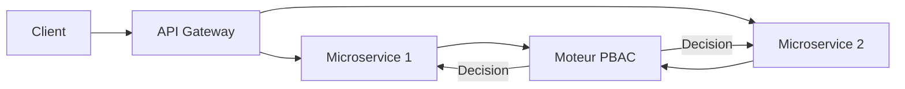

# **4.3 — PBAC : Policy-Based Access Control (Contrôle d’accès basé sur des politiques)**

Le PBAC est une évolution naturelle du RBAC et de l’ABAC.
Il repose sur un concept central : **définir des politiques (policies)** qui décrivent précisément les conditions d’accès à une ressource.

Ces politiques sont généralement **écrites sous forme de règles** lisibles, parfois dans un langage dédié.
L’API évalue ces règles pour accepter ou refuser une requête.

PBAC = ABAC + une couche supplémentaire d'organisation et de centralisation des règles.

---

# **4.3.1 — Principe général**

Le PBAC consiste à définir **des politiques structurées**, souvent dans un fichier ou un service dédié, qui expriment :

* **qui** peut accéder
* **à quoi**
* **dans quelles conditions**
* **selon quelles règles**

Les politiques peuvent combiner :

* les rôles (RBAC),
* les attributs (ABAC),
* les scopes,
* le contexte,
* des règles métier spécifiques.

---

# **4.3.2 — Pourquoi PBAC ?**

Parce que dans les organisations, les règles d’accès deviennent vite trop complexes pour être codées directement dans le code backend.

PBAC permet de **centraliser** ces règles dans un système indépendant de l’application.

### Avantages principaux :

✔ Gérer des règles très complexes
✔ Séparer la logique métier du code source
✔ Faciliter la modification de règles sans redéploiement
✔ Harmoniser les règles entre plusieurs services
✔ Auditer la sécurité facilement
✔ Maintenir la cohérence dans une architecture microservices

---

# **4.3.3 — Structure conceptuelle d’un système PBAC**

```mermaid
flowchart TD
    A[Requête API] --> B[Collecte des attributs<br>(utilisateur, ressource, action, contexte)]
    B --> C[Évaluation d'une politique]
    C -->|Autorisé| D[Accès accordé]
    C -->|Refusé| E[403 Forbidden]
```

---

# **4.3.4 — Exemple simple : Politique PBAC**

### Règle exprimée en langage naturel

> « Un utilisateur peut voir une facture si :
>
> * il est le propriétaire,
> * ou il est comptable,
> * ou il est manager d’un département lié à cette facture. »

### Politique PBAC (exemple simplifié)

```
allow(view, facture) if
    facture.ownerId == user.id
    or user.role == "comptable"
    or user.department == facture.department;
```

Une telle politique serait ingérable dans un simple modèle RBAC.

---

# **4.3.5 — PBAC vs RBAC vs ABAC**

| Modèle   | Force principale                        | Limite                        |
| -------- | --------------------------------------- | ----------------------------- |
| **RBAC** | Simple, hiérarchique                    | Peu flexible                  |
| **ABAC** | Très granulaire                         | Complexité des règles         |
| **PBAC** | Règles globales, centralisées, lisibles | Nécessite un moteur de policy |

PBAC **englobe** RBAC et ABAC, tout en ajoutant un cadre d’organisation.

---

# **4.3.6 — Exemple concret : moteur de policy**

Beaucoup d’organisations utilisent des outils tels que :

* **OPA — Open Policy Agent**
* **Cedar (AWS IAM)**
* **Casbin**
* **Oso**

Ces outils permettent de définir des politiques dans un langage dédié, par exemple (OPA Rego) :

```
allow {
  input.user.role == "admin"
}

allow {
  input.resource.owner == input.user.id
}
```

L’API envoie les attributs au moteur PBAC,
qui renvoie : **allow** ou **deny**.

---

# **4.3.7 — Schéma PBAC dans une architecture microservices**



Tous les services consultent un moteur central pour les décisions d’accès.

---

# **4.3.8 — Avantages clés du PBAC**

### ✔ Centralisation

Toutes les règles d’accès sont définies dans un endroit unique.

### ✔ Évolution rapide

On modifie une policy → la sécurité change immédiatement.
Même sans redeploiement du code.

### ✔ Transparence

Les règles sont lisibles, auditées, versionnées.

### ✔ Cohérence

Tous les microservices appliquent les mêmes règles.

### ✔ Puissance de calcul

PBAC peut gérer des conditions complexes :

* horaires,
* géolocalisation,
* type d’appareil,
* risque de session,
* volume historique des actions.

---

# **4.3.9 — Limitations du PBAC**

### ❌ Nécessite un moteur de règles

Ce qui ajoute un composant dans l’architecture.

### ❌ Les policies doivent être testées

Une mauvaise règle → un accès indésirable.

### ❌ Complexité potentielle

Surtout si les politiques sont mal écrites ou trop nombreuses.

---

# **4.3.10 — Exemple pédagogique : PBAC dans un scénarios réel**

### Contexte

Une entreprise veut autoriser l’accès à un dossier de paie uniquement si :

* l’utilisateur appartient au département RH,
* ou il s’agit de son propre dossier,
* et l’accès ne peut se faire qu’en France,
* et uniquement via un appareil approuvé.

### Politique PBAC

```
allow(view, dossier_paie) if
    user.department == "RH"
    or dossier_paie.ownerId == user.id

    and context.location == "FR"
    and context.deviceTrusted == true;
```

Impossible à gérer proprement avec un simple RBAC.

---

# **4.3.11 — Comment PBAC et ABAC se complètent**

| Élément    | ABAC                      | PBAC                          |
| ---------- | ------------------------- | ----------------------------- |
| Attributs  | Définis et fournis        | Utilisés dans les politiques  |
| Logique    | Dispersée dans le code    | Centralisée dans moteur       |
| Complexité | Gérée au niveau API       | Gérée au niveau policy        |
| Evolution  | Nécessite changer le code | Simple modification de policy |

PBAC rend ABAC **pratique**, **lisible**, et **gouvernable**.

---

# **4.3.12 — Résumé du sous-chapitre**

* PBAC utilise des politiques pour définir ce qui est autorisé ou interdit.
* C’est une extension naturelle et puissante de RBAC et ABAC.
* Les règles sont centralisées, auditées et modifiables sans changer le code.
* Idéal pour les architectures microservices et les environnements complexes.
* Très flexible, mais nécessite un moteur de policy et une bonne gouvernance.