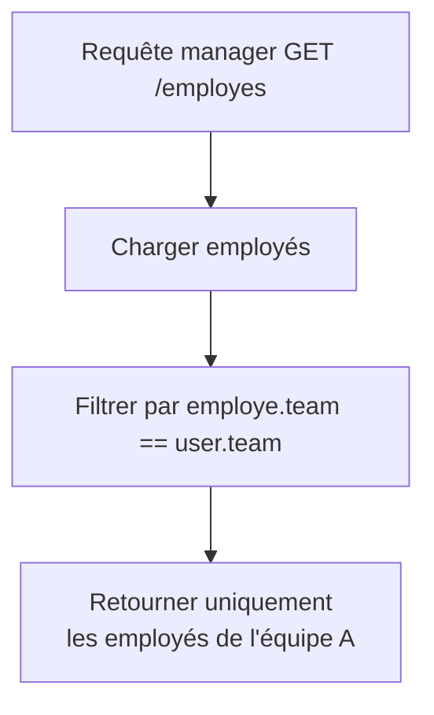

# **4.5 — Étude de cas : règles d’autorisation concrètes dans une API**

Dans ce sous-chapitre, nous allons rendre tout ce que nous avons vu (RBAC, ABAC, PBAC, claims, contexte) **pratique**.
L'objectif est de montrer, à travers des scénarios simples et concrets, **comment une API prend une décision d’autorisation**.

Nous allons examiner deux cas :

1. **"Un utilisateur ne peut accéder qu'à ses propres ressources"**
2. **"Un manager peut voir certaines données mais pas d’autres"**

Ces exemples sont fondamentaux : ils représentent *80 %* des règles d’autorisation dans les API réelles.

---

# **4.5.1 — Cas n°1 : Un utilisateur ne peut accéder qu’à ses propres ressources**

C’est la règle d’autorisation la plus courante.
Elle doit être **100 % appliquée côté backend**, jamais dans le frontend.

---

## **A. Situation**

Utilisateur :

```
sub = 42
role = "user"
```

Requête :

```
GET /utilisateurs/42/profil
```

Autorisé.

Mais si l’utilisateur tente :

```
GET /utilisateurs/99/profil
```

→ doit être refusé.

---

## **B. Comment l’API décide ?**

Elle compare :

* l’ID dans le token (`sub`)
* l’ID dans la requête (`:id`)

### La règle :

```
allow if user.sub == request.path.id
```

---

## **C. Schéma de décision**

```mermaid
flowchart TD
    A[Requête GET /users/{id}] --> B[Lire claim 'sub']
    A --> C[Extraire id de la requête]
    B --> D{sub == id ?}
    C --> D
    D -->|Non| E[403 Forbidden]
    D -->|Oui| F[Accès autorisé]
```

---

## **D. Exemple d’une décision correcte**

| Token    | Requête     | Résultat   |
| -------- | ----------- | ---------- |
| sub = 42 | `/users/42` | ✔ Autorisé |
| sub = 42 | `/users/99` | ❌ Refusé   |
| sub = 99 | `/users/42` | ❌ Refusé   |

---

## **E. Pourquoi ce cas est critique ?**

Parce que 90 % des failles **BOLA (API1)** viennent d'une mauvaise implémentation de cette règle.

Les développeurs supposent :

> “Le frontend n'affichera pas ces pages.”

❌ Mauvaise supposition.
Un attaquant appelle directement l’API.

---

# **4.5.2 — Cas n°2 : Un manager peut voir certaines données, mais pas d'autres**

Ce cas est plus complexe. Il nécessite souvent du **RBAC + ABAC**.

---

## **A. Situation**

### Utilisateur

```
role = "manager"
team = "A"
```

### Requête

```
GET /employes
```

La règle métier :

> Un manager peut voir les employés **de son équipe**,
> mais pas les employés des autres équipes.

---

## **B. Attributs nécessaires**

Pour prendre une décision, l’API a besoin :

### Côté token (claims)

* `role`
* `team`

### Côté ressource

Chaque employé doit avoir une propriété :

```
employee.team
```

---

## **C. À quoi ressemble la politique ?**

Version PBAC simplifiée :

```
allow(view, employe) if
    user.role == "manager"
    and user.team == employe.team;
```

---

## **D. Schéma visuel**



L’API **ne renvoie pas** les employés d’autres équipes.

---

## **E. Exemple explicite**

Équipe des employés :

| Employé | Team |
| ------- | ---- |
| Alice   | A    |
| Bob     | A    |
| Claire  | B    |
| David   | C    |

Token du manager :

```
role = "manager"
team = "A"
```

Réponse API correcte :

```
[Alice, Bob]
```

Réponse API incorrecte :

```
[Alice, Bob, Claire, David]
```

Le second cas constitue une **faille majeure** :
→ **Excessive Data Exposure (API3)**
→ **Broken Function Level Authorization (API5)**

---

# **4.5.3 — Ajout de contraintes contextuelles**

On peut compléter la règle avec :

### Condition temporelle

```
context.hour between 8 and 18
```

### Condition géographique

```
context.country == "FR"
```

### Condition de sécurité

```
context.deviceTrusted == true
```

Cela devient une politique **ABAC/PBAC complète et robuste**.

---

# **4.5.4 — Version complète de la politique**

```
allow(view, employe) if
    user.role == "manager"
    and user.team == employe.team
    and context.country == "FR"
    and context.hour >= 8
    and context.hour <= 18
    and context.deviceTrusted == true;
```

Une telle règle est impossible à modéliser avec du RBAC seul.
Elle nécessite un modèle plus riche (ABAC / PBAC).

---

# **4.5.5 — Exercices conceptuels possibles (pour un bootcamp)**

### ✔ Exercice 1 :

“Un utilisateur peut modifier uniquement ses propres données.”

→ Trouver la règle.

### ✔ Exercice 2 :

“Un manager peut voir les employés de son équipe, mais seulement en semaine.”

→ Ajouter une contrainte contexte.

### ✔ Exercice 3 :

“Un administrateur peut tout faire, mais jamais depuis l’étranger.”

→ Combinaison RBAC + contexte.

---

# **4.5.6 — Résumé du sous-chapitre**

* Les cas concrets permettent d’appliquer RBAC, ABAC et PBAC.
* L’autorisation nécessite souvent de comparer des claims et des attributs de ressource.
* La règle “un utilisateur ne peut voir que ses données” est essentielle pour éviter BOLA.
* Les managers nécessitent généralement un contrôle de contexte (équipe, heure, pays…).
* PBAC permet d’écrire clairement des politiques complexes.