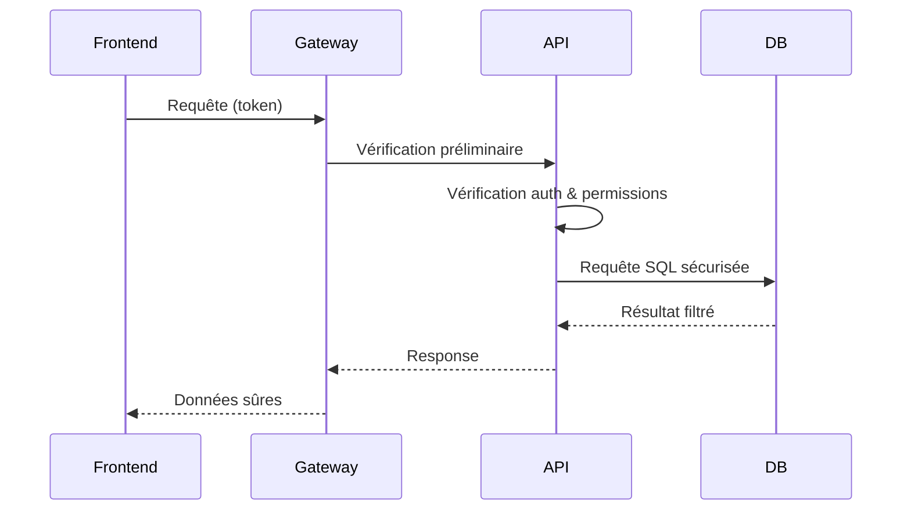

# **5.1 — Séparation des couches (frontend / backend / API / database)**

La séparation des couches est l’un des principes *fondamentaux* d’une architecture sécurisée.
Elle permet de réduire les risques, d’isoler les pannes, de limiter l’impact d’un attaquant et de structurer la sécurité de manière cohérente et robuste.

Dans ce chapitre, nous allons voir :

* pourquoi séparer les couches,
* comment elles interagissent,
* quels risques apparaissent si on ne les sépare pas,
* et comment ce principe s’inscrit dans une architecture API moderne.

---

# **5.1.1 — Qu’est-ce qu’une architecture en couches ?**

Une architecture en couches sépare l’application en plusieurs blocs ayant chacun un rôle :

* **Frontend** → interface utilisateur
* **Backend/API** → logique métier
* **Services internes** → microservices, traitements, messages
* **Base de données** → stockage des données
* **API Gateway / Reverse Proxy** → couche d’entrée sécurisée

Chacune de ces couches doit être **isolée** et **indépendante**, avec des responsabilités clairement définies.

---

# **5.1.2 — Schéma pédagogique simple**

```mermaid
flowchart TD
    F[Frontend (Web/Mobile)] --> G[API Gateway / Reverse Proxy]
    G --> B[Backend / API]
    B --> S[Services internes / Microservices]
    B --> D[Base de données]
```

Ce modèle clarifie :

* où appliquer les contrôles d’accès,
* où valider les données,
* où chiffrer les échanges,
* où journaliser les actions.

---

# **5.1.3 — Pourquoi séparer le frontend et le backend ?**

Parce que le frontend :

* est **non fiable**,
* peut être modifié par l’utilisateur,
* peut être inspecté, manipulé, piraté, copié.

Le backend :

* est **le seul endroit fiable** pour appliquer les règles d’accès,
* doit ignorer toute validation du frontend,
* doit tout surveiller et tout contrôler.

### Règle absolue :

> **Le frontend n’est jamais une source de vérité.
> Seul le backend décide.**

---

# **5.1.4 — Pourquoi séparer l’API du backend ?**

En réalité, “backend” et “API” sont parfois confondus.
Mais dans une architecture solide, on distingue :

* **Backend API** → interface REST/GraphQL
* **Services internes** → logique avancée, jobs, moteurs métier

Cette séparation permet :

### ✔ Une meilleure scalabilité

L’API est stateless et facilement réplicable.

### ✔ Une meilleure sécurité

Les microservices internes ne sont pas exposés au public.

### ✔ Une meilleure organisation

Chaque composant a une fonction claire.

---

# **5.1.5 — Pourquoi séparer l’API et la base de données ?**

Parce que :

* la base de données ne doit **jamais** être exposée directement,
* l’API doit valider, filtrer et nettoyer toutes les entrées avant d’interagir avec la DB,
* la DB n’est pas conçue pour gérer l'authentification et l’autorisation.

### Si un client accédait directement à la DB ➝ Chaos total

* Risque d'injection
* Vol massif de données
* Modification non contrôlée
* Suppression non autorisée
* Absence de journalisation correcte

C’est exactement ce que l’API empêche.

---

# **5.1.6 — Conséquences d'une mauvaise séparation**

Voici ce qui se passe si les couches sont mal séparées.

### ❌ Logique métier dans le frontend

Les règles d’accès deviennent modifiables par l’utilisateur → **catastrophe**.

### ❌ Accès direct à la base de données

Pas de sécurité → **données volées** en masse.

### ❌ API et backend couplés

Impossible de scaler, difficile à sécuriser.

### ❌ Services internes accessibles publiquement

Les attaquants peuvent directement frapper les microservices → très dangereux.

---

# **5.1.7 — Séparation = meilleures protections**

Chaque couche peut contenir des protections spécifiques.

### **Frontend**

* Aucune confiance
* Validation simple pour l’expérience utilisateur
* Jamais de secrets stockés

### **API**

* Authentification
* Autorisation RBAC/ABAC/PBAC
* Rate limiting
* Logging
* Validation des entrées

### **Backend / Services internes**

* Limitation des permissions
* Communication authentifiée
* Traçabilité

### **Base de données**

* Rôles SQL stricts
* Jamais de droits admin pour l’API
* Chiffrement des données sensibles

### **API Gateway**

* Anti-DDoS
* Anti-bot
* Protection des tokens
* Caching
* Filtrage IP

---

# **5.1.8 — Exemple visuel : données qui traversent les couches**



Chaque couche ajoute des contrôles.

---

# **5.1.9 — Principe Zero Trust appliqué à la séparation**

Séparer les couches permet d’appliquer le modèle :

> **Ne jamais faire confiance au client.
> Ne jamais faire confiance à un réseau interne.
> Toujours valider, toujours vérifier.**

Ainsi :

* le frontend est traité comme hostile,
* l’API valide tout,
* la DB ne parle qu’au backend,
* l’API gateway filtre ce qui arrive,
* les microservices s’authentifient entre eux.

---

# **5.1.10 — Résumé du sous-chapitre**

* La séparation des couches est essentielle pour la sécurité et la scalabilité.
* Frontend, API, backend interne et DB ont des responsabilités distinctes.
* Le frontend est non fiable ; le backend doit tout valider.
* L’API agit comme un bouclier entre les clients et la base de données.
* Une mauvaise séparation crée des failles massives (BOLA, injections, fuite de données).
* Zero Trust s'applique à chaque couche de la chaîne.
