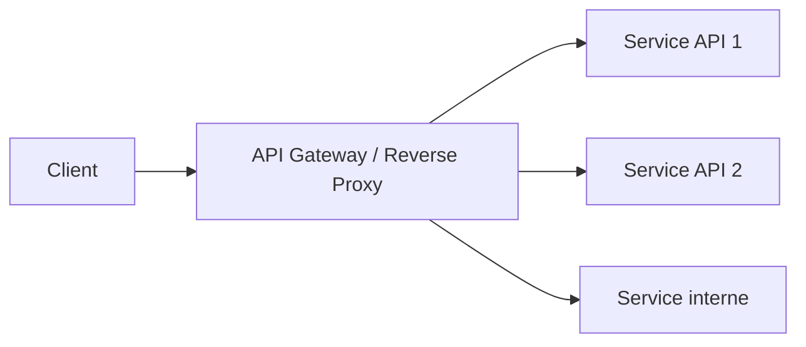
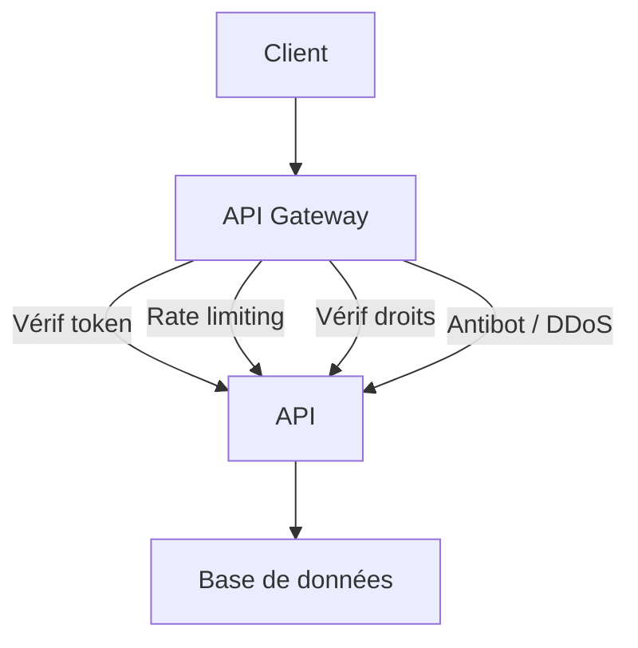
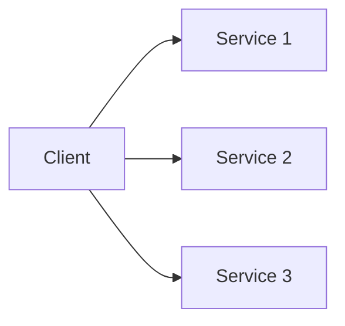

# **5.2 — API Gateway & Reverse Proxy : pourquoi ils sont indispensables**

Les **API Gateway** et les **Reverse Proxy** sont des composants essentiels d’une architecture API moderne et sécurisée.
Ils jouent le rôle de **gardien**, **filtre**, **pare-feu applicatif**, **point central d’entrée**, et parfois même de **coordinateur** entre services.

Sans eux, une API est **nue**, exposée, vulnérable, difficile à faire évoluer et impossible à sécuriser correctement.

Ce chapitre explique :

* ce qu’est une API Gateway,
* la différence avec un Reverse Proxy,
* pourquoi ils sont indispensables,
* quelles protections ils offrent,
* ce qui se passe quand on ne les utilise pas.

---

# **5.2.1 — Schéma général**



Tous les appels passent par **un seul point d’entrée**.

---

# **5.2.2 — Reverse Proxy : définition simple**

Un **Reverse Proxy** est un serveur qui reçoit les requêtes du client **à la place** des serveurs API.

Fonctions principales :

* redirection du trafic vers les serveurs internes
* cache
* TLS/HTTPS
* proxying réseau
* logging
* filtrage d’IP
* protection minimale

Reverse proxies courants :

* **Nginx**
* **Traefik**
* **HAProxy**

---

# **5.2.3 — API Gateway : définition simple**

Une **API Gateway** est un Reverse Proxy **amélioré**, conçu spécialement pour les APIs.

Fonctions supplémentaires :

* authentification
* autorisation
* rate limiting
* quotas
* transformation des requêtes
* agrégation de réponses
* signature des requêtes internes
* routage intelligent
* anti-DDoS
* journalisation centralisée
* monitoring
* validation des schémas (OpenAPI)

Gateways courantes :

* **Kong**
* **KrakenD**
* **Tyk**
* **Apigee**
* **AWS API Gateway**

---

# **5.2.4 — Pourquoi une API Gateway est indispensable ?**

### ✔ **1. Sécurité centralisée**

Sans Gateway :

* chaque microservice doit gérer sa propre authentification,
* chaque service doit gérer son propre rate limiting,
* chaque service doit filtrer ses entrées.

C’est **impossible** à maintenir.

Avec une Gateway :

* toutes les protections sont au même endroit
  → plus simple, plus sûr, plus cohérent.

---

### ✔ **2. Protection contre les attaques courantes**

La Gateway peut bloquer :

* brute force
* DDoS
* scans automatisés
* appels trop fréquents
* IP malveillantes
* attaques par payload démesuré
* injections triviales
* CORS mal configuré

Elle filtre avant même que l’API soit touchée.

---

### ✔ **3. Point central pour la gestion des tokens**

La Gateway peut :

* vérifier la validité des JWT,
* vérifier les scopes,
* appliquer les règles RBAC/PBAC simples,
* refuser les tokens expirés,
* gérer la rotation des clés de signature.

Ainsi, les microservices n’ont pas besoin de refaire tout cela.

---

### ✔ **4. Simplification de l'architecture**

Sans API Gateway :

* le client doit connaître tous les services internes
* les URLs changent lors de la scalabilité
* la sécurité devient ingérable

Avec une Gateway :

```
/api/users
/api/orders
/api/payments
```

Le client n’a qu’un seul endpoint.

---

### ✔ **5. Routage intelligent**

La Gateway peut router en fonction :

* de la version (`/v1`, `/v2`),
* du type d’utilisateur,
* du payload,
* des headers,
* du plan d’abonnement (freemium, premium).

Elle peut même :

* agréger plusieurs microservices
* transformer la réponse pour le client

---

# **5.2.5 — Schéma : rôle de la Gateway dans la sécurité**



La Gateway est un véritable **bouclier applicatif**.

---

# **5.2.6 — Exemple d’architecture sans Gateway**



Résultats :

* clients exposés à une multitude d’URLs,
* sécurité éclatée,
* maintenance impossible,
* risque majeur d’incohérence entre services,
* surface d’attaque *beaucoup* plus grande.

---

# **5.2.7 — API Gateway vs Reverse Proxy : comparaison**

| Fonction                    | Reverse Proxy | API Gateway |
| --------------------------- | ------------- | ----------- |
| Routage                     | ✔             | ✔           |
| HTTPS/TLS                   | ✔             | ✔           |
| Mise en cache               | ✔             | ✔           |
| Authentification            | ❌ (minimal)   | ✔           |
| Vérification JWT            | ❌             | ✔           |
| Rate limiting               | ❌ (rare)      | ✔           |
| Transformation de requêtes  | ❌             | ✔           |
| Quotas                      | ❌             | ✔           |
| Anti-DDoS                   | ❌             | ✔           |
| Détection anomalies         | ❌             | ✔           |
| Agrégation de microservices | ❌             | ✔           |

Une Gateway est une *super-proxy* conçu pour les APIs.

---

# **5.2.8 — Cas réel : ce que la Gateway protège dans votre API**

### Avant la requête :

* IP filtrée
* fréquence contrôlée
* taille du payload validée
* token vérifié
* en-têtes analysés
* schéma JSON validé
* contexte appliqué (tenant, langue, source)

### Pendant :

* routage vers le bon service
* gestion du timeout
* gestion des erreurs
* circuit breaker

### Après :

* logs centralisés
* métriques
* audit trails

---

# **5.2.9 — Que se passe-t-il sans API Gateway ?**

* Attaques DDoS atteignent directement vos serveurs
* Tous les services doivent implémenter l’authentification
* Incohérence des règles d’accès
* Pas de limite de fréquence → risque de surcharge
* Pas de vérification uniforme des tokens
* Plus difficile de monitorer les attaques
* Surface d’attaque élargie
* Coût et complexité explosent

Une API sans Gateway est vulnérable par conception.

---

# **5.2.10 — Résumé du sous-chapitre**

* Le Reverse Proxy est la brique de base ; la Gateway est sa version spécialisée pour les APIs.
* L’API Gateway centralise la sécurité : authentification, autorisation, rate limiting, anti-DDoS, validation.
* Elle simplifie massivement l’architecture et réduit les risques.
* Elle protège votre backend en empêchant les attaques d’atteindre les serveurs internes.
* Sans Gateway, chaque service doit tout gérer → chaos et vulnérabilités.

