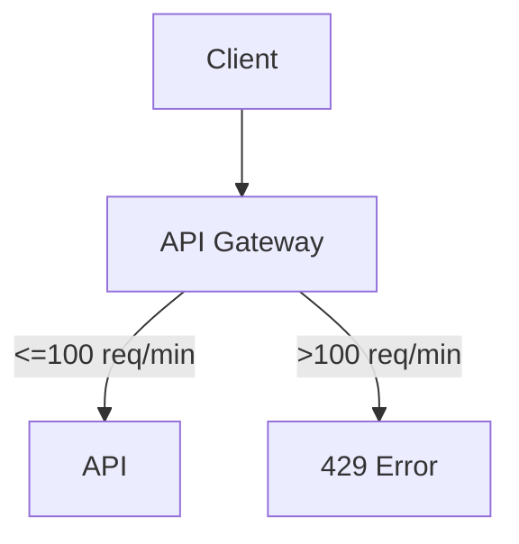
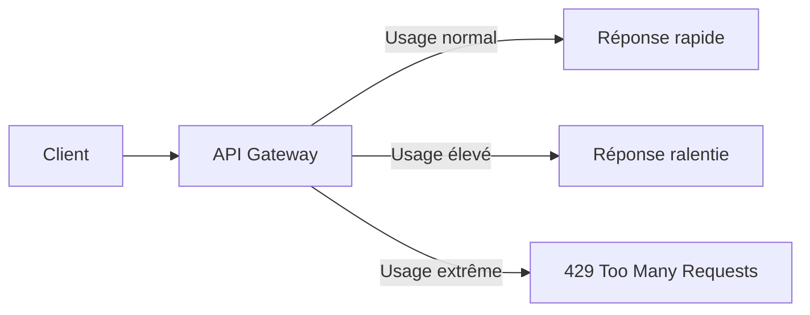
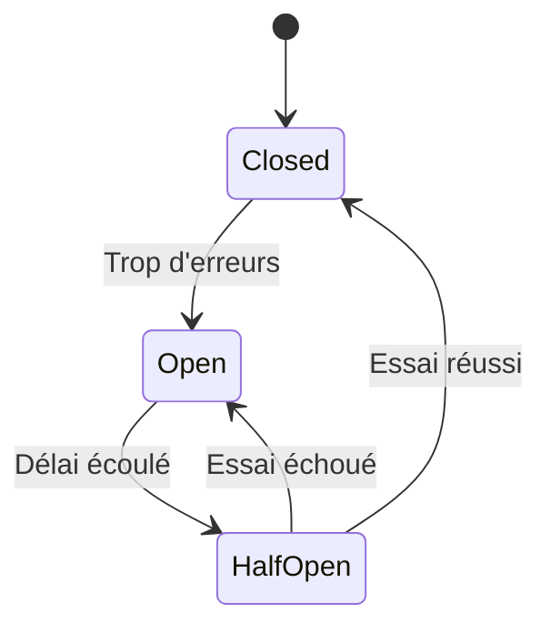
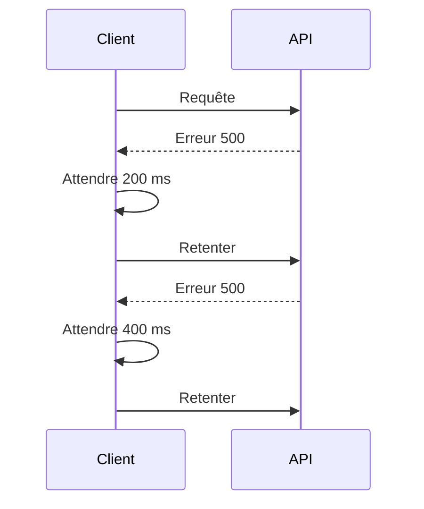
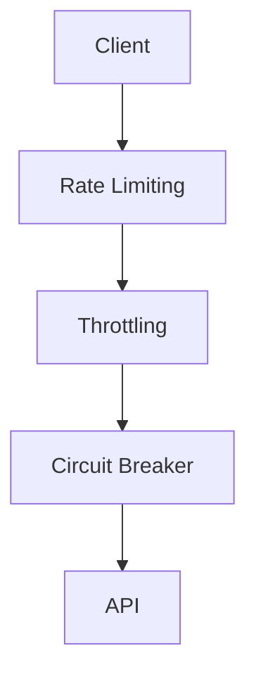

# **5.3 — Patterns de sécurité : Rate Limiting, Throttling, Circuit Breaker, Retry / Backoff**

Les **patterns de sécurité** sont des mécanismes architecturaux conçus pour protéger les APIs contre :

* les abus,
* les surcharges,
* les attaques par déni de service,
* les appels excessifs,
* les pannes en cascade,
* les clients mal configurés ou malveillants.

Ces patterns complètent les contrôles d’authentification et d’autorisation, en ajoutant une **résilience** indispensable à toute API moderne.

Dans ce chapitre, nous allons expliquer quatre patterns essentiels :

1. **Rate Limiting**
2. **Throttling**
3. **Circuit Breaker**
4. **Retry + Backoff**

Chaque concept est illustré clairement avec des schémas et des exemples.

---

# **5.3.1 — Rate Limiting (limitation de débit)**

Le **rate limiting** limite le **nombre de requêtes** qu’un client peut effectuer dans une période donnée.

Exemples :

* *100 requêtes par minute*
* *10 requêtes par seconde*
* *1 000 requêtes par heure*

Si la limite est dépassée →
**l’API bloque les appels** et renvoie :

```
429 Too Many Requests
```

---

## **Pourquoi c’est essentiel ?**

* Empêche les abus
* Protège contre le DDoS de bas niveau
* Empêche un script malveillant de saturer l’API
* Protége les ressources coûteuses (ex : paiement, génération PDF)
* Empêche l’épuisement des serveurs

---

## **Schéma visuel**



La Gateway bloque l’excès avant même que l’API ne soit atteinte.

---

## **Exemple concret**

Un client appelle :

* 1 requête → OK
* 10 requêtes → OK
* 200 requêtes en 1 minute → ❌ rejetées
* 1 000 requêtes en rafale → ❌ rejet immédiat

---

# **5.3.2 — Throttling (ralentissement contrôlé)**

Le throttling ne bloque pas les requêtes,
il **ralentit progressivement** le client pour éviter la surcharge.

Différence clé :

| Pattern           | Effet                    |
| ----------------- | ------------------------ |
| **Rate limiting** | Stoppe net → erreur 429  |
| **Throttling**    | Ralentit progressivement |

---

## **C’est utile pour :**

* éviter les pics soudains,
* lisser la charge,
* gérer les clients mal configurés,
* garantir une qualité de service minimale.

---

## Exemple de logique de throttling

> Si l’utilisateur dépasse 50 requêtes/minute,
> → ralentir la réponse de 200 ms
> Si l’utilisateur dépasse 100 requêtes/minute,
> → ralentir de 500 ms
> Au-delà de 200 req/min,
> → jeter les requêtes.

---

## Schéma visuel



---

# **5.3.3 — Circuit Breaker**

Le **Circuit Breaker** protège votre API contre les défaillances **en cascade**.

### Principe :

Si un service interne échoue trop souvent,
on **ouvre le circuit**, et l’API :

* ne tente plus d’appeler ce service pendant un temps,
* renvoie une réponse de fallback.

---

## **Pourquoi c’est vital ?**

Sans circuit breaker :

* un service interne tombe,
* l’API continue de le solliciter,
* la charge augmente,
* tout le système s'écroule.

Avec circuit breaker :

* le service défaillant est isolé,
* les autres services continuent de fonctionner.

---

## États du Circuit Breaker



---

## Exemple concret

Votre API appelle un service de paiement :

* Le service renvoie **des erreurs 500** →
  → Circuit breaker **ouvre**
  → Votre API arrête d'appeler le service
  → Évite une panne globale

---

# **5.3.4 — Retry + Backoff**

Quand un appel échoue, un client peut réessayer.
Mais réessayer immédiatement est dangereux :

* surcharge du serveur
* aggravation d’un problème réseau
* amplification d’une panne

→ Il faut **espacer les tentatives** : c’est le backoff.

---

# **Types de backoff**

### **1. Backoff simple**

Attendre un délai fixe (ex : 200 ms)

### **2. Backoff exponentiel**

Attendre de plus en plus longtemps :

* 100 ms
* 200 ms
* 400 ms
* 800 ms
* …

### **3. Backoff exponentiel + jitter (hasard)**

Le plus sécurisé :

* 100 ms + aléatoire
* 200 ms + aléatoire
* 400 ms + aléatoire

Cela évite que tous les clients réessaient en même temps.

---

## Schéma visuel



---

# **5.3.5 — Comment ces patterns interagissent ?**



À chaque étape, la requête peut :

* être ralentie
* être bloquée
* être redirigée
* être refusée
* être envoyée vers une alternative

Ce sont **des couches de défense successives**.

---

# **5.3.6 — Exemples concrets d’utilisation dans la vraie vie**

### Stripe (paiements)

* Rate limiting strict
* Protection anti-fraude intégrée
* Backoff exponentiel obligatoire

### GitHub API

* 5000 requêtes par heure par token
* 403 si dépassement

### AWS API Gateway

* Throttling élastique
* Protection DDoS intégrée
* Circuit breakers pour microservices

---

# **5.3.7 — Risques si ces patterns ne sont pas utilisés**

Sans ces mécanismes :

### ❌ Votre API peut être saturée par accident

Un client mal écrit peut envoyer 500 requêtes/seconde.

### ❌ Votre API peut tomber face à une attaque triviale

Un bot qui rafraîchit `/login` en boucle.

### ❌ Une panne peut se propager à tout le système

Un microservice en échec → tout crash.

### ❌ Les ressources coûteuses peuvent être abusées

Ex : génération de PDF, envoi d’emails, export de données.

### ❌ Impossible de garantir une qualité de service

Les bons utilisateurs souffrent à cause des mauvais.

---

# **5.3.8 — Résumé du sous-chapitre**

* **Rate Limiting** : limite le nombre de requêtes → protège contre l’abus.
* **Throttling** : ralentit les clients trop agressifs.
* **Circuit Breaker** : isole les services en panne pour éviter les cascades.
* **Retry + Backoff** : empêche les réessais massifs qui aggravent les pannes.

Ces patterns sont essentiels pour toute API professionnelle :
ils protègent, stabilisent et renforcent toute l’architecture.
