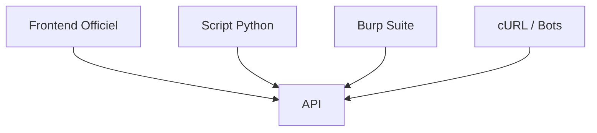
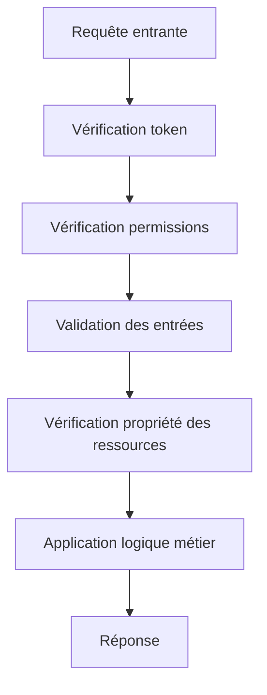
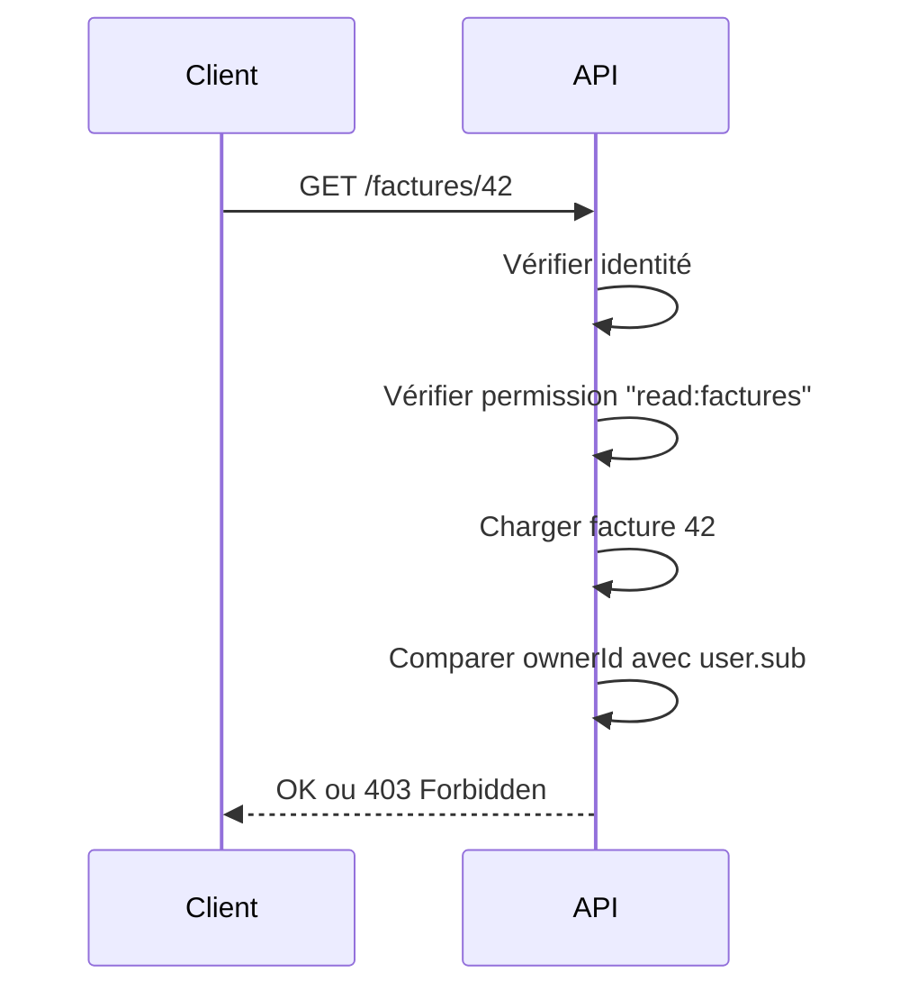

# **5.4 — Contrôles côté backend : ne jamais faire confiance au client**

Ce chapitre introduit **l’un des principes les plus importants de toute la sécurité API** :

> **Le backend ne doit jamais faire confiance au frontend, ni aux clients en général.**
> **Jamais.**
> Même si le frontend est “le vôtre”, même si “personne ne voit le code”, même si “on a mis des validations dans le formulaire”.

Dans les API modernes, le backend est **la seule autorité de vérité**.
Il doit tout vérifier, tout valider, tout contrôler.

Ce principe est au cœur du modèle **Zero Trust**.

---

# **5.4.1 — Pourquoi ne jamais faire confiance au client ?**

Parce que le client :

* peut être modifié,
* peut être piraté,
* peut être remplacé par un script,
* peut être contourné,
* peut être imité par un attaquant,
* peut envoyer *absolument ce qu’il veut* à l’API.

Même un client web “officiel” peut être inspecté avec :

* les DevTools
* un proxy comme Burp Suite
* un script automatisé
* Postman / cURL
* un bot Python

**Le backend doit traiter chaque requête comme venant d’un ennemi potentiel.**

---

# **5.4.2 — Exemple visuel : Pourquoi le frontend n’est pas fiable**



Tous ces clients ont **le même pouvoir** :
ils peuvent envoyer des requêtes avec :

* n’importe quels paramètres,
* n’importe quel corps JSON,
* n’importe quel token,
* n’importe quel identifiant,
* n’importe quelle URL.

Le serveur **ne peut pas distinguer** un “bon” client d’un “attacker”.

---

# **5.4.3 — Quelles validations doivent être faites côté backend ?**

Le backend doit tout vérifier systématiquement, notamment :

---

### **1. Authentification du token**

* signature
* expiration
* issuer
* audience
* algorithme
* intégrité du payload

---

### **2. Autorisation**

* role
* scopes
* permissions
* ABAC
* PBAC

---

### **3. Les paramètres d’URL**

Exemple de faille BOLA :

```
GET /users/999/bank-account
```

Même si le frontend ne propose pas cette URL,
l’attaquant peut l'appeler.

---

### **4. Le corps JSON**

Même si le frontend ne montre pas certains champs,
un attaquant peut envoyer :

```
{
  "role": "admin",
  "team": "A",
  "price": -1000
}
```

Le backend doit refuser toute donnée incorrecte ou sensible.

---

### **5. Le type et la taille des données**

* nombre maximal d’éléments
* types attendus (string, number, …)
* formats (UUID, email, date)
* tailles maximales (payload limit)

---

### **6. Sanitation (anti-XSS, anti-SQLi, etc.)**

Tout ce que le client envoie doit être neutralisé :

* escapement
* validation stricte
* whitelist des champs
* jamais d’injection dans SQL ou HTML

---

### **7. Propriété des ressources**

La règle BOLA la plus importante :

> **Un utilisateur ne doit accéder qu’à ses propres données.**

Le backend doit comparer :

```
user.sub == resource.owner
```

---

### **8. Limitation du nombre de résultats (pagination)**

Empêche les extractions massives de données.

---

# **5.4.4 — Erreurs classiques à éviter absolument**

## **❌ Erreur 1 : Faire confiance à la validation du frontend**

→ Le client peut l’enlever ou la modifier.

---

## **❌ Erreur 2 : Penser qu’un champ “readonly” est sécurisé**

Un attaquant peut toujours l’envoyer via JSON.

---

## **❌ Erreur 3 : Penser que CORS protège une API**

CORS ne protège *rien* contre un cURL ou Postman.

---

## **❌ Erreur 4 : Penser qu’un ID dans l’URL est sûr**

Les attaquants testent :

```
/orders/1
/orders/2
/orders/3
```

L'API doit vérifier la *propriété*.

---

## **❌ Erreur 5 : Confier de l’autorisation au frontend**

Exemple :

Frontend : “Si l’utilisateur n’est pas admin, on cache les boutons”.

L’attaquant :
→ Ouvre DevTools
→ Affiche le bouton
→ Ou appelle directement l’API

---

# **5.4.5 — Comment le backend doit traiter chaque requête ?**



Chaque bloc est **obligatoire**.
Aucun n'est facultatif.

---

# **5.4.6 — Exemple concret : modification de profil**

### Mauvaise implémentation (trop courante)

Le frontend désactive le champ “role” dans le formulaire.
Mais l’API accepte :

```
PATCH /profil
{
  "role": "admin"
}
```

→ Élève de privilège immédiat.
→ Catastrophe.

### Bonne implémentation

Le backend ignore totalement any champ non autorisé :

```
PATCH /profil
{
  "role": "admin",
  "team": "A",
  "username": "nouveau_nom"
}
```

L’API ne modifie que `username`.
Et répond une erreur si l’utilisateur tente d’éditer un champ interdit.

---

# **5.4.7 — Exemple concret : accès à une facture**



SANS cette étape → BOLA.

---

# **5.4.8 — Pourquoi cela s’appelle Zero Trust ?**

Parce que le backend :

* ne fait confiance à aucun input,
* ne fait confiance à aucun client,
* ne fait confiance à aucun header,
* ne fait confiance à aucune URL,
* ne fait confiance à aucun champ JSON,
* ne fait confiance à aucune validation frontend.

Il **valide tout**, systématiquement.

---

# **5.4.9 — Résumé du sous-chapitre**

* Le backend ne doit jamais faire confiance au client.
* Tous les contrôles doivent être faits côté serveur, sans exception.
* Le frontend peut être contourné, modifié ou attaqué.
* Le backend doit valider : token, permissions, attributs, ressources, tailles, formats…
* La règle BOLA “ne voir que ses propres données” doit être appliquée **côté backend**.
* Ce principe est la base du modèle **Zero Trust**.
