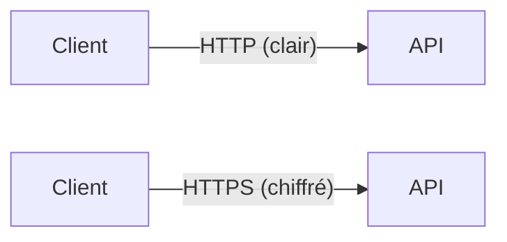
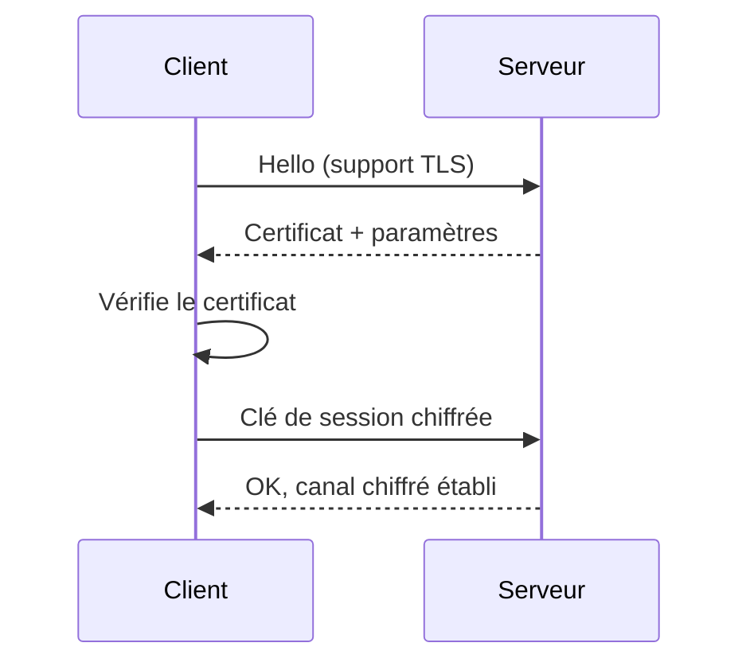
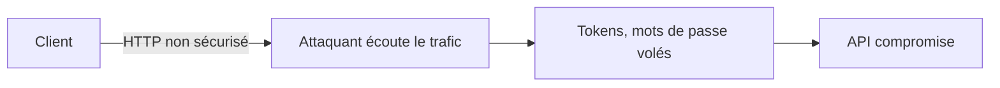

# **6.1 — HTTPS / TLS : rappels indispensables**

Le **HTTPS** et le protocole **TLS** constituent la base de la sécurité des échanges dans une API moderne.
Sans HTTPS, aucune autre mesure de sécurité n’a réellement de valeur :
les tokens, les mots de passe, les données sensibles → tous pourraient être interceptés.

Ce chapitre explique :

* pourquoi HTTPS est obligatoire,
* comment TLS protège une API,
* quelles attaques il empêche,
* ce que contient un certificat,
* quelles erreurs sont fréquentes,
* quelles bonnes pratiques appliquer.

---

# **6.1.1 — Pourquoi HTTPS est obligatoire pour une API ?**

Parce qu’une API échange :

* des tokens d’accès,
* des refresh tokens,
* des identifiants,
* des données personnelles,
* des données métier sensibles.

Sans HTTPS, tout cela circule **en clair**, lisible sur le réseau.

### Un attaquant peut alors :

* lire les requêtes,
* lire les réponses,
* voler les tokens,
* modifier les données,
* usurper l’utilisateur.

HTTPS empêche tout cela.

---

# **6.1.2 — HTTP vs HTTPS : schéma simple**



### HTTP → informations lisibles par n’importe qui.

### HTTPS → données chiffrées illisibles même par un attaquant.

---

# **6.1.3 — Que fait exactement TLS ?**

TLS (Transport Layer Security) assure trois choses essentielles :

---

## **1. Confidentialité**

Les données sont chiffrées :
un attaquant ne peut pas lire le contenu.

---

## **2. Intégrité**

Les données ne peuvent pas être modifiées sans être détectées.

Exemple d’attaque empêchée :
modifier un montant → impossible avec TLS.

---

## **3. Authenticité**

Le serveur présente un certificat numérique qui prouve son identité.

Le client sait qu’il parle bien à :

* api.monsite.com
* et pas à un serveur pirate

---

# **6.1.4 — Schéma de fonctionnement TLS**



Une fois le canal établi, tout est chiffré.

---

# **6.1.5 — Qu’est-ce qu’un certificat TLS ?**

Un certificat contient :

* le **nom de domaine** (ex : api.maboutique.com)
* la **clé publique** du serveur
* la durée de validité
* l’autorité de certification qui l’a signé (Let’s Encrypt, Sectigo…)

Le navigateur ou le client API vérifie que :

* le certificat est valide,
* il n’est pas expiré,
* il est signé par une autorité de confiance,
* il correspond bien au domaine appelé.

---

# **6.1.6 — Pourquoi HTTPS protège les tokens ?**

Dans une API moderne :

* les **Access Tokens** transitent dans `Authorization: Bearer …`
* les **Refresh Tokens** transitent dans des cookies sécurisés
* les données sensibles circulent en JSON

Sans HTTPS, un simple attaquant sur le même Wi-Fi peut faire :

```
sniffing → capture → token volé → API compromise
```

HTTPS empêche ce vol.

---

# **6.1.7 — Attaques neutralisées par HTTPS / TLS**

### ✔ Interception des communications (MITM)

Un attaquant entre le client et le serveur.

### ✔ Sniffing réseau

Wi-Fi public, réseau d’entreprise compromis, etc.

### ✔ Manipulation des requêtes

Injection de paramètres ou modification des réponses.

### ✔ Usurpation de serveur

Attaquant simulant “api.monsite.com”.

### ✔ Replay non chiffré

Récupération et réinjection brute du trafic.

---

# **6.1.8 — Erreurs fréquentes à ne jamais commettre**

## ❌ Autoriser HTTP pour l’API

L'API doit refuser toute requête sans HTTPS.

## ❌ Permettre “[http://localhost”](http://localhost”) en production

Jamais.
Même pour des tests, il vaut mieux :

* utiliser TLS local
* ou des tunnels (ngrok / cloudflared)

## ❌ Utiliser un certificat auto-signé en prod

Les clients ne peuvent pas valider l’identité du serveur.

## ❌ Accepter des TLS faibles (TLS 1.0, 1.1)

Versions obsolètes et vulnérables.

## ❌ Ne pas renouveler les certificats automatiquement

Expiration = panne globale.

---

# **6.1.9 — Bonnes pratiques pour une API sécurisée**

### ✔ Forcer HTTPS (HSTS)

HTTP Strict Transport Security empêche le downgrade.

### ✔ Désactiver les versions faibles

N’autoriser que TLS 1.2 et TLS 1.3.

### ✔ Utiliser Let’s Encrypt ou équivalent

Certificats gratuits + renouvellement automatique.

### ✔ Rotation automatique des certificats

Évite les pannes par expiration.

### ✔ Monitoring de l’expiration

Alerter 30 jours avant.

### ✔ Certificats wildcard si besoin

ex : `*.api.mondomaine.com`

---

# **6.1.10 — Schéma : sécurité API sans HTTPS = échec**



---

# **6.1.11 — Schéma : sécurité API avec HTTPS = protection**

```mermaid
flowchart LR
    A[Client] -- HTTPS chiffré --> B[API]
    C[Attaquant] -- Sniffing -->|illisible| A
```

Même si un attaquant intercepte le trafic → impossible de lire les données.

---

# **6.1.12 — Résumé du sous-chapitre**

* HTTPS/TLS est indispensable pour sécuriser une API.
* Il garantit confidentialité, intégrité, authenticité.
* Il protège les tokens (Access & Refresh).
* Il empêche les attaques MITM et le sniffing.
* Il doit être obligatoire, avec TLS moderne et certificats valides.
* Sans HTTPS, aucune API n’est sécurisée, même avec JWT, OAuth2, RBAC ou PBAC.