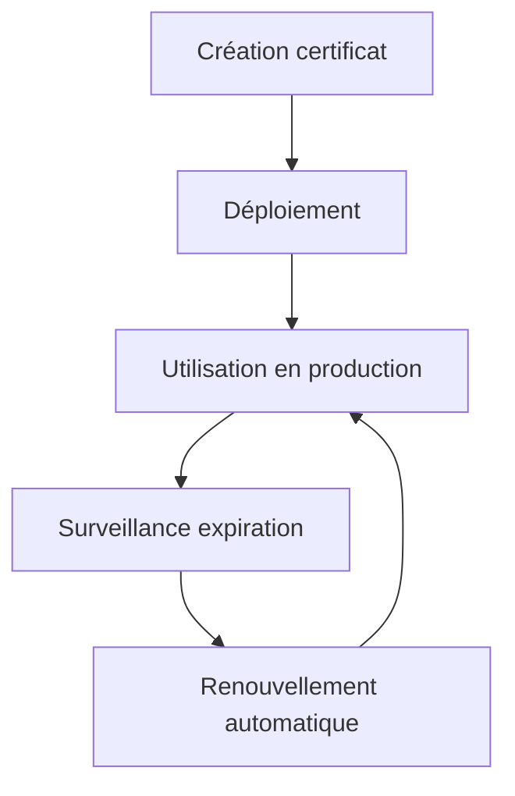

# **6.2 — Gestion des certificats**

Les certificats TLS sont au cœur de la sécurité des communications dans une API.
Ils permettent au client de s’assurer qu’il parle bien au **bon serveur**, et garantissent que les données échangées sont **chiffrées et protégées**.

Cependant, mal gérer ses certificats peut rendre une API :

* inutilisable,
* vulnérable à des attaques,
* non conforme,
* ou instable.

Ce chapitre explique :

* ce qu’est un certificat,
* comment il fonctionne,
* comment le générer et le renouveler,
* quels risques existent,
* et quelles bonnes pratiques appliquer en production.

---

# **6.2.1 — Qu’est-ce qu’un certificat TLS ?**

Un certificat TLS est un fichier signé par une **autorité de certification (CA)**, qui lie :

* un **nom de domaine**,
* à une **clé publique**,
* pour une **durée limitée**,
* avec la **garantie de l’identité du serveur**.

Le client (navigateur, mobile ou API) utilise ce certificat pour s’assurer de l’authenticité du serveur.

---

# **6.2.2 — Contenu d’un certificat**

Un certificat contient :

* **Common Name (CN)** → le domaine associé (ex: `api.monsite.com`)
* **Subject Alternative Names (SAN)** → autres domaines valides
* **Clé publique**
* **Dates de validité (Not Before / Not After)**
* **Signature de l’autorité de certification**
* **Algorithme cryptographique (RSA, ECDSA)**

Le client valide ces champs avant d’établir la connexion.

---

# **6.2.3 — Certificats auto-signés vs certificats signés**

| Type             | Usage          | Sécurité | Clients                    |
| ---------------- | -------------- | -------- | -------------------------- |
| **Auto-signé**   | Tests internes | Faible   | Rejeté par les navigateurs |
| **Signé par CA** | Production     | Élevée   | Accepté partout            |

Les certificats auto-signés ne doivent **jamais** être utilisés en production.
Ils empêchent toute validation automatique par le client.

---

# **6.2.4 — Les autorités de certification (CA)**

Les CA publiques souscrivent aux normes WebTrust.
Exemples :

* **Let’s Encrypt** (gratuit, automatisé)
* Sectigo
* GlobalSign
* DigiCert
* GoDaddy

Let’s Encrypt est devenu la norme pour les API modernes.

---

# **6.2.5 — La chaîne de certificats**

Un certificat est valide si :

1. Le certificat serveur est bien signé par une CA intermédiaire
2. Cette CA intermédiaire est signée par une CA racine
3. La CA racine est reconnue par le client

Schéma :

```mermaid
flowchart TD
    A[Racine (Root)] --> B[CA Intermédiaire]
    B --> C[Certificat Serveur]
    C --> D[Client (valide la chaîne)]
```

Si un élément manque → le client rejette la connexion.

---

# **6.2.6 — Le renouvellement automatique**

Les certificats Let’s Encrypt expirent tous les 90 jours.

C’est volontaire :

* meilleure sécurité,
* rotation des clés fréquente,
* réduction des risques de compromission.

Un service comme **Certbot** peut automatiquement :

* générer
* renouveler
* déployer
  les certificats.

Un API en production doit **toujours** automatiser ce processus.

---

# **6.2.7 — Risques liés aux certificats expirés**

Quand un certificat expire :

* ⚠️ toutes les connexions HTTPS échouent
* ⚠️ l’API devient instantanément inaccessible
* ⚠️ certaines applications mobiles plantent
* ⚠️ certains scripts échouent en silence
* ⚠️ les utilisateurs reçoivent des alertes de sécurité

80 % des outages majeurs “inexpliqués” viennent d’un certificat expiré.

---

# **6.2.8 — Dangers des certificats mal configurés**

### ❌ Anciennes versions TLS activées

→ Débits faibles, vulnérabilités connues exploitées.

### ❌ Clés trop faibles (1024 bits)

→ Vulnérable au cassage cryptographique.

### ❌ Absence de SAN

→ Le certificat ne couvre pas les sous-domaines utilisés.

### ❌ Mauvais domaine dans le certificat

→ Interception possible via MITM.

### ❌ Certificat auto-signé en production

→ Rejeté par les clients → API inutilisable.

### ❌ Absence de renouvellement automatique

→ Expiration ⇒ panne massive.

---

# **6.2.9 — Bonnes pratiques pour la gestion des certificats**

### ✔ Toujours utiliser TLS 1.2+

TLS 1.3 recommandé.

### ✔ Utiliser Let’s Encrypt en production

Gratuit, fiable, rotation automatique.

### ✔ Automatiser le renouvellement

Cron + Certbot, ou mécanismes intégrés

### ✔ Surveiller l’expiration des certificats

Alertes au moins 30 jours avant.

### ✔ Désactiver TLS et ciphers faibles

Éviter RC4, MD5, SHA1.

### ✔ Utiliser des certificats wildcard si besoin

Pour protéger tous les sous-domaines :

```
*.api.monsite.com
```

### ✔ Tester régulièrement avec des outils comme :

* SSL Labs (Qualys)
* testssl.sh

---

# **6.2.10 — Schéma : cycle de vie d’un certificat TLS**



Le cycle doit être **continu et automatisé**.

---

# **6.2.11 — Résumé du sous-chapitre**

* Les certificats TLS garantissent l’identité du serveur et chiffrent les données.
* Ils doivent être délivrés par une CA reconnue (Let’s Encrypt conseillé).
* Le renouvellement automatique est indispensable.
* La chaîne de certificats doit être complète et valide.
* Des certificats expirés ou mal configurés provoquent des pannes critiques.
* TLS 1.2+ est obligatoire, TLS 1.3 recommandé.
* La gestion des certificats fait partie intégrante de la sécurité API.