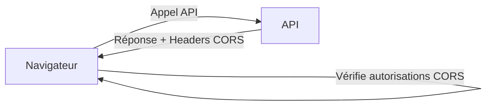
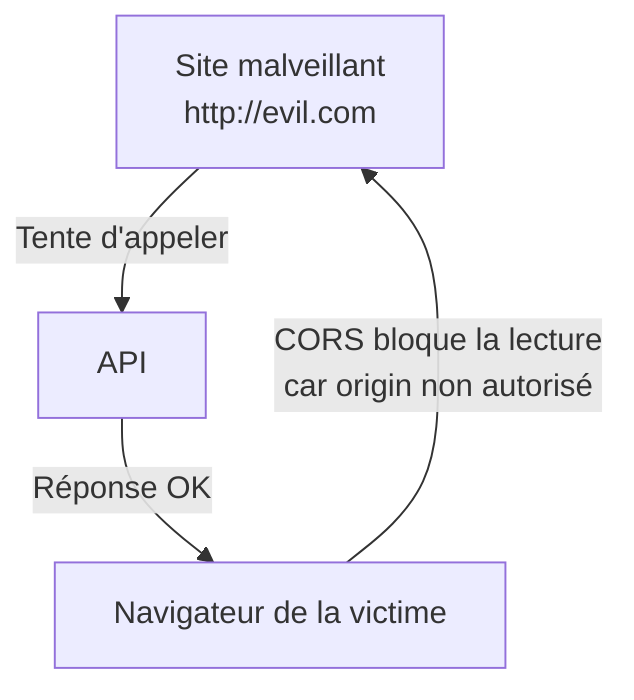

# **6.3 — CORS : comprendre les risques, pas juste “débloquer le front”**

CORS (Cross-Origin Resource Sharing) est l’un des concepts les plus mal compris dans la sécurité des APIs.
Beaucoup de développeurs le voient comme un obstacle qu’il faut “désactiver” pour que le frontend fonctionne.
Mais en réalité, **CORS est un mécanisme de sécurité essentiel** dans les navigateurs — même si, paradoxalement, il **ne protège pas l’API contre les attaquants**.

Ce chapitre clarifie entièrement :

* ce qu’est CORS,
* pourquoi il existe,
* ce qu’il protège,
* ce qu’il ne protège PAS,
* comment l’utiliser correctement,
* quelles configurations sont dangereuses.

---

# **6.3.1 — Qu’est-ce que CORS ?**

CORS est un mécanisme du **navigateur web** qui contrôle si un site A (ex : `https://frontend.com`) a le droit d'appeler une API B (ex : `https://api.backend.com`).

Il ne concerne :

* ni Postman
* ni cURL
* ni scripts serveurs
* ni mobiles
* ni bots
* ni attaquants

CORS protège **uniquement** l’utilisateur du navigateur contre les pages malveillantes.

---

# **6.3.2 — Schéma : rôle de CORS**



Si les headers CORS n’autorisent pas l'origine →
le navigateur **bloque la réponse**, mais **la requête est quand même envoyée**.

---

# **6.3.3 — Exemple concret**

Frontend hébergé sur :

```
https://app.maboutique.com
```

API hébergée sur :

```
https://api.maboutique.com
```

Même si les deux services vous appartiennent, ils sont “cross-origin”, donc CORS s’applique.

---

# **6.3.4 — Important : CORS ne protège pas votre API**

CORS ne bloque pas l’appel.
Il bloque **la lecture de la réponse par le navigateur**.

Un attaquant peut toujours appeler :

```bash
curl https://api.maboutique.com/secret
```

Même si CORS est très strict.

Donc CORS :

* ✔ protège les utilisateurs contre certains vols de données
* ✖ ne protège pas l’API des attaques

---

# **6.3.5 — Le préflight (OPTIONS)**

Pour certaines requêtes (PATCH, PUT, DELETE, POST avec JSON…),
le navigateur envoie d’abord une requête :

```
OPTIONS /endpoint
```

Ce “préflight” demande :

* quelles origines sont autorisées ?
* quels headers sont autorisés ?
* quelles méthodes sont autorisées ?

L’API doit répondre avec les bons headers CORS.

---

# **6.3.6 — Headers importants de CORS**

### **1. Access-Control-Allow-Origin**

Indique quelles origines sont autorisées.

Exemple sécurisé :

```
Access-Control-Allow-Origin: https://app.maboutique.com
```

### **2. Access-Control-Allow-Methods**

Méthodes autorisées :

```
GET, POST, PATCH, DELETE
```

### **3. Access-Control-Allow-Headers**

Headers que le client peut envoyer :

```
Authorization, Content-Type
```

### **4. Access-Control-Allow-Credentials**

Permet d’envoyer les cookies au serveur.

⚠️ Très sensible.

---

# **6.3.7 — Configuration dangereuse : `*`**

Beaucoup de développeurs font :

```
Access-Control-Allow-Origin: *
```

Pourquoi c'est dangereux ?

* Ça signifie que *tous les sites du monde* peuvent lire les réponses de votre API.
* Si vous activez aussi `Allow-Credentials: true`, c’est interdit… et pour de bonnes raisons.

---

# **6.3.8 — Règle ABSOLUE :**

> **Jamais : `Access-Control-Allow-Origin: *` avec des cookies ou des tokens persistants.**

Cela ouvre la porte au vol de session via n’importe quel site malveillant.

---

# **6.3.9 — Bonne configuration pour une API authentifiée**

```
Access-Control-Allow-Origin: https://app.maboutique.com
Access-Control-Allow-Credentials: true
Access-Control-Allow-Headers: Authorization, Content-Type
Access-Control-Allow-Methods: GET, POST, PATCH, DELETE
```

Ici :

* seul votre frontend peut appeler l’API depuis un navigateur,
* les cookies sont envoyés,
* les requêtes sont bien contrôlées.

---

# **6.3.10 — Schéma pédagogique : ce que CORS bloque réellement**



Le site malveillant **envoie** la requête,
mais JavaScript **ne peut pas lire** la réponse.

---

# **6.3.11 — Ce que CORS n'empêche PAS**

| Attaque                             | CORS empêche ? |
| ----------------------------------- | -------------- |
| Attaques API via cURL / Postman     | ❌ Non          |
| Attaques brute-force                | ❌ Non          |
| Appels depuis un script Python      | ❌ Non          |
| Requêtes depuis une machine IoT     | ❌ Non          |
| Appels directs d’un attaquant       | ❌ Non          |
| Appels authentifiés avec token volé | ❌ Non          |

CORS ne protège que **l’utilisateur du navigateur**, pas l’API.

---

# **6.3.12 — Mauvaises pratiques à éviter**

### ❌ Ajouter `*` pour “faire marcher le front”

Grosse erreur.

### ❌ Copier/coller une config trouvée sur StackOverflow

Très dangereux.

### ❌ Mettre l’API en “wide-open CORS”

Cela expose des données involontairement.

### ❌ Permettre plusieurs origines sensibles sans filtrage dynamique

Il faut une whitelist.

---

# **6.3.13 — Bonnes pratiques**

### ✔ Toujours whitelister les origines

Pas de wildcard.

### ✔ Activer CORS seulement pour les fronts légitimes

Limiter les surfaces d'exposition.

### ✔ Garder la logique de sécurité côté backend

CORS ≠ sécurité API.

### ✔ Documenter les origines autorisées

Pour éviter les erreurs futures.

### ✔ Tester avec Postman ET un vrai navigateur

Les comportements diffèrent.

---

# **6.3.14 — Résumé du sous-chapitre**

* CORS protège les navigateurs, pas les API.
* CORS ne doit jamais être désactivé ou mis en wildcard sans réflexion.
* Le backend doit valider authentification et permissions, indépendamment de CORS.
* Une configuration correcte est essentielle pour éviter les fuites de données côté front.
* Zero Trust s’applique ici aussi : n’autoriser que les origines nécessaires.
* CORS n’est qu’une **couche de sécurité du client**, pas du serveur.
