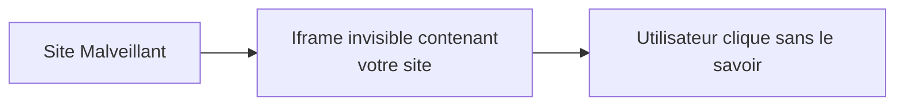

# **6.4 — Headers de sécurité (CSP, HSTS, X-Frame-Options, etc.)**

Les **en-têtes de sécurité HTTP** sont des protections essentielles souvent oubliées.
Ils permettent d’empêcher des attaques avant même qu’elles ne puissent se produire :
XSS, clickjacking, vol de cookies, downgrade HTTPS…
Ils renforcent la sécurité **du navigateur** et donc de l’utilisateur.

Même si ce sont des protections côté client, **elles sont envoyées par le serveur**, donc font partie intégrante de la sécurité API/Web.

Dans ce chapitre, nous allons voir :

* les principaux headers,
* ce qu’ils empêchent,
* comment les configurer,
* pourquoi ils sont indispensables.

---

# **6.4.1 — Pourquoi les headers de sécurité sont importants ?**

Parce qu’ils activent des protections intégrées dans les navigateurs.
Sans eux, même un front bien codé peut être vulnérable.

Ils permettent de :

* protéger contre XSS
* forcer l’usage du HTTPS
* empêcher le clickjacking
* contrôler l’exposition des cookies
* limiter la fuite d’informations

---

# **6.4.2 — Headers principaux à connaître**

Voici ceux que toute API/plateforme web devrait absolument utiliser.

---

# **1️⃣ HSTS — Strict-Transport-Security**

Empêche toute communication en HTTP.
Le navigateur apprend qu'il **doit utiliser HTTPS pour toujours**.

Exemple :

```
Strict-Transport-Security: max-age=63072000; includeSubDomains; preload
```

Effets :

* impossible de faire du downgrade HTTPS → HTTP
* même si l’utilisateur tape `http://site.com`, le navigateur force `https://`

---

# **2️⃣ CSP — Content-Security-Policy**

Probablement le **header de sécurité le plus puissant**.

Il permet de contrôler **ce qui peut être chargé** dans la page :

* scripts
* images
* styles
* fonts
* frames
* connexions

Et donc de neutraliser la majorité des attaques XSS.

Exemple minimal :

```
Content-Security-Policy: default-src 'self';
```

Exemple plus complet :

```
Content-Security-Policy:
  default-src 'self';
  script-src 'self' https://apis.google.com;
  img-src 'self' data:;
  style-src 'self' 'unsafe-inline';
```

---

# **3️⃣ X-Frame-Options**

Empêche une page d’être affichée dans une iframe.

Pourquoi ?
Pour éviter les attaques de **clickjacking** où un site malveillant vous piège en superposant une interface invisible.

Exemples :

```
X-Frame-Options: DENY
```

ou

```
X-Frame-Options: SAMEORIGIN
```

---

# **4️⃣ X-Content-Type-Options**

Empêche le navigateur de deviner (“sniffer”) un type de fichier fourni par le serveur.

Protection contre les attaques de type :

* upload malicieux
* exécution de scripts masqués

Exemple :

```
X-Content-Type-Options: nosniff
```

---

# **5️⃣ Referrer-Policy**

Empêche la fuite de données sensibles dans l’en-tête `Referer`.

Exemple recommandé :

```
Referrer-Policy: no-referrer
```

ou

```
Referrer-Policy: strict-origin-when-cross-origin
```

---

# **6️⃣ Permissions-Policy**

Permet de désactiver l’accès à des fonctionnalités du navigateur :

* caméra
* micro
* géolocalisation
* capteurs
* paiement
* etc.

Exemple :

```
Permissions-Policy: geolocation=(), microphone=()
```

---

# **7️⃣ Cache-Control / Pragma / Expires**

Très importants si l’API renvoie :

* données sensibles
* résultats personnalisés
* pages d’erreur contenant des infos

Exemple :

```
Cache-Control: no-store
```

Cela empêche le navigateur de conserver les données en cache.

---

# **6.4.3 — Schéma global de leur rôle**

```mermaid
flowchart TD
    A[Serveur API/Web] --> B[Headers de Sécurité]
    B --> C[Navigateur]
    C --> D[Protections activées<br>(XSS, Clickjacking, HTTPS forcé...)]
```

---

# **6.4.4 — Exemple illustré : Clickjacking**

Sans X-Frame-Options :



Avec X-Frame-Options :

→ Impossible d’intégrer votre site dans une iframe.

---

# **6.4.5 — Exemple illustré : Atténuer une XSS via CSP**

Sans CSP :

```javascript
<script>alert("hack")</script>
```

→ exécuté dans le navigateur

Avec CSP :

```
script-src 'self';
```

→ seuls les scripts provenant du serveur autorisé sont exécutés.

Les scripts injectés ne s’exécutent tout simplement pas.

---

# **6.4.6 — Headers conseillés pour une API Web moderne**

Voici une configuration robuste :

```
Strict-Transport-Security: max-age=63072000; includeSubDomains; preload
X-Content-Type-Options: nosniff
X-Frame-Options: DENY
Referrer-Policy: strict-origin-when-cross-origin
Permissions-Policy: geolocation=(), microphone=()
Content-Security-Policy: default-src 'none'; frame-ancestors 'none';
Cache-Control: no-store
```

---

# **6.4.7 — Attention : APIs vs Front Web**

* Certaines protections (CSP, X-Frame-Options) ne s'appliquent pas exactement pareil pour une API pure JSON.
* Mais elles deviennent essentielles si l’API renvoie **des pages**, ou si elle alimente un front web hébergé au même domaine.

Le plus important pour une API pure :

* HSTS
* nosniff
* Referrer-Policy
* Cache-Control
* Permissions-Policy (selon usage)

---

# **6.4.8 — Résumé du sous-chapitre**

Les headers de sécurité :

* activent des protections intégrées dans les navigateurs,
* réduisent les risques XSS, clickjacking, sniffing et fuite d’informations,
* renforcent l’usage de HTTPS,
* empêchent des comportements dangereux par défaut.

Ils font partie des **standards de sécurité moderne**, et tout serveur les servant au navigateur devrait les envoyer systématiquement.