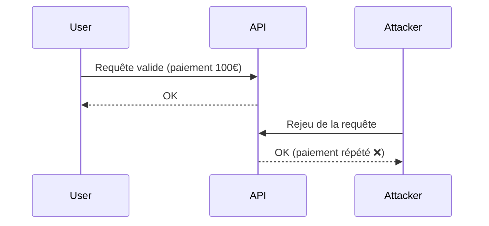
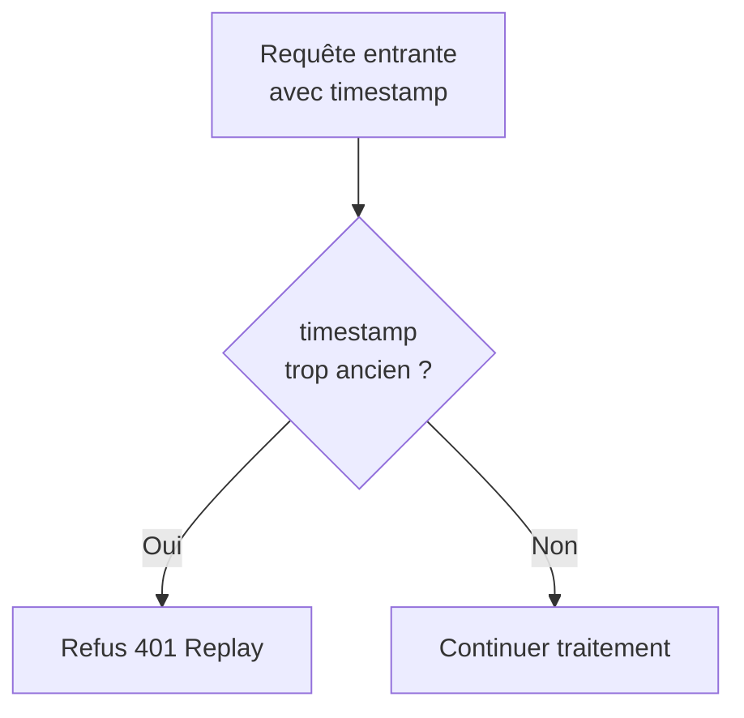
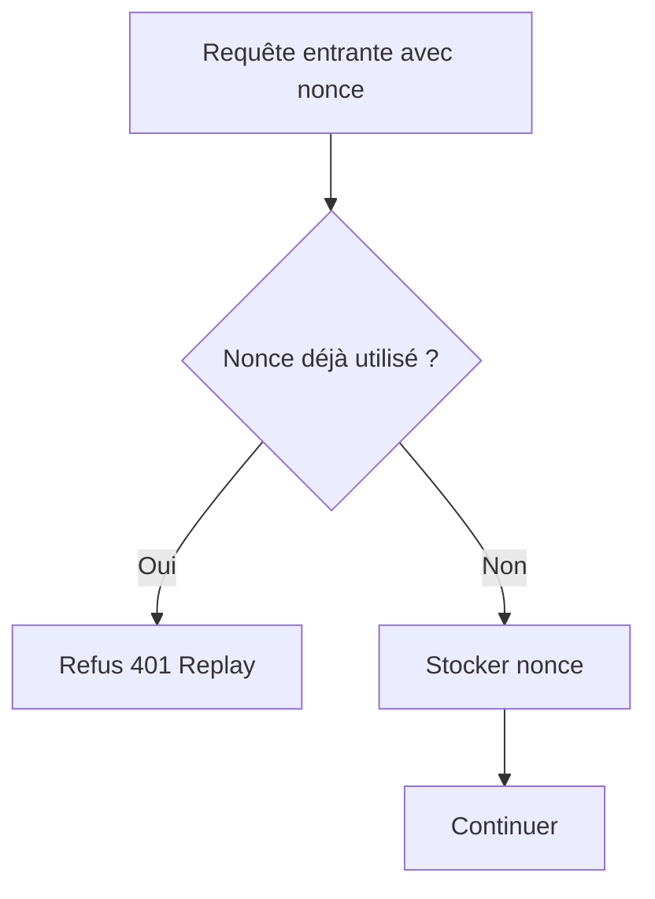
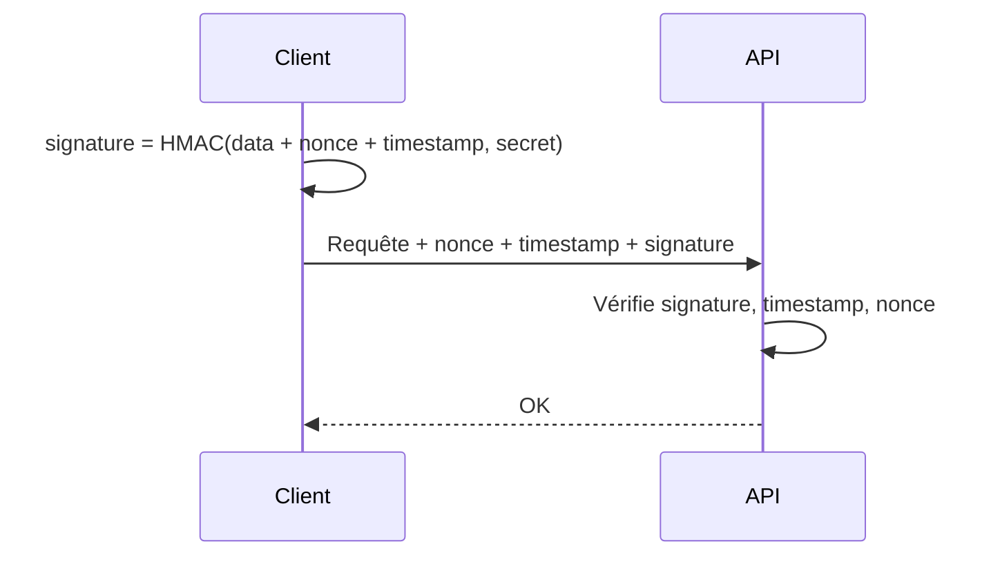

# **6.5 — Protection anti-rejeu (nonce, timestamp, signature)**

La **protection anti-rejeu** (anti-replay) est un mécanisme essentiel pour empêcher un attaquant :

* d’intercepter une requête valide,
* et de la rejouer plus tard,
* pour obtenir le même effet (paiement, création d’utilisateur, commande, suppression d’un fichier…).

Même si la requête a été correctement authentifiée, signée et autorisée,
**un simple “replay” peut être catastrophique** si l’API n’est pas protégée.

Dans ce chapitre, nous allons expliquer :

* ce qu'est une attaque par rejeu,
* pourquoi elle est très dangereuse,
* comment la contrer avec timestamps, nonces et signatures,
* des schémas simples pour comprendre,
* d’autres méthodes courantes dans les API modernes.

---

# **6.5.1 — Qu’est-ce qu’une attaque par rejeu ?**

Une attaque par rejeu consiste à **réutiliser une requête valide** pour tromper le système.

### Exemple simple :

1. L’utilisateur envoie une requête de paiement :

   ```
   POST /paiement  { montant: 100 }
   ```

2. L’attaquant capture la requête via un proxy réseau.

3. L’attaquant renvoie la requête **exactement telle quelle**,
   même plusieurs fois.

Résultat :

* plusieurs paiements,
* plusieurs commandes,
* plusieurs suppressions,
* plusieurs transferts…

Même si la requête originale était authentifiée !

---

# **6.5.2 — Schéma simple d’une attaque replay**



Sans protection anti-rejeu, **l’API ne voit pas la différence**.

---

# **6.5.3 — Pourquoi HTTPS ne suffit pas ?**

HTTPS protège contre l’interception, mais :

* si l’attaquant est déjà dans la machine du client,
* ou si le token est volé,
* ou s'il observe les requêtes via un navigateur compromis,
* ou qu'il récupère les logs d’un serveur intermédiaire…

… alors **la requête peut être parfaitement rejouée**.

Le serveur doit donc vérifier **qu’une requête ne peut pas être réutilisée**.

---

# **6.5.4 — Méthodes de protection anti-rejeu**

Il existe **trois mécanismes principaux** :

1. **Timestamp (horodatage)**
2. **Nonce (identifiant unique)**
3. **Signature (HMAC)**

Souvent, on les combine.

---

# **6.5.5 — 1) Timestamp : horodatage de la requête**

Chaque requête contient un header avec l’heure :

```
X-Timestamp: 1712345678
```

Le serveur refuse si :

* l’heure est trop ancienne,
* l’heure est trop future,
* ou si elle dépasse une tolérance temporaire (ex : ± 30 secondes)

### Avantage :

Empêche le rejeu plus tard.

### Limite :

N’empêche pas un rejeu **immédiat** dans la même fenêtre temporelle.

---

# **6.5.6 — Schéma du timestamp**



---

# **6.5.7 — 2) Nonce : identifiant unique par requête**

Un **nonce** est un identifiant **unique**, utilisable une seule fois :

```
X-Nonce: 8f2e9c1b-2e3a-4fa6-93cb-fa12345678ab
```

Le serveur garde une liste des nonces déjà vus (en cache, Redis…).

### Fonctionnement :

* si le nonce est nouveau → OK
* si le nonce a déjà été utilisé → rejeter immédiatement

### Avantage :

Empêche **tout** rejeu, même dans la même seconde.

### Limite :

Nécessite de stocker les nonces récemment vus.

---

# **6.5.8 — Schéma du nonce**



---

# **6.5.9 — 3) Signature (HMAC)**

Le client signe la requête avec une **clé secrète** partagée entre le client et le serveur.

La signature dépend :

* des paramètres
* du corps
* de l’URL
* du nonce
* du timestamp

Exemple :

```
X-Signature: hmacsha256(body + timestamp + nonce, secret_key)
```

Le serveur vérifie que :

* la signature est valide
* le timestamp est récent
* le nonce n’a pas été utilisé

Si une seule condition échoue → la requête est rejetée.

---

# **6.5.10 — Exemple illustré de signature**



---

# **6.5.11 — Exemple d’en-têtes anti-rejeu dans une API**

```
X-Timestamp: 1712345678
X-Nonce: 8f2e9c1b-2e3a-4fa6-93cb-fa12345678ab
X-Signature: a82df34bfe98c1...
```

Le serveur valide :

1. Le timestamp est récent
2. Le nonce n’a pas été vu
3. La signature est correcte

---

# **6.5.12 — Cas d’usage typiques**

### ✔ Paiements

Obligatoire par PCI-DSS.

### ✔ Transferts bancaires

Empêcher l’envoi multiple d’un ordre.

### ✔ APIs sensibles / coût computationnel élevé

Génération de PDF, IA, conversions…

### ✔ Appels machines à machines sécurisés

Microservices internes → signature + nonce.

### ✔ Webhooks (GitHub, Stripe…)

Tous utilisent des signatures HMAC pour éviter le rejeu.

---

# **6.5.13 — Exemple concret : Webhook Stripe**

Stripe envoie :

```
Stripe-Signature: t=171234, v1=abcd..., v0=efgh...
```

Votre serveur doit :

* vérifier le timestamp,
* vérifier la signature HMAC,
* refuser un événement avec timestamp trop ancien.

---

# **6.5.14 — Attaques empêchées**

### ✔ Rejouer un paiement

→ évité

### ✔ Rejouer une suppression de ressource

→ évité

### ✔ Rejouer un appel authentifié même avec token valide

→ évité

### ✔ Rejouer un webhook

→ évité

### ✔ Rejouer un appel API capturé dans les logs

→ évité

---

# **6.5.15 — Mauvaises pratiques à NE PAS faire**

### ❌ Pas d’anti-rejeu sur des actions sensibles

Paiement, suppression, action financière…

### ❌ Utiliser uniquement des timestamps sans nonce

Vulnérable au rejeu immédiat.

### ❌ Stocker les nonces trop longtemps

Cause un déni de service involontaire.

### ❌ Utiliser un secret faible pour HMAC

Entraîne la compromission totale des signatures.

---

# **6.5.16 — Bonnes pratiques**

* ✔ Combiner timestamp + nonce + signature
* ✔ Garder une fenêtre de validité courte (30–60 sec)
* ✔ Stocker les nonces dans Redis ou en cache mémoire
* ✔ Ajouter la bonne granularité (signature inclut path + body)
* ✔ Documenter clairement pour tous les clients API
* ✔ Protéger aussi les webhooks

---

# **6.5.17 — Résumé du sous-chapitre**

* Une attaque par rejeu consiste à réutiliser une requête valide.
* HTTPS n’empêche pas le rejeu.
* Les protections essentielles sont :

    * timestamp (anti-rejeu tardif),
    * nonce (anti-rejeu absolu),
    * signature HMAC (intégrité + authenticité).
* Les trois combinés offrent la meilleure protection.
* Indispensable pour les actions critiques (paiement, transfert, suppression, webhook).