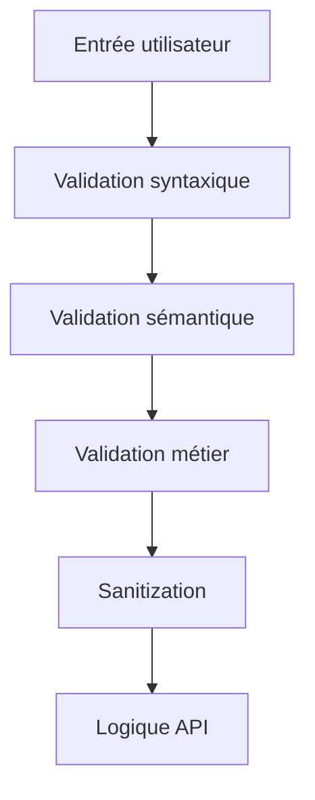

# **7.1 — Validation entrée / sortie (server-side validation)**

La **validation des données côté serveur** est l’un des piliers essentiels de la sécurité des APIs.
C’est une défense *obligatoire*, car **toutes les entrées venant du client sont considérées comme potentiellement dangereuses**.

Ce chapitre explique :

* pourquoi la validation doit être faite **côté serveur** et jamais uniquement côté frontend,
* quelles sont les méthodes de validation,
* comment éviter les injections,
* comment limiter l’exposition des données en sortie,
* et comment structurer une API robuste, prévisible et non vulnérable.

---

# **7.1.1 — Pourquoi valider côté serveur ?**

### ❌ Le frontend n’est pas fiable

Un attaquant peut :

* modifier le JavaScript,
* appeler l’API via Postman, cURL, Python,
* supprimer les validations,
* envoyer n’importe quel payload JSON.

### ✔ Le backend est le seul endroit sûr

Il doit valider *systématiquement* :

* les paramètres d’URL
* les query params
* le corps JSON
* les headers
* les fichiers uploadés

Ce principe fait partie du modèle :
**Zero Trust → ne jamais faire confiance à l’utilisateur.**

---

# **7.1.2 — Schéma : cycle de traitement sécurisé d’une requête**

```mermaid
flowchart TD
    A[Requête brute] --> B[Validation des entrées]
    B -->|OK| C[Sécurité applicative<br>(auth + authz)]
    C --> D[Logique métier]
    D --> E[Validation des sorties]
    E --> F[Réponse API]
    B -->|Erreur| G[400 Bad Request]
```

La validation intervient **au début** et **à la fin**.

---

# **7.1.3 — Validation des entrées : ce qu’il faut contrôler**

Voici les éléments à valider **côté serveur** :

---

## **1) Format des données**

Exemples :

* email valide ?
* UUID conforme ?
* integer ou string ?
* boolean vrai / faux ?

Si un champ incertain arrive → erreur 400.

---

## **2) Contraintes métier simples**

Exemples :

* âge ≥ 18
* prix ≥ 0
* date dans le futur
* taille maximale d’un champ string
* liste avec un nombre d’éléments limité

---

## **3) Types stricts**

Exemple :

```
"quantity": "10"   ❌  (string)
"quantity": 10     ✔  (number)
```

Les APIs robustes ne tolèrent pas les types incorrects.

---

## **4) Champs obligatoires / optionnels**

Si “email” est requis :

```
POST /inscription
{
    "password": "1234"
}
```

→ 400 Bad Request.

---

## **5) Whitelisting des champs**

N’acceptez *que* les champs attendus.

Exemple d’envoi malveillant :

```
PATCH /profil
{
  "username": "paul",
  "role": "admin"
}
```

Si votre API ne whiteliste pas les attributs →
risque d’élévation de privilèges.

---

# **7.1.4 — Validation des données en profondeur**

Certaines données doivent être validées très strictement :

### ✔ Entrées texte

→ éviter les injections (SQL, NoSQL, template, LDAP…)

### ✔ Entrées numériques

→ éviter les dépassements (buffers, pagination excessive…)

### ✔ Entrées de liste

→ empêcher les payloads volumineux

### ✔ Entrées fichiers (upload)

→ taille, type MIME, extension, scan antivirus

---

# **7.1.5 — Exemples d’erreurs de validation dangereuses**

### ❌ Manque de validation des IDs

```
GET /users/00000123
```

→ l’attaquant peut essayer des milliers d’IDs → BOLA.

### ❌ Emails non validés

Peut casser des workflows entiers.

### ❌ Données non typées

Ex :

```
{ "isAdmin": "true" }
```

Peut exploiter des failles logiques dans certains frameworks.

### ❌ Absence de limite sur les listes

Ex :

```
GET /products?limit=1000000
```

→ attaque de surcharge.

---

# **7.1.6 — Exemples concrets de validation correcte**

## **Exemple 1 : Endpoint de création**

```
POST /order
{
  "productId": "d0c3f18e-41d7-4e1e-9adb-88ff8cb7a67d",
  "quantity": 2
}
```

Validation côté serveur :

* `productId` → UUID
* `quantity` → entier ≥ 1
* pas d’autres champs acceptés
* taille JSON limitée (ex : 2 KB)

---

## **Exemple 2 : Endpoint de pagination**

```
GET /customers?limit=50&offset=0
```

Contrôles :

* `limit ≤ 100`
* `offset ≥ 0`
* `limit` et `offset` doivent être des **entiers**

---

# **7.1.7 — Validation des sorties (output validation)**

Très souvent oubliée !

### Pourquoi valider les sorties ?

* éviter de renvoyer **trop de données**
* éviter les fuites accidentelles
* supprimer les champs sensibles

### Exemples de champs à NE JAMAIS renvoyer :

* mot de passe hashé
* secret API
* clé API du user
* token JWT
* rôle si inutile
* informations internes du système
* erreurs techniques (stack trace)

---

## Exemple de réponse à nettoyer :

Réponse brute de la DB :

```json
{
  "id": 42,
  "email": "alice@example.com",
  "password": "$argon2id$v=19$m=65536",
  "created_at": "2023-01-01",
  "internal_note": "VIP",
  "role": "user"
}
```

Réponse API correcte :

```json
{
  "id": 42,
  "email": "alice@example.com",
  "role": "user"
}
```

---

# **7.1.8 — Validation ≠ Sanitization (différence)**

### ✔ Validation

→ Vérifie que les données reçues sont correctes.

### ✔ Sanitization

→ Nettoie les données dangereuses (ex: retirer `<script>`).

Les deux doivent être présentes.

---

# **7.1.9 — Schéma global de la validation**



---

# **7.1.10 — Outils conceptuels souvent utilisés**

Même si nous ne faisons pas de code dans ce cours, voici des concepts importants :

* validation par schéma (ex : OpenAPI, JSON Schema)
* validation d’objet par contraintes déclaratives
* middlewares de validation
* typage strict
* whitelisting des champs autorisés
* listes de regex sécurisées

Peu importe la technologie :
**le concept reste identique partout.**

---

# **7.1.11 — Mauvaises pratiques à éviter**

### ❌ Valider uniquement dans le frontend

→ Contournable en 2 secondes.

### ❌ Faire une validation “light”

→ Attaques d’injection et erreurs logiques.

### ❌ Accepter n’importe quel type

→ Confusion, plantages, exploitation.

### ❌ Renvoyer des champs sensibles

→ Fuite massive de données.

### ❌ Absence de contrôle sur la taille du JSON

→ Attaque de surcharge.

---

# **7.1.12 — Bonnes pratiques**

### ✔ Toujours valider côté serveur

Quelle que soit la validation frontend.

### ✔ Valider chaque champ et chaque type

Tolérance zéro.

### ✔ Whitelister les attributs autorisés

Pas de traitement pour les champs inconnus.

### ✔ Sanitizer les entrées texte

Protection anti-XSS / injections.

### ✔ Limiter la taille maximale du payload

Évite certains DDoS.

### ✔ Valider aussi les sorties

Évite les fuites accidentelles.

---

# **7.1.13 — Résumé du sous-chapitre**

* Le backend doit valider toutes les entrées, sans exception.
* Le frontend n’est pas une source de sécurité.
* Validation = structure + type + format + contraintes métier.
* Sanitization = nettoyage des contenus dangereux.
* La validation des sorties évite les fuites accidentelles.
* Une validation rigoureuse empêche un grand nombre de vulnérabilités (Injection, Misconfiguration, BOLA, etc.).
