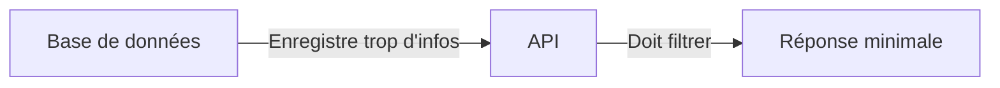
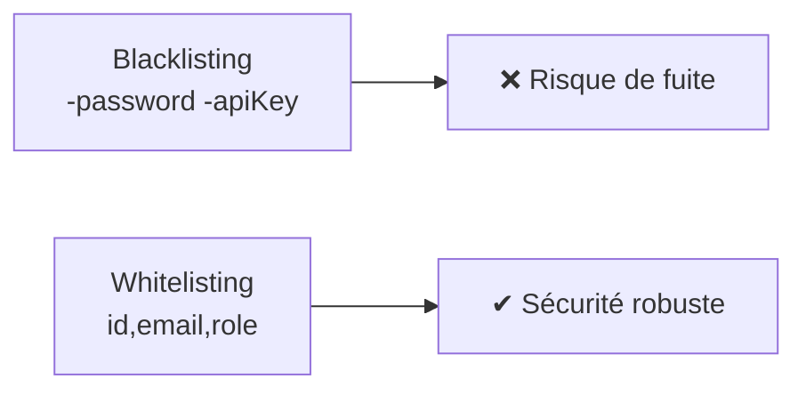

# **7.2 — Limitation du champ de réponse (whitelisting)**

Limiter le champ de réponse est un principe fondamental de la sécurité des APIs :
**une API ne doit renvoyer que les données strictement nécessaires.**

Cette règle simple permet d’éviter :

* les fuites d’informations sensibles,
* l’exposition involontaire de champs internes,
* les attaques de type **Excessive Data Exposure (OWASP API3)**,
* l’ingénierie sociale basée sur des données renvoyées par erreur,
* la compromission de comptes via des champs que personne n’aurait dû voir.

Dans ce chapitre, nous allons découvrir :

* pourquoi limiter les réponses est essentiel,
* de nombreux exemples concrets,
* comment whitelister les champs retournés,
* comment éviter les erreurs courantes,
* comment représenter visuellement les risques.

---

# **7.2.1 — Pourquoi limiter les champs en sortie ?**

Parce que l’API est souvent “trop bavarde”.

La base de données contient plus d’informations que nécessaires :

* données internes,
* flags techniques,
* clés étrangères,
* informations confidentielles,
* métadonnées internes,
* références internes,
* valeurs sensibles.

L’API ne doit *jamais* exposer :

* le modèle interne d’un objet,
* une ligne brute de la BDD,
* des champs superflus.

### Exemple classique de fuite :

Retourner un utilisateur avec :

```json
{
  "id": 42,
  "email": "alice@example.com",
  "password": "$argon2id$...",
  "internal_score": 94,
  "is_admin": false,
  "billing_address_id": 12
}
```

Même si le frontend n’utilise pas ces champs →
Ils sont visibles par *tout le monde* via l’API.

---

# **7.2.2 — Schéma simple**



---

# **7.2.3 — Le principe du whitelisting**

Au lieu d’exclure des champs,
**on définit explicitement ceux que l’on veut retourner**, et rien d’autre.

### Exemple :

Au lieu de faire :

> “On renvoie tout sauf le password”

On fait :

> “On renvoie uniquement : id, email, prénom, nom”

Cela évite totalement :

* d’oublier un champ sensible
* de créer une fuite après ajout d’un nouveau champ en base
* de laisser passer des données inutiles

---

# **7.2.4 — Exemple avant/après**

### ❌ Mauvaise pratique : réponse brute DB

```json
{
  "id": 1,
  "email": "bob@example.com",
  "password": "$argon2id$...",
  "isActive": true,
  "created_at": "2023-01-01",
  "internal_flag": "X01",
  "last_login_ip": "192.168.0.14"
}
```

### ✔ Bonne pratique : whitelisting

```json
{
  "id": 1,
  "email": "bob@example.com"
}
```

---

# **7.2.5 — Limitation selon le contexte de l’utilisateur**

Dans une API sécurisée, la réponse dépend **de l’utilisateur qui l’appelle**.

Exemple : l’objet "Utilisateur" peut être représenté :

### Pour l'utilisateur lui-même

```json
{
  "id": 1,
  "email": "bob@example.com",
  "preferences": {...}
}
```

### Pour un admin

```json
{
  "id": 1,
  "email": "bob@example.com",
  "role": "user",
  "isBlocked": false
}
```

### Pour un autre utilisateur

```json
{
  "id": 1,
  "publicName": "Bob"
}
```

La réponse doit être **contextuelle** et **restreinte**.

---

# **7.2.6 — Le whitelisting évite l’OWASP API3 : Excessive Data Exposure**

API3 concerne l'exposition de données sensibles ou inutiles.

### Exemple réel :

```
GET /orders/42
```

Réponse dangereuse :

```json
{
  "orderId": 42,
  "productId": 91,
  "price": 99,
  "billing_card_hash": "sk_09021faf93",
  "internal_validation_code": "OK42",
  "delivery_status": "pending"
}
```

Un attaquant peut :

* comprendre des process internes,
* deviner des schémas de BDD,
* exploiter des champs non prévus.

---

# **7.2.7 — Schéma visuel : d’une réponse brute à une réponse filtrée**

```mermaid
flowchart TD
    A[Objet complet DB] --> B[Filtrage]
    B --> C[Règle métier<br>(whitelist)]
    C --> D[Objet nettoyé envoyé au client]
```

---

# **7.2.8 — Types d’informations qui ne doivent *jamais* être retournées**

### ❌ Hashs de mots de passe

Même s’ils sont hashés.

### ❌ Secrets API

Même partiels.

### ❌ Tokens JWT

Même expirés.

### ❌ Logs internes

Même “inutiles pour l’attaquant”.

### ❌ Champs internes de la BDD

Ex : `internal_note`, `debug_flag`, `in_internal_review`.

### ❌ PII inutiles

Si la donnée n’est pas utile → ne pas renvoyer.

---

# **7.2.9 — Stratégies de whitelisting**

### ✔ Stratégie 1 : whitelisting strict

Ne renvoyer *que 3 à 5 champs* par objet.

### ✔ Stratégie 2 : DTO / serializers

Créer une version “publique” du modèle interne.

### ✔ Stratégie 3 : mapping selon rôle

Définir un “profil de réponse” par rôle utilisateur.

### ✔ Stratégie 4 : projection en base

Sélectionner uniquement les colonnes nécessaires :

```
SELECT id, email FROM users WHERE id = 1;
```

→ Empêche d'exposer même par accident.

---

# **7.2.10 — Exemple d’erreur typique dans les startups**

Le développeur écrit :

```json
return user;
```

Puis, quelques mois plus tard :

* un autre développeur ajoute `api_key`,
* un autre ajoute `is_admin`,
* un autre ajoute `salary`,
* un autre ajoute `internal_notes`.

Résultat :

→ Tout est soudain exposé à l’extérieur.
→ Fuite majeure.
→ RGPD / conformité en danger.

---

# **7.2.11 — Ne jamais faire de “blacklisting”**

Exemple de blacklisting :

> “On renvoie tout sauf password et api_key.”

Problème :

* un jour, un champ sensible “internalToken” est ajouté
  → il n’est pas blacklisté
  → il fuit automatiquement

Blacklisting = catastrophe annoncée.

---

# **7.2.12 — Représentation visuelle : whitelisting vs blacklisting**



---

# **7.2.13 — Validation des sorties + Whitelisting = combo parfait**

Combiner :

* validation stricte des entrées,
* whitelisting strict en sortie,

→ donne des APIs prévisibles, sécurisées, sobres et difficiles à attaquer.

---

# **7.2.14 — Résumé du sous-chapitre**

* L’API ne doit jamais renvoyer tout l’objet stocké en BDD.
* Il faut whitelister explicitement les champs renvoyés.
* Cela empêche l’exposition accidentelle de données sensibles.
* Les réponses doivent être adaptées au rôle de l’utilisateur.
* Le whitelisting empêche l’OWASP API3 (Excessive Data Exposure).
* Les champs sensibles ne doivent jamais sortir, sous aucune forme.
* Le whitelisting est un des piliers du design d’API sécurisée.
