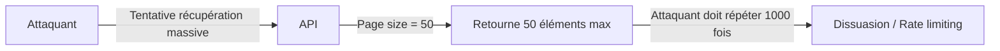
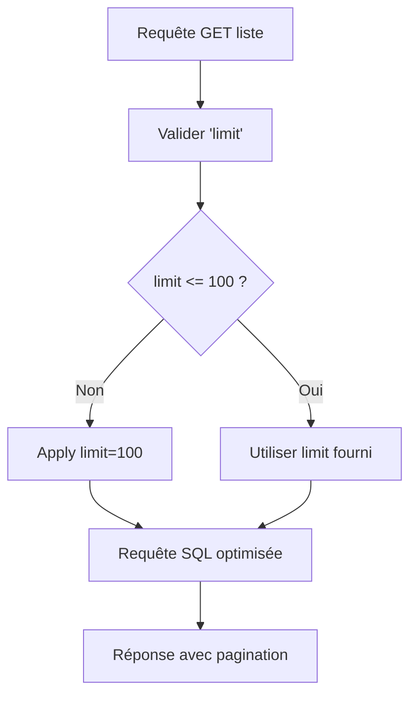

# **7.3 — Pagination obligatoire**

La pagination est un mécanisme essentiel dans les APIs modernes.
Elle relève à la fois de la **performance**, de la **sécurité** et de la **protection contre les abus**.

Ce que les débutants pensent souvent :

> “La pagination, c’est juste pour pas afficher trop d’éléments.”

La réalité :

> **La pagination est une mesure de sécurité critique pour empêcher l’extraction massive de données (Data Scraping) et les attaques par surcharge.**

Dans ce chapitre, nous allons voir :

* pourquoi la pagination est indispensable,
* quelles attaques elle empêche,
* comment concevoir une pagination sécurisée,
* quelles erreurs classiques éviter,
* des schémas pour visualiser le processus,
* des exemples concrets d’attaques stoppées par la pagination.

---

# **7.3.1 — Pourquoi la pagination est obligatoire dans une API ?**

### 1. **Empêcher la récupération massive de données sensibles**

Sans pagination, une requête malveillante pourrait faire :

```
GET /users
```

→ récupérer **tous** les utilisateurs d’un coup.

C’est une fuite majeure, souvent catastrophique.

---

### 2. **Éviter les attaques de surcharge**

Sans limite :

```
GET /logs?limit=9999999
```

→ surcharge CPU, mémoire, base de données → crash.

---

### 3. **Réduire la surface d’attaque BOLA (API1)**

Limiter par page réduit :

* le nombre d’IDs testables,
* la facilité de parcourir les ressources,
* les attaques d’énumération.

---

### 4. **Optimisation de la performance**

Une API sans pagination est :

* lente,
* instable,
* coûteuse,
* imprévisible.

La pagination rend l’API **scalable**.

---

# **7.3.2 — Schéma simple : pourquoi la pagination limite l’abus**



---

# **7.3.3 — Types de pagination**

Les principaux modèles :

---

## **1) Pagination offset/limit (classique)**

```
GET /products?limit=50&offset=0
```

Facile à comprendre mais exploitable pour :

* scraper les données
* enumerer les IDs

---

## **2) Pagination par curseur (cursor-based)**

Plus sécurisée et scalée :

```
GET /products?cursor=eyJpZCI6IDQyfQ&limit=50
```

Le curseur encode la position, pas l'index.

→ plus difficile de scraper
→ performant sur les grosses tables

---

## **3) Pagination keyset**

Utilise un champ trié comme référence :

```
GET /orders?after_id=450
```

Très efficace pour :

* les systèmes de logs
* les systèmes temps réel

---

# **7.3.4 — Limite maximale obligatoire**

Toute API sécurisée impose :

```
limit <= 100
```

Même si un client demande :

```
limit=10000
```

→ le backend renvoie maximum 100.

---

# **7.3.5 — Schéma visuel : architecture pagination sécurisée**



---

# **7.3.6 — Erreurs classiques à éviter**

### ❌ 1. Ne pas imposer de pagination par défaut

Certains endpoint renvoient *tout* par défaut → faille.

---

### ❌ 2. Accepter n’importe quel “limit”

Exemple catastrophique :

```
GET /users?limit=999999
```

→ Fuite massive.
→ Crash de la base.

---

### ❌ 3. Renvoyer la structure interne de la pagination

Ne jamais envoyer d’index internes, IDs séquentiels, etc.

---

### ❌ 4. Mélanger pagination et filtrage mal fait

Exposer trop d’options combinables = risque d’abus.

---

### ❌ 5. Ne pas combiner pagination + rate limiting

Recycler un endpoint paginé sans rate limit → scraping massif.

---

# **7.3.7 — Pagination et sécurité : un exemple concret d’attaque**

Imagine une API :

```
GET /customers?limit=100000
```

Un attaquant récupère :

* adresses email
* numéros client
* historiques d’achat
* données personnelles
* segmentation marketing
* données internes

C’est une attaque **Excessive Data Exposure** + **Data Scraping**.

Avec pagination max-limit :

```
limit max = 50
rate limit = 10 req/min
```

Faire un scraping complet devient :

* lent
* bruyant
* contrôlable
* détectable
* parfois impossible

---

# **7.3.8 — Pagination côté client ≠ pagination côté serveur**

Le frontend peut paginer visuellement, mais **l’API doit paginer réellement**.

Si la base renvoie toute la table et le frontend “cache le reste”,
→ c’est une catastrophe.

---

# **7.3.9 — Deux réponses de pagination courantes**

### Exemple offset/limit :

```json
{
  "data": [...],
  "limit": 20,
  "offset": 40,
  "total": 350
}
```

### Exemple cursor-based :

```json
{
  "data": [...],
  "next_cursor": "eyJpZCI6IDQyfQ"
}
```

---

# **7.3.10 — Résumé du sous-chapitre**

* La pagination protège contre les fuites et les attaques par surcharge.
* Elle limite la quantité de données renvoyées → sécurité et performance.
* Maximum limit doit être imposé côté serveur.
* Pagination != esthétique → c’est une mesure de sécurité.
* Pagination doit être combinée avec rate limiting pour éviter le scraping.
* La pagination cursor-based est la plus robuste et scalable.
* L’API ne doit jamais renvoyer toute une table.