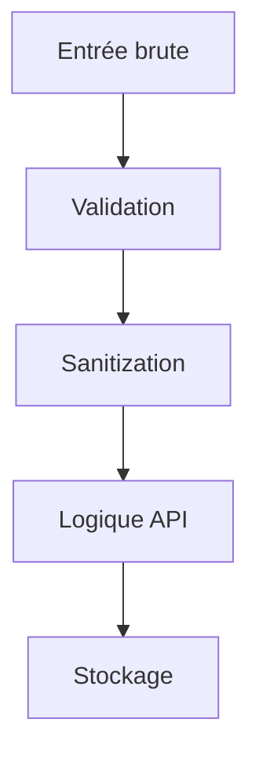
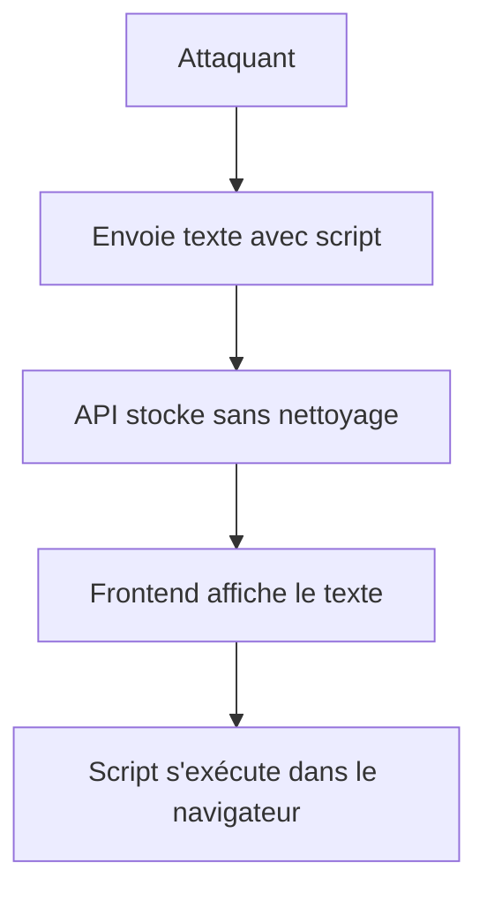
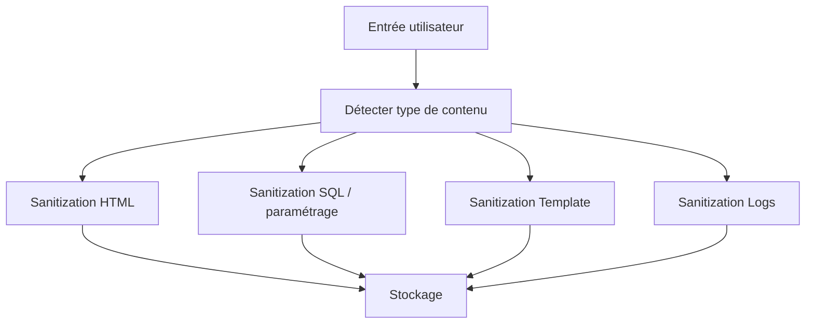

# **7.4 — Sanitization (XSS, SQLi, Template Injection)**

La **sanitization** consiste à **nettoyer**, **neutraliser** ou **transformer** les données entrantes et sortantes afin qu’elles ne puissent **pas être interprétées comme du code**, ni provoquer des comportements dangereux.

Elle complète la validation (vue en 7.1) mais son rôle est distinct :

> **La validation vérifie que la donnée est correcte.**
> **La sanitization garantit qu’elle est inoffensive.**

Ce chapitre couvre :

* Pourquoi la sanitization est indispensable
* Les types d’attaques qu’elle empêche (XSS, SQLi, injections diverses)
* Les erreurs typiques
* Les bonnes pratiques
* Des schémas simples pour comprendre
* Des exemples concrets d’attaques et de défenses

---

# **7.4.1 — Pourquoi la sanitization est essentielle ?**

Parce que **tout ce que l’utilisateur envoie** à une API peut contenir :

* du code malveillant,
* des caractères dangereux,
* des séquences pouvant casser une requête SQL,
* du script JavaScript caché,
* des payloads d’injection,
* des instructions de template,
* des commandes système.

Même un simple texte “inoffensif” peut cacher :

```
<script>alert("hack")</script>
```

ou

```
' OR 1=1 --
```

ou

```
{{ 7 * 7 }}
```

Si ces données sont réutilisées **sans nettoyage**, elles peuvent être exécutées dans :

* une page HTML (XSS),
* une requête SQL (SQL Injection),
* un moteur de template (template injection),
* des logs (log injection).

---

# **7.4.2 — Schéma : où la sanitization intervient ?**



La sanitization doit impérativement se faire **avant que la donnée soit stockée**.

---

# **7.4.3 — Sanitization ≠ Validation**

### ✔ Validation

→ Vérifie que la donnée respecte un format ou une règle.
Ex: `"age": 30` est un entier positif.

### ✔ Sanitization

→ Neutralise ou transforme des caractères dangereux.
Ex: transformer `<script>` en `&lt;script&gt;`.

Les deux sont complémentaires et doivent toujours être utilisées.

---

# **7.4.4 — Type d’attaques évitées par la sanitization**

## **1. XSS (Cross-Site Scripting)**

Injection de JavaScript dans des champs visibles côté frontend.

Exemple d’entrée utilisateur :

```
<script>stealCookies()</script>
```

Si l’API renvoie cela brut → le navigateur exécute le script.

---

## **2. SQL Injection (SQLi)**

Tentative de casser ou manipuler une requête SQL.

Payload typique :

```
' OR 1=1 --
```

Si le backend concatène cette chaîne dans la requête SQL →
la base renvoie **toutes les lignes**.

---

## **3. Template Injection**

Quand des données utilisateur sont interprétées par un moteur de template :

Payload :

```
{{ 7 * 7 }}
```

ou pire :

```
{{ system('rm -rf /') }}
```

---

## **4. Log Injection**

Un utilisateur injecte dans un champ texte :

```
ERROR: User admin logged in
```

ou

```
\nCRITICAL ERROR\n
```

→ les logs deviennent trompeurs, voire exploitables.

---

# **7.4.5 — XSS : explication simple**

XSS survient quand un texte provenant du client est inséré dans une page HTML sans encodage.

Exemple :

Un champ "commentaire" :

```
<script>alert("Hacked");</script>
```

Est renvoyé dans une page web.

→ **le script est exécuté** dans le navigateur des autres utilisateurs.

### Schéma visuel :



C’est l’une des attaques les plus courantes.

---

# **7.4.6 — SQL Injection : explication simple**

Si le backend fait :

```
SELECT * FROM users WHERE name = '" + input + "';
```

Et que l’utilisateur envoie :

```
" OR 1=1 --
```

Alors la requête devient :

```
SELECT * FROM users WHERE name = "" OR 1=1 -- ";
```

→ renvoie **tous les utilisateurs**
→ ou permet des attaques encore plus graves selon le cas
→ même si la donnée est “validée” comme string

---

# **7.4.7 — Template Injection : explication simple**

Certains moteurs de template évaluent des expressions comme :

```
{{ 7 * 7 }}
```

Si la donnée utilisateur est injectée dans un template :

```
<p>{{ commentaire }}</p>
```

et l'utilisateur envoie :

```
{{ 7 * 7 }}
```

→ le moteur peut **exécuter** l’expression.
Dans certains moteurs, cela peut aller jusqu’à **l'exécution de code serveur**.

---

# **7.4.8 — Comment se défendre ?**

La sanitization dépend du type d’utilisation finale de la donnée.

---

## ✔ 1) Contre XSS : Escape HTML

Transformer les caractères dangereux :

```
<  → &lt;
>  → &gt;
"  → &quot;
'  → &#39;
```

Ainsi :

```
<script>
```

devient :

```
&lt;script&gt;
```

→ impossible à exécuter.

---

## ✔ 2) Contre SQL Injection : requêtes paramétrées

Ne jamais construire des requêtes SQL avec concaténation.

Toujours utiliser :

* prepared statements
* ORM sécurisés
* paramètres stricts

Même si la donnée est “sanitisée”,
**la meilleure protection est la paramétrisation**.

---

## ✔ 3) Contre Template Injection : neutraliser les opérateurs de template

Transformer :

```
{{ }}
<% %>
${ }
```

en versions échappées.

---

## ✔ 4) Contre Log Injection : nettoyer les caractères de contrôle

Supprimer :

* `\n` (nouvelle ligne)
* `\t` (tabulations)
* caractères invisibles
* séquences de terminal ANSI

---

# **7.4.9 — Processus complet de sanitization**



Chaque chemin dépend **du contexte d’utilisation** de la donnée.

---

# **7.4.10 — Erreurs courantes à éviter**

### ❌ 1. “On valide déjà les données, pas besoin de sanitization.”

Validation ≠ sécurité ≠ sanitization.

---

### ❌ 2. Sanitiser *après* avoir stocké

Trop tard.

---

### ❌ 3. Accepter du HTML “filtré”

Très risqué, même avec des listes de tags autorisés.

---

### ❌ 4. Croire que JSON empêche les injections

FAUX : un JSON mal exploité peut casser SQL, HTML, logs, templates…

---

### ❌ 5. Sanitiser uniquement au frontend

Attaquant → cURL → pas de sanitization.

---

# **7.4.11 — Bonnes pratiques essentielles**

* ✔ Sanitiser **avant stockage**
* ✔ Combiner validation + sanitization
* ✔ Utiliser des prepared statements pour SQL
* ✔ Ne jamais concaténer des chaînes dans des contextes sensibles
* ✔ Échapper les données avant affichage dans du HTML
* ✔ Échapper les données avant usage dans un template
* ✔ Nettoyer les données envoyées dans les logs
* ✔ Documenter le comportement pour éviter les erreurs internes

---

# **7.4.12 — Résumé du sous-chapitre**

* La sanitization neutralise ou transforme les données dangereuses.
* Elle empêche les attaques XSS, SQLi, Template Injection, Log Injection.
* Elle doit être effectuée **côté serveur**, même si le frontend filtre déjà.
* Elle complète la validation mais ne la remplace pas.
* Les prepared statements sont la meilleure défense contre SQLi.
* La sanitization dépend du contexte où les données seront utilisées.
* Sans sanitization, toute donnée utilisateur est un risque majeur.
