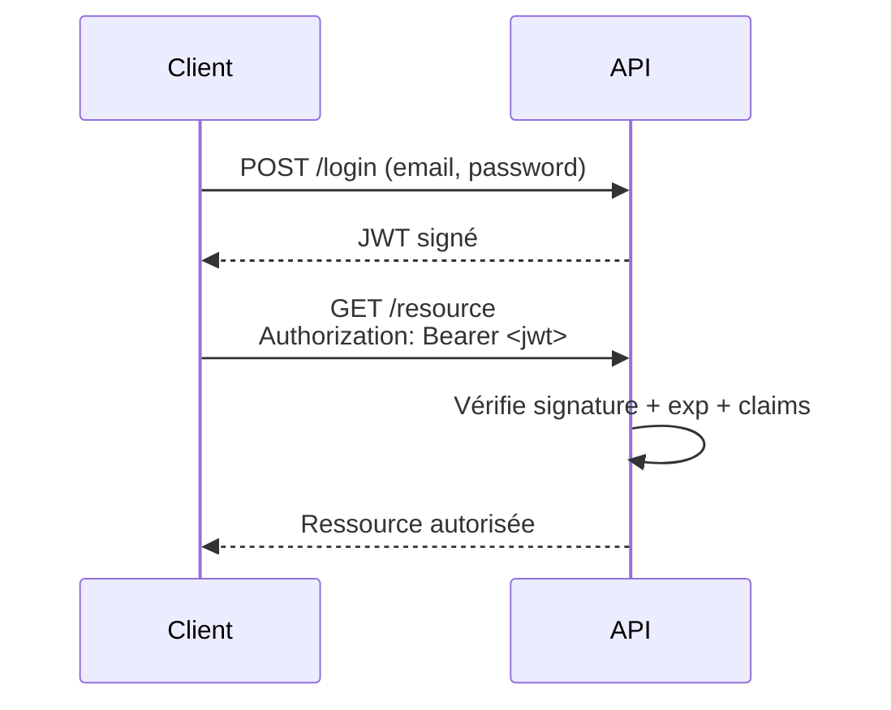

# **8.1 — Structure d’un JWT (header / payload / signature)**

Les JWT (JSON Web Tokens) sont aujourd’hui l’un des mécanismes d’authentification les plus utilisés dans les APIs modernes.
Ils sont simples, portables, légers, mais **souvent mal compris** et donc **mal utilisés**, ce qui peut entraîner des failles critiques.

Dans ce chapitre, nous allons voir :

* ce qu’est un JWT,
* sa structure interne,
* les rôles du header / payload / signature,
* à quoi ils servent réellement,
* et les erreurs de compréhension fréquentes chez les débutants.

---

# **8.1.1 — Qu’est-ce qu’un JWT ?**

Un JWT est un **token porteur** (*bearer token*) :

> Celui qui le possède peut agir comme l’utilisateur.

C’est une **chaîne de caractères encodée en Base64**, qui contient :

* des informations (les *claims*),
* une signature cryptographique permettant de vérifier l'intégrité.

Un JWT **n'est pas chiffré**, il est seulement **encodé**.
Donc toute personne qui possède le token peut **lire son contenu**.

→ Erreur classique : croire qu’un JWT est secret ou illisible.

---

# **8.1.2 — Format général d’un JWT**

Voici la forme d’un JWT :

```
xxxxx.yyyyy.zzzzz
```

Il est composé de trois parties séparées par des points :

1. **header**
2. **payload**
3. **signature**

Représentation visuelle :

```mermaid
flowchart LR
    A[Header<br>(JSON encodé)] --> C[.]
    B[Payload<br>(JSON encodé)] --> C
    C --> D[Signature<br>(HMAC ou RSA)]
```

---

# **8.1.3 — Partie 1 : Header**

Le header indique :

* le type de token (`typ`)
* l’algorithme utilisé pour signer (`alg`)

Exemple :

```json
{
  "alg": "HS256",
  "typ": "JWT"
}
```

Encodé en Base64 → première partie du token.

### Rôle :

* dire au serveur comment vérifier la signature
* pas de données sensibles ici

---

# **8.1.4 — Partie 2 : Payload**

Le payload contient les **claims** :
des informations sur l'utilisateur ou le contexte.

Exemples de claims :

### **Claims standards :**

* `iss` – issuer (qui a émis le token)
* `sub` – subject (ID utilisateur)
* `exp` – expiration
* `iat` – issued at (date création)

### **Claims custom :**

* `role`: "admin"
* `permissions`: ["read", "write"]
* `email`: "[alice@example.com](mailto:alice@example.com)"

Exemple complet :

```json
{
  "sub": "42",
  "email": "alice@example.com",
  "role": "user",
  "iat": 1712345678,
  "exp": 1712349278
}
```

⚠️ Très important :
**Le payload n'est pas chiffré → les données sont visibles.**

---

# **8.1.5 — Partie 3 : Signature**

C’est la partie la plus critique.

La signature =

```
HMAC( base64(header) + "." + base64(payload), secret )
```

Ou, en asymétrique :

```
RSA/ECDSA_sign( header.payload, private_key )
```

La signature garantit :

* l'intégrité du token,
* que personne ne l’a modifié,
* et qu’il provient bien de l’émetteur.

### ⚠️ Mais elle ne empêche PAS :

* la lecture du contenu
* le vol du token
* la réutilisation du token volé

Le JWT reste un **bearer token**.

---

# **8.1.6 — Exemple d’un JWT complet (tronqué)**

```
eyJhbGciOiJIUzI1NiIsInR5cCI6IkpXVCJ9.
eyJzdWIiOiI0MiIsImVtYWlsIjoiYWxpY2VAZXhhbXBsZS5jb20iLCJyb2xlIjoidXNlciJ9.
SflKxwRJSMeKKF2QT4fwpMeJf36POk6yJV_adQssw5c
```

Décodé →

### Header

```json
{
  "alg": "HS256",
  "typ": "JWT"
}
```

### Payload

```json
{
  "sub": "42",
  "email": "alice@example.com",
  "role": "user"
}
```

### Signature

`SflKxwRJSMeKKF2QT4fwpMeJf36P...`

---

# **8.1.7 — JWT : ce qu’il est et ce qu’il n’est pas**

### ✔ Un JWT est :

* un token portable
* auto-contenant (contient ses informations)
* signé (intégrité garantée)
* utilisable dans les APIs stateless
* utilisable entre services (microservices)

### ❌ Un JWT n’est PAS :

* un token chiffré
* un token secret
* un token inviolable
* un token non volable
* un token facile à révoquer
* un remplacement de session traditionnelle dans tous les cas

---

# **8.1.8 — Erreurs de débutants (très fréquentes)**

### ❌ Croire que le contenu est caché

Non → Base64 = réversible.

### ❌ Mettre des données sensibles dans le payload

Interdit :

* numéro carte bancaire
* mot de passe hashé
* secret interne
* données personnelles sensibles

### ❌ Choisir un algorithme faible

HS256 est encore utilisé mais RS256 est préférable.

### ❌ Avoir une expiration trop longue (1 jour, 1 semaine…)

Danger → token volé = compte compromis.

### ❌ Ne pas vérifier correctement la signature côté API

Erreur fatale : n'importe qui peut forger un faux token.

---

# **8.1.9 — Visualisation du fonctionnement d’un JWT dans une API**



---

# **8.1.10 — Pourquoi un JWT permet une API stateless ?**

Parce que :

* le backend n’a pas besoin de stocker de session,
* il peut se contenter de vérifier la signature,
* toutes les infos nécessaires sont dans le token.

Cela rend les API :

* plus simples à scaler,
* plus rapides,
* plus découplées.

Mais cela entraîne aussi :

* difficulté de révocation,
* risque si token volé,
* importance majeure de l’expiration courte.

(Tout cela sera approfondi dans la section 8.2 et suivantes.)

---

# **8.1.11 — Résumé du sous-chapitre**

* Un JWT a 3 parties : header, payload, signature.
* Le payload n'est jamais chiffré → lisible par tous.
* Le JWT garantit l’intégrité, pas la confidentialité.
* Toutes les données sensibles doivent être exclues du payload.
* La signature empêche la modification du token.
* L’expiration est essentielle pour limiter les dégâts en cas de vol.
* Le JWT est un bearer token : qui le possède peut agir.
* JWT ≠ session → il a ses forces et faiblesses propres.