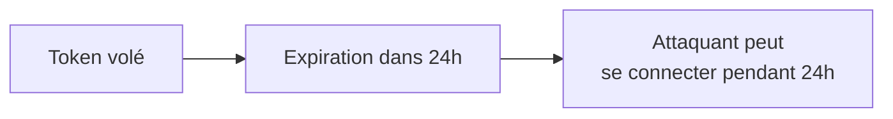
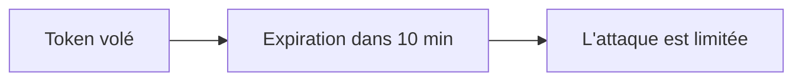
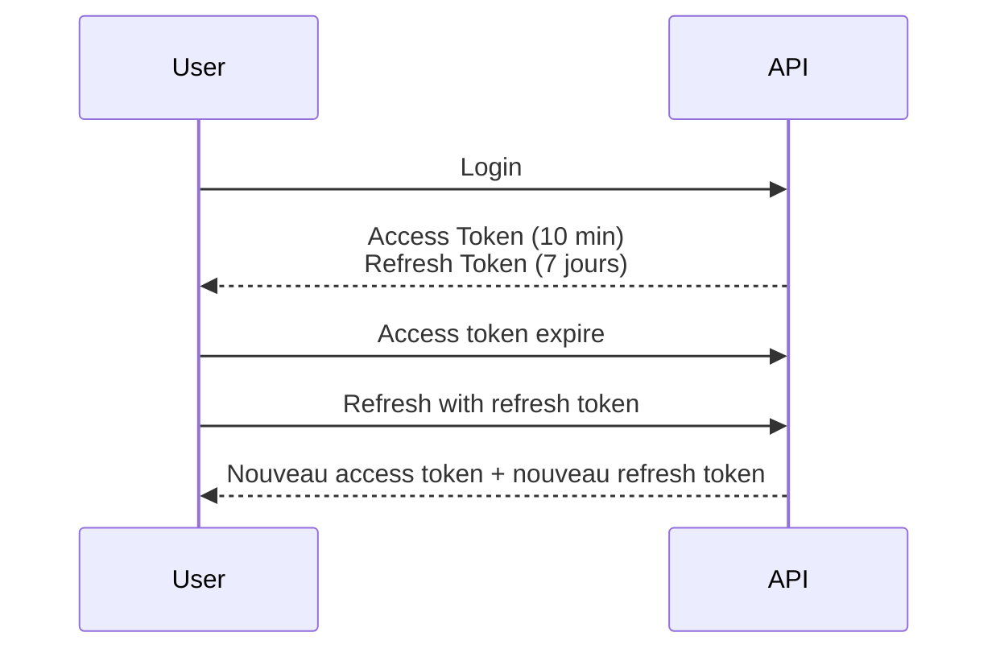

# **8.2 — Bonnes pratiques : rotation, expiration courte, algorithmes, blacklisting**

Maintenant que nous avons compris ce qu’est un JWT et comment il fonctionne, il est temps de voir **comment l’utiliser correctement**.

Car un JWT **mal configuré** peut transformer une API en porte ouverte :

* tokens valides trop longtemps,
* tokens impossibles à révoquer,
* algorithmes faibles,
* secrets exposés,
* absence de rotation…

Dans ce chapitre, nous allons découvrir les règles essentielles pour sécuriser un JWT en production.

---

# **8.2.1 — Pourquoi les JWT nécessitent des bonnes pratiques strictes ?**

Parce qu’un JWT :

* est un bearer token → **qui le possède peut agir** ;
* est lisible → **ne rien mettre de sensible dedans** ;
* ne peut pas être facilement révoqué → **expiration courte obligatoire** ;
* peut être volé → **via logs, storage, réseau, XSS, réutilisation**.

Un JWT doit être traité comme un **objet extrêmement sensible**.

---

# **8.2.2 — Règle fondamentale : expiration courte**

Un JWT ne doit presque jamais vivre plus de :

* **5 minutes** pour des actions critiques,
* **15 minutes** pour une session standard,
* **1 heure maximum** dans des contextes très spécifiques.

Pourquoi ?

### Parce qu’un token volé est immédiatement exploitable.

Plus il vit longtemps :

* plus un attaquant peut l’utiliser,
* plus difficile de réduire les dégâts d’une fuite.

### Schéma : impact d’une expiration trop longue



Avec expiration courte :



---

# **8.2.3 — Rotation des Refresh Tokens**

Comme les access tokens (JWT courts) expirent vite, on utilise **un refresh token** pour en générer de nouveaux.

### Fonctionnement :

1. Le client reçoit :

    * un access token (JWT)
    * un refresh token (longue durée)

2. Quand l’access token expire →
   le client en demande un nouveau avec le refresh token.

### Règle de sécurité majeure :

> **À chaque utilisation du refresh token → émettre un nouveau refresh token.**

C’est la rotation.

### Pourquoi ?

* empêche le rejeu du refresh token
* évite qu’un attaquant l’utilise silencieusement
* permet la révocation granulaire

---

# **8.2.4 — Blacklisting / Revocation**

Problème des JWT stateless :
Impossible d’annuler un token qui a déjà été émis.

La solution :
Stocker les tokens **révoqués** dans une liste noire (blacklist).

### Cas d’usage :

* déconnexion
* compromission suspectée
* changement de mot de passe
* retrait d’autorisation / changement de rôle

La blacklist doit être :

* stockée en mémoire rapide (Redis),
* purgée automatiquement selon expiration du token.

---

# **8.2.5 — Algorithmes : HS256 vs RS256 vs ES256**

## **HS256 (clé secrète partagée)**

* rapide
* simple
* **moins sécurisé** si plusieurs services doivent vérifier le token
* secret unique pour signer et vérifier

❌ Risque :
Une fuite du secret compromise **tous les tokens**.

---

## **RS256 (clé privée / clé publique)**

* plus sûr
* scalable
* idéal pour microservices
* vérification via clé publique (diffusable à tous)
* signature via clé privée (gardée secrète)

→ Recommandé dans la majorité des projets modernes.

---

## **ES256 (algorithme elliptique)**

* encore plus performant
* signatures plus petites
* très bon pour mobiles et IoT

---

# **8.2.6 — Mauvaise pratique critique : accepter alg=none**

Au début du JWT, l’algorithme est indiqué :

```json
{
  "alg": "none",
  "typ": "JWT"
}
```

Cette configuration est catastrophique :
Elle laisse un attaquant **créer un token sans signature**.

Heureusement, les frameworks modernes rejettent cette option,
mais elle reste un classique des CTFs et vulnérabilités anciennes.

---

# **8.2.7 — Ne jamais stocker un JWT dans LocalStorage**

LocalStorage → accessible via JavaScript → vulnérable à XSS.

Si un attaquant injecte ceci :

```javascript
console.log(localStorage.getItem("access_token"))
```

→ token volé
→ compte compromis

### Alternatives plus sûres :

* cookies HttpOnly + Secure + SameSite
* stockage en mémoire volatile
* Secure Enclave / Keychain (mobiles)

---

# **8.2.8 — Utiliser le champ `exp` pour expiration**

Un JWT sans expiration :

❌ jamais acceptable
❌ jamais sécurisé
❌ jamais raisonnable

Le champ `exp` est obligatoire :

```json
{
  "exp": 1712349278
}
```

---

# **8.2.9 — Vérification côté serveur : la checklist**

Pour valider un JWT, le backend doit :

1. ✔ vérifier la signature
2. ✔ refuser les tokens expirés (`exp`)
3. ✔ vérifier les dates `iat` et `nbf`
4. ✔ vérifier l’émetteur (`iss`)
5. ✔ vérifier le public (`aud`)
6. ✔ vérifier que l’utilisateur a encore les droits
7. ✔ vérifier que le token n’est pas en blacklist

---

# **8.2.10 — Schéma : bon cycle de vie d’un JWT**



---

# **8.2.11 — Mauvaises pratiques courantes**

### ❌ Laisser les tokens vivre plusieurs heures / jours

→ si vol, impact énorme

### ❌ Utiliser HS256 pour des microservices multiples

→ partage du secret entre trop de systèmes

### ❌ Ne pas gérer de blacklist

→ impossible de révoquer un token

### ❌ Ne pas utiliser `exp`

→ token illimité

### ❌ Les stocker dans LocalStorage

→ XSS = token volé

### ❌ Ne pas vérifier le champ `iss`

→ un autre service peut se faire passer pour le vôtre

---

# **8.2.12 — Bonnes pratiques essentielles**

* ✔ expiration courte (5–15 min)
* ✔ refresh tokens avec rotation
* ✔ blacklist pour rendre invalides certains tokens
* ✔ RS256 ou ES256 recommandés
* ✔ ne jamais mettre de données sensibles dans le JWT
* ✔ vérifier strictement les claims
* ✔ stocker les tokens de manière sécurisée
* ✔ ne jamais accepter `alg=none`
* ✔ surveiller les usages anormaux (token utilisé depuis 2 pays à 2 min d’intervalle)

---

# **8.2.13 — Résumé du sous-chapitre**

* Le JWT doit vivre très peu de temps.
* Les refresh tokens doivent être rotatifs.
* La révocation doit être possible via une blacklist.
* L’algorithme doit être robuste (RS256/ES256).
* Le JWT est un bearer token, donc potentiellement volable.
* Éviter absolument LocalStorage.
* Respecter la checklist de validation.
* Une mauvaise configuration annule tous les avantages du JWT.