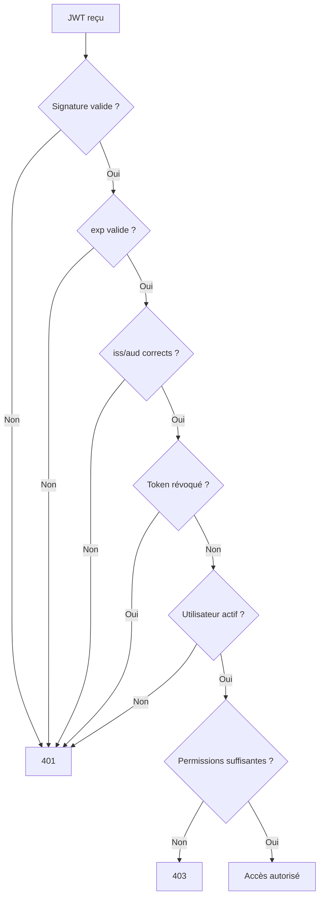

# **8.4 — Comment une API valide un token correctement ?**

Une API ne doit **jamais** simplement accepter un token parce qu’il “ressemble à un JWT”.
Elle doit effectuer **une série de vérifications strictes**, dans un ordre précis, afin de garantir :

* que le token n’a pas été modifié,
* qu’il provient bien de l’émetteur attendu,
* qu’il n’a pas expiré,
* qu’il correspond au bon utilisateur,
* qu'il n’a pas été révoqué,
* qu'il a les permissions nécessaires,
* qu'il n’a pas été altéré ou forgé.

Ce chapitre explique **exactement** comment une API doit valider un token en production, en utilisant des concepts généraux (indépendants du langage ou du framework).

---

# **8.4.1 — Schéma global du processus de validation**

```mermaid
flowchart TD
    A[Requête entrante<br>avec JWT] --> B[Vérifier la structure]
    B --> C[Vérifier la signature]
    C --> D[Verifier les claims<br>(iss, aud, exp, iat...)]
    D --> E[Contrôler la révocation<br>(blacklist)]
    E --> F[Vérifier l'utilisateur]
    F --> G[Vérifier les permissions<br>(RBAC/ABAC/PBAC)]
    G --> H[Accès autorisé]
    B -->|Échec| Z[401 Invalid Token]
    C -->|Échec| Z
    D -->|Échec| Z
    E -->|Échec| Z
    F -->|Échec| Z
    G -->|Échec| Y[403 Forbidden]
```

---

# **8.4.2 — Étape 1 : Vérification de la structure**

L’API doit vérifier que le token est conforme :

* format `xxx.yyy.zzz`
* Base64 décodable
* JSON valide dans header/payload

Si ce n’est pas le cas → **401 Invalid Token**.

Cela permet déjà d’éviter les tokens forgés ou corrompus.

---

# **8.4.3 — Étape 2 : Vérification de la signature**

La signature prouve que :

* le token n’a pas été modifié,
* il a été signé par le bon émetteur,
* il est authentique.

Selon le type de signature :

## ✔ Avec RS256 / ES256 (clé publique / clé privée)

* La clé **privée** signe
* La **clé publique** vérifie

L’API doit :
→ charger la clé publique depuis un endpoint JWKS ou un fichier sécurisé
→ vérifier la signature

Si la signature NE correspond PAS :
→ **Token rejeté immédiatement**

C’est l’étape la plus importante.

---

# **8.4.4 — Étape 3 : Vérification des claims standard**

Un token valide doit contenir les informations nécessaires pour être interprété correctement.

### Claims à vérifier **obligatoirement** :

| Claim | Description | Risques si ignoré              |
| ----- | ----------- | ------------------------------ |
| `exp` | expiration  | token utilisable éternellement |
| `nbf` | not before  | token utilisable trop tôt      |
| `iat` | issued at   | tokens forgés antérieurs       |
| `iss` | issuer      | token issu d’un autre service  |
| `aud` | audience    | token destiné à une autre API  |

### Exemple de validation :

```
exp < maintenant ?  → rejet
iat > maintenant ?  → rejet
nbf > maintenant ?  → rejet
iss != "https://mon-api.com" ? → rejet
aud != "mon-service" ? → rejet
```

---

# **8.4.5 — Étape 4 : Vérification de la révocation (blacklist)**

Un JWT est stateless →
Il reste valide jusqu’à expiration, **même si l’utilisateur se déconnecte**.

Pour contrer cela :

> L’API doit stocker les tokens invalidés (ou leurs identifiants) dans une blacklist.

Exemples de cas où un token doit être révoqué :

* changement de mot de passe
* suspicion de vol
* utilisateur supprimé
* permission révoquée
* logout manuel

Si le token apparaît dans la blacklist →
→ **401 Token Revoked**

---

# **8.4.6 — Étape 5 : Vérification de l’existence et de l'état de l’utilisateur**

Même si un token est valide, l’utilisateur peut être :

* supprimé
* désactivé
* bloqué
* en attente de validation

L’API doit :

* charger l’utilisateur correspondant (`sub`)
* vérifier son statut

Si l’utilisateur n’existe plus → **401 Invalid Token**

Si l’utilisateur existe mais est bloqué → **403 Forbidden**

---

# **8.4.7 — Étape 6 : Vérification des permissions (RBAC / ABAC / PBAC)**

Même si le token est :

* valide,
* signé,
* non expiré,
* non révoqué,
* associé à un utilisateur actif,

l’accès ne doit être accordé **que si l’utilisateur a les bons droits**.

L’API doit vérifier :

* le rôle (`role`) → RBAC
* les attributs (`department`, `ownerId`) → ABAC
* les policies → PBAC
* les scopes (`read:users`, `write:orders`)

### Exemple :

```
Utilisateur = role "user"
Requête = DELETE /users/42
```

→ si `user.id != 42` → **403 Forbidden**

---

# **8.4.8 — Les 7 raisons les plus courantes d’un token invalide**

1. Signature incorrecte
2. Expiration dépassée
3. Issuer incorrect
4. Audience incorrecte
5. Token révoqué
6. Token forgé ou altéré
7. Permissions insuffisantes

---

# **8.4.9 — Exemple complet : ce qui se passe quand une API reçoit un JWT**

Prenons une requête :

```
GET /orders/123
Authorization: Bearer eyJhbGciOi...
```

### L’API doit faire :

1. Décoder le token
2. Vérifier sa structure
3. Vérifier la signature
4. Vérifier expiration / issuer / audience
5. Chercher l'utilisateur en base
6. Vérifier l’état du compte
7. Vérifier les permissions
8. Vérifier que l’utilisateur a bien le droit d'accéder à cette commande
9. Retourner la ressource ou un 403

---

# **8.4.10 — Schéma simplifié de la validation complète**



---

# **8.4.11 — Les mauvaises pratiques à éviter absolument**

### ❌ 1 — Vérifier uniquement la signature

→ ignore expiration, issuer, audience…

### ❌ 2 — Accepter n’importe quel algorithme depuis le header

→ vulnérabilité “alg=none”
→ ou substitution HS256 ↔ RS256

### ❌ 3 — Lire le token sans vérifier la signature

→ extrêmement dangereux

### ❌ 4 — Ne pas vérifier `iss` et `aud`

→ accepter des tokens d'autres services

### ❌ 5 — Ne pas implémenter de blacklist

→ impossible d’invalider un token volé

### ❌ 6 — Se baser uniquement sur `role`

→ manque de granularité et risques ABAC/BOLA

---

# **8.4.12 — Résumé du sous-chapitre**

Une API sécurisée doit :

* contrôler la structure du token
* vérifier la signature cryptographique
* rejeter les tokens expirés
* vérifier issuer (iss) et audience (aud)
* vérifier que l’utilisateur existe et est actif
* gérer la révocation via blacklist
* valider les permissions (RBAC/ABAC/PBAC)
* ne jamais faire confiance au JWT sans vérification complète

La validation d’un token est un processus strict, précis et indispensable pour une API Zero Trust.