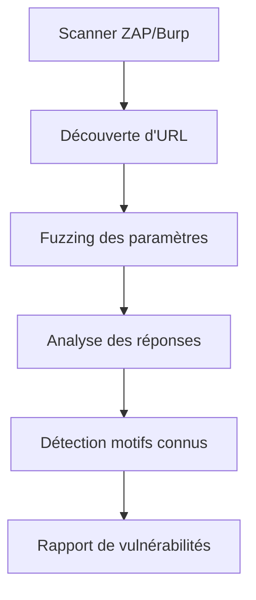
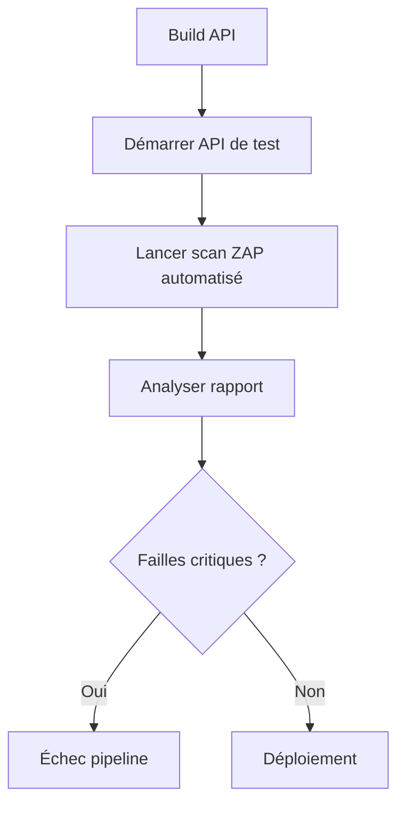

# **9.2 — Tests automatisés (OWASP ZAP, Burp Suite Community)**

Les tests automatisés de sécurité permettent de **scanner une API de manière structurée**, répétable, et beaucoup plus exhaustive qu’un test manuel.
Ils sont essentiels dans une approche **DevSecOps**, car ils permettent :

* d’identifier automatiquement des vulnérabilités connues,
* de tester des comportements anormaux,
* de vérifier l’absence de configurations dangereuses,
* de repérer des failles OWASP API Top 10,
* et d’intégrer ces contrôles dans un pipeline CI/CD.

Dans ce chapitre, nous allons explorer :

* le rôle des outils de test automatisé,
* comment OWASP ZAP et Burp Suite fonctionnent,
* les types de failles qu’ils détectent,
* leurs limites,
* la façon de les utiliser pour les APIs REST.

---

# **9.2.1 — Pourquoi automatiser les tests de sécurité ?**

Les tests manuels sont précieux, mais :

* ils ne couvrent pas tout,
* ils varient selon l’opérateur,
* ils sont difficiles à répéter,
* ils peuvent oublier certaines routes,
* ils ne détectent pas certaines classes de vulnérabilités techniques.

Les tests automatisés :

* sont reproductibles,
* sont plus rapides,
* trouvent des failles simples immédiatement,
* s’intègrent bien dans un pipeline CI/CD,
* détectent les régressions au fil des évolutions.

---

# **9.2.2 — OWASP ZAP et Burp Suite Community : deux outils gratuits majeurs**

## **OWASP ZAP**

* open source, gratuit, maintenu par OWASP
* excellent pour l’automatisation
* idéal pour APIs et applications web
* intégration possible dans CI/CD (Docker, scripts)

## **Burp Suite Community**

* gratuit mais fonctionnalités limitées
* puissant scanner manuel
* détecte déjà de nombreuses failles
* version Pro = scanner automatisé complet

---

# **9.2.3 — Types de vulnérabilités détectées automatiquement**

Ces outils peuvent identifier :

### ✔ Mauvaises configurations (API7)

* CORS trop permissif
* headers de sécurité manquants
* TLS faible
* informations serveur exposées

### ✔ Injections (API8) selon les contextes

* SQL injection
* XSS
* Command injection
* Template injection
* LDAP injection

### ✔ Détection d’erreurs internes

* stack traces exposées
* messages trop verbeux
* chemins internes

### ✔ Endpoints accessibles sans authentification

* routes oubliées
* endpoints admin exposés

### ✔ Vérification de redirections dangereuses

→ open redirects

### ✔ Comportements dangereux

* réponse différente selon existence d’un utilisateur
* disclosures de données internes
* taille de réponse révélatrice d’un accès non autorisé

---

# **9.2.4 — Schéma simple : fonctionnement d’un scanner automatisé**



---

# **9.2.5 — Phase 1 : Découverte des endpoints**

Le scanner explore :

* les URL trouvées dans les réponses
* les patterns usuels (`/api/v1/users`, `/auth/login`, etc.)
* les liens exposés dans la documentation OpenAPI
* les endpoints appelés pendant la navigation proxy

Cela permet de cartographier **la surface d'exposition réelle**.

---

# **9.2.6 — Phase 2 : Fuzzing**

Pour détecter les comportements anormaux, le scanner :

* envoie de multiples variantes de paramètres,
* teste des entrées extrêmes,
* joue avec des caractères spéciaux,
* tente des injections connues.

Exemples :

```
' OR 1=1 --
"><script>alert(1)</script>
../../../../etc/passwd
%00%00%00
```

L’objectif est de provoquer :

* une erreur,
* un comportement incohérent,
* une fuite d’information.

---

# **9.2.7 — Phase 3 : Analyse des réponses**

Le scanner analyse automatiquement :

* les codes HTTP
* les erreurs internes
* les variations de taille de réponse
* les redirections
* les patterns de texte sensibles
* les changements entre requêtes valides/invalides

---

# **9.2.8 — Phase 4 : Détection des vulnérabilités**

Exemples de failles détectées :

### BOLA (API1)

→ si l’API renvoie des données différentes selon un ID manipulé.

### Misconfigurations critiques

→ ex : `Access-Control-Allow-Origin: *` avec `Allow-Credentials`.

### Injections

→ si un payload provoque une erreur SQL.

### XSS

→ si un script envoyé se retrouve dans une réponse HTML.

### Leaks d'informations

→ stack trace, version du serveur, chemins internes.

---

# **9.2.9 — Utiliser OWASP ZAP pour tester une API REST**

### Trois modes principaux :

---

## **1) Mode Proxy (manuel)**

ZAP intercepte les requêtes entre le navigateur et l’API.
Permet :

* d’inspecter et modifier dynamiquement les requêtes
* d’appliquer des attaques ciblées
* de comprendre les flux

---

## **2) Mode Spider / Crawler**

Découvre les endpoints automatiquement.

---

## **3) Mode Active Scan**

Lance des attaques automatiques sur les endpoints trouvés.

Exemples :

* injections tentées sur chaque paramètre
* tests systématiques sur chaque route
* validation des headers de sécurité

---

# **9.2.10 — Utiliser Burp Suite Community**

Burp Community n’a pas de scanner automatique (réservé à la version Pro),
mais permet :

* interception et modification des requêtes
* tests manuels avancés
* fuzzing
* inspection des réponses
* détection semi-automatique de patterns dangereux

C’est un excellent outil pour comprendre comment un attaquant interagit avec votre API.

---

# **9.2.11 — Limites des scanners automatisés**

### ❌ Ils ne comprennent pas la logique métier

Exemple :
→ “Un utilisateur ne doit voir que ses propres commandes”
Le scanner n’a pas la notion de "propriétaire".

### ❌ Ils ne détectent pas les défauts d’autorisation profonde (BOLA, BFLA)

Les vulnérabilités complexes nécessitent des tests humains.

### ❌ Ils génèrent parfois des faux positifs

→ notamment sur CORS, XSS, headers, cookies

### ❌ Ils ne remplacent pas les tests manuels

Ils les complètent.

---

# **9.2.12 — Intégration en CI/CD**

OWASP ZAP peut être intégré :

* dans GitHub Actions
* GitLab CI
* Jenkins
* Azure DevOps
* Bitbucket pipelines

L’objectif :

> scanner automatiquement chaque nouvelle version de l’API.

Cela garantit que les failles connues ne réapparaissent pas.

---

# **9.2.13 — Exemple simplifié de pipeline**



---

# **9.2.14 — Résumé du sous-chapitre**

* OWASP ZAP et Burp Suite sont des outils majeurs pour tester la sécurité des APIs.
* Ils détectent automatiquement les injections, misconfigurations, erreurs serveur.
* Ils permettent de fuzzifier les paramètres et observer les comportements.
* Ils ne détectent pas les failles liées à la logique métier (BOLA).
* ZAP peut être automatisé et intégré dans un pipeline CI/CD.
* Burp Community permet des tests manuels très fins.
* Les tests automatisés complètent les tests manuels, mais ne les remplacent pas.