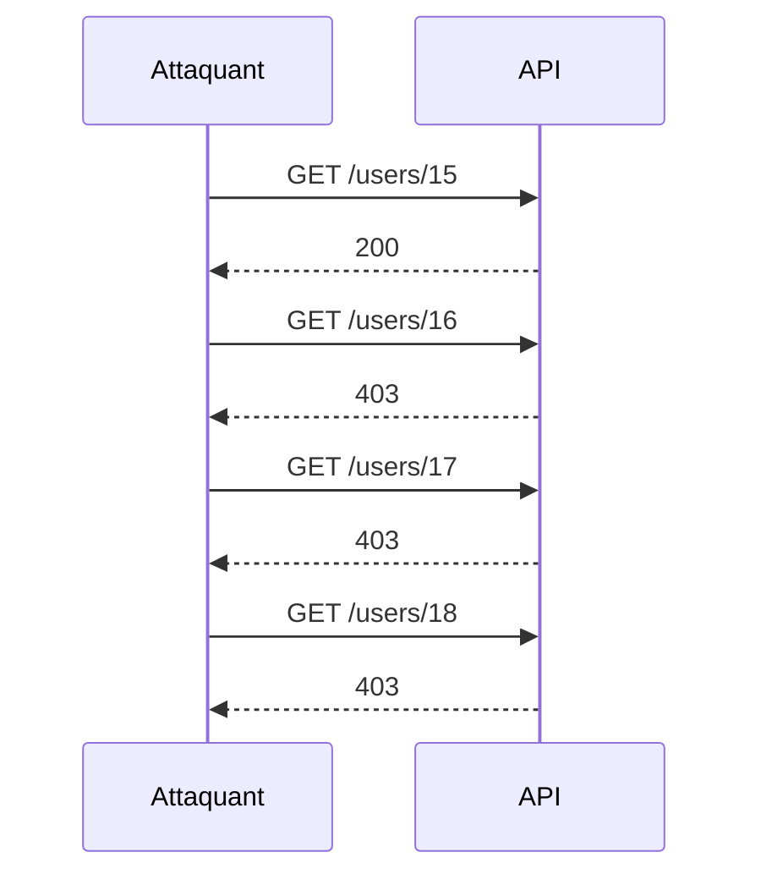

# **9.4 — Analyse de logs pour détecter des patterns d’attaque**

Les logs sont une source d'information essentielle pour comprendre ce qui se passe dans une API.
Ils permettent de détecter :

* des attaques en cours,
* des comportements anormaux,
* des tentatives d'exploration de ressources,
* des failles de sécurité exploitées,
* des problèmes de performance ou d'intégrité.

Dans ce chapitre, nous allons voir :

* quels types de logs analyser,
* quels signaux indiquent une attaque,
* les patterns associés aux failles OWASP API Top 10,
* comment repérer les indices faibles,
* comment visualiser les patterns répétitifs.

---

# **9.4.1 — Pourquoi analyser les logs ?**

Parce que les logs permettent de :

* reconstruire une attaque,
* détecter des anomalies rapidement,
* identifier un comportement malveillant,
* comprendre les failles exploitées,
* améliorer la sécurité de l’API.

Les logs sont parfois la **seule preuve** d’une attaque passée.

---

# **9.4.2 — Types de logs utiles pour la sécurité**

### ✔ Logs d'accès API

* méthode (GET / POST / DELETE)
* URL exacte
* code de réponse
* userId / IP (anonymisés si nécessaire)
* user-agent
* timestamps

### ✔ Logs d’erreurs

* erreurs 4xx
* erreurs 5xx
* exceptions interceptées

### ✔ Logs d’authentification

* tentatives échouées
* tokens invalides
* tokens expirés
* comptes bloqués

### ✔ Logs d'autorisation

* accès refusés (403)
* permissions insuffisantes

### ✔ Logs système

* montée de charge
* saturation CPU/mémoire

---

# **9.4.3 — Schéma : pipeline d’analyse des logs**

```mermaid
flowchart TD
    A[Logs bruts] --> B[Collecte centralisée]
    B --> C[Normalisation]
    C --> D[Analyse automatique<br>(patterns / règles)]
    D --> E[Détection anomalies]
    E --> F[Alerting / Response]
```

---

# **9.4.4 — Pattern 1 : Tentatives de BOLA (API1)**

La faille la plus classique des APIs.

### Indices dans les logs :

* Un même utilisateur teste plusieurs IDs qui ne lui appartiennent pas
* Forte séquence de requêtes 404/403 sur `/users/{id}`
* Incréments d’IDs réguliers :

Exemple de séquence :

```
GET /users/15 → 200
GET /users/16 → 403
GET /users/17 → 403
GET /users/18 → 403
```

**Pattern typique d’exploration d’ID.**

### Visualisation comme un pattern d’attaque :



---

# **9.4.5 — Pattern 2 : Brute-force sur l’authentification**

Indicateur dans les logs :

```
POST /login → 401
POST /login → 401
POST /login → 401
...
```

Si l’IP ou l’utilisateur :

* enchaîne des dizaines de tentatives,
* utilise des variations systèmes (alice → alice1 → alice123),
* accélère le rythme,

→ **attaque de mot de passe**.

---

# **9.4.6 — Pattern 3 : Token volé ou réutilisé**

Un token JWT réutilisé depuis :

* deux pays différents en 5 minutes
* deux IP d’opérateurs incompatibles
* deux devices distincts

ou encore :

```
Authorization: Bearer <JWT>
→ Utilisé 200 fois en quelques secondes
```

→ Très probable : bot / attaque automatisée.

---

# **9.4.7 — Pattern 4 : Rate-limiting non respecté (API4)**

Si on observe :

* même endpoint appelé 1000 fois / minute
* même IP saturant l’API
* absence de 429
* charges élevées à certains points

→ absence de contrôle de débit.

---

# **9.4.8 — Pattern 5 : Fuite de données (API3)**

Dans les logs de réponses :

* champs inattendus
* objets trop complets
* retours disproportionnés
* erreurs révélant le schéma interne

Exemple :

```
Returned object: { id, email, password_hash, isAdmin, isVerified }
```

Le log révèle ici un problème de filtering.

---

# **9.4.9 — Pattern 6 : Injection SQL/XSS**

Signaux dans les logs :

### Requêtes contenant :

```
' OR 1=1 --
"><script>alert(1)</script>
{{7*7}}
%00%00%00
```

ou de nombreuses erreurs `500` ou `Syntax error SQL` →
indicateur clair de tentative d’injection.

---

# **9.4.10 — Pattern 7 : Path Traversal**

Requêtes repérées :

```
../../../../etc/passwd
..%2F..%2F
/%5C../%5C../
```

Même si l’API ne sert pas de fichiers, cela peut révéler :

* un scanner,
* une tentative d'exploitation,
* un outil automatisé de pentest.

---

# **9.4.11 — Pattern 8 : Exploration agressive de l’API**

* endpoints inconnus testés
* tentatives `OPTIONS` multiples
* requêtes sur `/admin`, `/internal`, `/debug`, `/hidden`

Exemple :

```
GET /admin
GET /private
GET /debug
GET /config
```

→ Tentative d’exploration ou recherche d’interface oubliée.

---

# **9.4.12 — Indices faibles indiquant une attaque lente**

Certaines attaques sont fines et progressives :

* un ID testé toutes les 10 minutes
* un même user-agent rare
* séquence de 403 dispersés dans le temps
* modification subtile des paramètres

Ces signaux faibles doivent être agrégés et corrélés dans un système centralisé (ELK, Datadog, Splunk, Grafana Loki…).

---

# **9.4.13 — Comment visualiser les patterns ?**

Avec une plateforme de logs :

* histogrammes des codes HTTP
* heatmap des IP / user-agents
* courbes de volume
* densité d’erreurs
* regroupement des patterns d’URL
* clustering de comportements (machine learning basique)

Ces visualisations facilitent la détection.

---

# **9.4.14 — Automatiser la détection**

Avec un système SIEM ou de monitoring (ex. Grafana, Datadog) :

### Règles à définir :

* plus de 10 401/min → alerte brute-force
* plus de 5 IDs explorés → possible BOLA
* 500 internes → problème ou attaque injection
* double IP pour un même token → token volé
* absence de 429 → abuse rate-limiting

---

# **9.4.15 — Résumé du sous-chapitre**

L’analyse des logs permet de détecter :

* tentatives de BOLA
* brute force
* vols de token
* injections
* path traversal
* fuites de données
* exploration anormale
* surcharges
* bugs internes révélateurs de failles

Les logs sont essentiels pour **la détection et la réponse aux incidents**.
