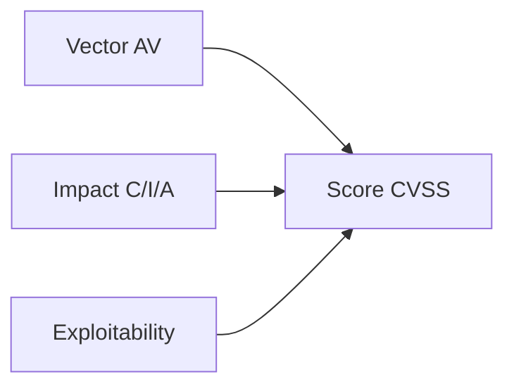

# **9.5 — Comment lire un rapport CVE lié à une API ?**

Les CVE (Common Vulnerabilities and Exposures) sont des identifiants standardisés utilisés pour documenter des failles de sécurité publiquement reconnues.
Comprendre une CVE est essentiel pour :

* évaluer l’impact sur une API,
* savoir si votre stack est vulnérable,
* décider de la priorité de correction,
* comprendre le mécanisme d’attaque,
* anticiper les patchs nécessaires.

Dans ce chapitre, nous allons apprendre :

* ce qu’est une CVE,
* comment elle se présente,
* comment interpréter sa gravité (CVSS),
* comment appliquer cette connaissance à la sécurité API,
* et comment réagir lorsqu’une CVE concerne une dépendance de votre projet.

---

# **9.5.1 — Qu’est-ce qu’une CVE ?**

Une CVE est une **entrée publique** dans une base mondiale recensant :

* une vulnérabilité connue,
* un identifiant unique (ex: CVE-2023-12345),
* une description technique,
* les versions affectées,
* les vecteurs d’attaque,
* les impacts potentiels,
* les correctifs disponibles.

Les CVE ne décrivent pas comment *exploiter* la vulnérabilité,
mais **de quoi il s’agit et pourquoi elle est dangereuse**.

---

# **9.5.2 — Structure typique d'une CVE**

Prenons une structure générique :

```
CVE-YYYY-NNNNN
Description
Impact
Versions affectées
Vecteur d’attaque
Conditions nécessaires
Score CVSS
Références externes
Correctifs
```

### Exemple fictif (simplifié) :

```
CVE-2023-12345
Description: A SQL injection vulnerability in the 'search' endpoint allows attackers to execute arbitrary queries.
Affected versions: API Gateway 2.1 to 2.3
Attack vector: Remote, no authentication required
Impact: Confidentiality, Integrity, Availability compromised
CVSS: 9.1 (Critical)
Fix: Version 2.4+
```

---

# **9.5.3 — Comment interpréter un identifiant CVE ?**

Exemple : `CVE-2024-27109`

* **2024** = année de publication
* **27109** = numéro unique parmi les failles publiées

L'identifiant ne révèle rien sur la nature de la vulnérabilité,
il sert juste de **référence universelle**.

---

# **9.5.4 — Lire le champ le plus important : la description**

La description précise :

* le type d’attaque (injection, XSS, RCE…)
* le composant vulnérable
* le niveau d’accès nécessaire (auth ? admin ?)
* la conséquence potentielle
* le contexte (API, backend, lib, gateway…)

Exemple :

```
A missing authorization check in the /users/{id} endpoint allows
attackers to access other users' data.
```

→ Faible autorisation → BOLA → API1 OWASP

---

# **9.5.5 — Impact (Confidentiality / Integrity / Availability)**

Une CVE se classe selon 3 dimensions fondamentales :

### ✔ Confidentialité

Est-ce que la vulnérabilité permet de lire des données sensibles ?

### ✔ Intégrité

Est-ce que l’attaquant peut modifier des données ?

### ✔ Disponibilité

Peut-il faire planter l’API ou la rendre indisponible ?

Un impact marqué **C/I/A = HIGH** → vulnérabilité critique.

---

# **9.5.6 — Les versions affectées**

Un point crucial : savoir si votre projet ou infrastructure est vulnérable.

Exemple :

```
Affected versions: Express.js 4.17.0 to 4.18.1
```

Vous devez alors vérifier votre version :

* 4.18.1 → vulnérable
* 4.18.2 → corrigée
* 4.16.0 → non affectée

**Beaucoup d’équipes patchent trop tard car elles ne lisent pas cette ligne.**

---

# **9.5.7 — Attack Vector (AV)**

Une partie essentielle du score CVSS.

Elle indique comment l’attaque peut être réalisée :

| AV           | Signification             | Danger            |
| ------------ | ------------------------- | ----------------- |
| Network (N)  | exploitable à distance    | 🔥 très dangereux |
| Adjacent (A) | même réseau local         | ⚠️                |
| Local (L)    | accès machine nécessaire  | moins grave       |
| Physical (P) | accès physique nécessaire | faible            |

Pour les APIs, presque toutes les CVE critiques utilisent **AV = Network**.

---

# **9.5.8 — Conditions d’exploitation**

La CVE indique si l’attaque nécessite :

* une authentification
* un rôle spécifique
* un paramètre précis
* un état particulier du système

Exemple :

```
Requires no authentication
```

→ Danger maximal
→ Votre API est ouverte à toute la planète

---

# **9.5.9 — Le score CVSS : comprendre la gravité**

Le CVSS (0 à 10) permet d'évaluer la sévérité.

| Score    | Gravité  |
| -------- | -------- |
| 0.0–3.9  | Faible   |
| 4.0–6.9  | Moyen    |
| 7.0–8.9  | Élevé    |
| 9.0–10.0 | Critique |

Une API exposée publiquement doit **corriger toutes les CVE ≥ 7.0** rapidement.

---

# **9.5.10 — Exemple visuel du modèle CVSS**



---

# **9.5.11 — Références externes**

Une CVE comporte souvent des liens vers :

* un commit de correction
* un changelog
* une analyse du mainteneur
* un POC (Proof Of Concept) parfois partiel
* des discussions publiques

Ces liens sont essentiels pour comprendre :

* comment la vulnérabilité fonctionne réellement
* comment la corriger

---

# **9.5.12 — Comment savoir si votre API est vulnérable ?**

6 étapes simples :

1. Vérifier si la CVE concerne une bibliothèque que vous utilisez
2. Vérifier votre version exacte
3. Évaluer si votre API utilise la fonctionnalité vulnérable
4. Vérifier si l’API est exposée au vecteur d’attaque
5. Lire les correctifs disponibles
6. Tester un scénario d’exploitation minimal (si safe)

---

# **9.5.13 — Comment prioriser une CVE ?**

Vous devez corriger en priorité :

1. CVE critique (CVSS ≥ 9)
2. CVE exploitable via réseau (AV: Network)
3. CVE sans authentification requise
4. CVE permettant exfiltration ou modification de données
5. CVE utilisées publiquement dans des attaques réelles (**exploits actifs**)

---

# **9.5.14 — Exemple concret de lecture d’une CVE pour API**

Exemple (fictif mais réaliste) :

```
CVE-2024-22222
Description: A missing authorization check in the /invoices/{id} endpoint allows
attackers to read invoices belonging to other users.
Affected versions: BillingAPI 3.2.0 - 3.4.1
Attack vector: Network, no authentication required
Impact: Confidentiality High
CVSS: 9.4 (Critical)
Fix: Version 3.4.2
```

### Analyse :

* type : BOLA (OWASP API1)
* très grave : pas d’authentification
* impact : lecture données sensibles
* score : critique
* correctif : mettre à jour en 3.4.2

### Conclusion :

Patch immédiat + vérification des logs pour voir si exploitation passée.

---

# **9.5.15 — Résumé du sous-chapitre**

Une CVE contient :

* un identifiant unique
* une description technique
* l’impact sur C/I/A
* les versions vulnérables
* le vecteur d’attaque
* le score CVSS
* les correctifs

Savoir lire une CVE permet :

* d’évaluer la gravité réelle
* de déterminer si votre API est vulnérable
* de prioriser les correctifs
* de comprendre les mécanismes d’attaque
* d’améliorer la sécurité de votre stack