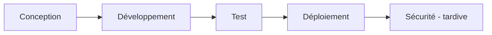
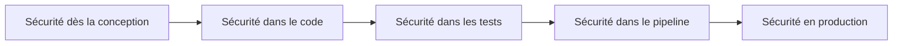
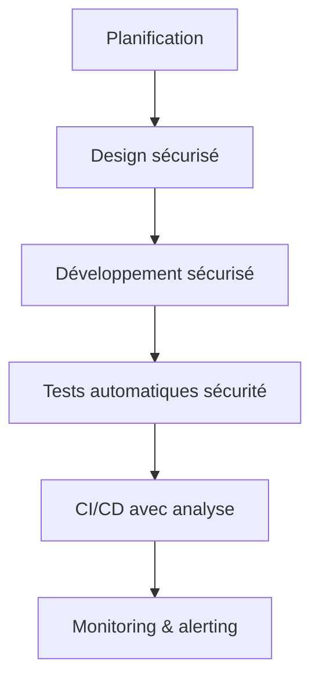

# **10.1 — Shift Left Security**

Le concept de **Shift Left Security** est l’un des principes fondamentaux de la sécurité moderne en développement logiciel.
Il signifie :

> **Intégrer la sécurité le plus tôt possible dans le cycle de développement, plutôt qu’à la fin.**

Ce chapitre explique ce principe de manière simple, imagée et progressive, spécialement pour des débutants.

---

# **10.1.1 — Pourquoi “Shift Left” ?**

Dans un diagramme d'un cycle de développement classique, la sécurité était historiquement **à la fin**, lors des tests finaux :

Problème :
Quand on trouve une faille **à la fin** :

* il est trop tard pour corriger proprement,
* c’est plus cher,
* c’est plus long,
* cela bloque le projet,
* parfois on déploie quand même → catastrophe.

### Exemple simple :

Si tu découvres que **les fondations d’une maison sont fragiles** alors que les murs sont déjà construits…
→ trop tard pour tout refaire sans coûts énormes.

---

# **10.1.2 — Ce que propose le Shift Left**

Le Shift Left consiste à déplacer la sécurité **au début du cycle**, dès :

* la conception,
* le coding initial,
* les tests unitaires,
* le choix des dépendances,
* le pipeline CI/CD.

La sécurité devient **continue**, pas un “garde-fou final”.

---

# **10.1.3 — Pourquoi le Shift Left est indispensable pour les API ?**

Les APIs sont :

* exposées à Internet,
* attaquées en permanence,
* modifiées souvent,
* construites avec beaucoup de dépendances,
* sensibles aux erreurs de logique (BOLA),
* utilisées par plusieurs équipes.

Les failles API viennent souvent :

* de mauvaises autorisations,
* de validations absentes,
* d’erreurs dans le code,
* de dépendances vulnérables,
* de mauvaises décisions d’architecture.

Si on détecte ces failles **avant même le déploiement**, on évite la majorité des risques.

---

# **10.1.4 — Schéma : où placer la sécurité dans une approche Shift Left ?**

La sécurité est **partout**, pas uniquement après les tests.

---

# **10.1.5 — Ce que Shift Left change concrètement dans un projet API**

### ✔ Avant

* On code l’API
* On déploie
* On teste la sécurité
* On découvre des failles
* On patch dans l’urgence

### ✔ Avec Shift Left

* On modélise les menaces dès le début
* On choisit les bonnes validations d’entrée
* On met en place dès le départ l’auth et les permissions
* On active des scanners de dépendances
* On ajoute du SAST dans le pipeline
* On teste automatiquement à chaque commit

Résultat :
**On développe plus vite, mais plus sûrement.**

---

# **10.1.6 — Les 5 piliers du Shift Left pour les API**

## **1) Threat Modeling (modélisation des menaces) dès le design**

Avant de coder, on pose les questions :

* Quelles données sont sensibles ?
* Qui a le droit d’accéder à quoi ?
* Quel est le chemin critique d'accès ?
* Qu'est-ce qui pourrait mal tourner ?

---

## **2) Validation des entrées systématique**

On décide **dès les premières lignes** :

* comment valider les données
* quel schéma utiliser
* quelles limites appliquer

---

## **3) Autorisation dès le début**

On définit :

* règles RBAC / ABAC
* ownerId
* accès interne / externe
* restrictions par ressource

---

## **4) Scanners de dépendances dès l’installation**

Chaque bibliothèque ajoutée dans le projet est un risque potentiel.

Shift Left =
analyse automatique **dès le moment où la dépendance est ajoutée**.

---

## **5) Tests de sécurité automatiques**

On ajoute dans la CI/CD :

* SAST (analyse de code)
* DAST (test automatisé API)
* Scan des conteneurs
* Scan des dépendances

---

# **10.1.7 — Avantages concrets du Shift Left**

### ✔ Moins de failles

La sécurité est pensée dès le début.

### ✔ Correction moins coûteuse

Une faille détectée tôt = 100× moins coûteuse à corriger.

### ✔ Moins d’incidents en production

Moins d’urgences, moins de stress.

### ✔ Documentation plus claire

Les stratégies de sécurité font partie du design.

### ✔ Développeurs formés et autonomes

La sécurité n’est plus un “gros mot”, mais une routine.

---

# **10.1.8 — Exemple : scénario avant/après**

### ❌ Avant (sécurité à droite)

1. L’équipe code l’API utilisateurs
2. Tests fonctionnels OK
3. En préprod, on teste la sécurité
4. On découvre que n’importe qui peut accéder aux données d’un autre utilisateur (BOLA)
5. Il faut refaire la moitié du backend

---

### ✔ Avec Shift Left

1. Dès le design, on dit : “Une ressource user est accessible seulement si `sub == user.id`.”
2. Les tests unitaires vérifient ce comportement
3. Les tests d’autorisation automatiques tournent dans la CI
4. Impossible d’introduire une BOLA par erreur

Shift Left = **prévention**, pas réaction.

---

# **10.1.9 — À quoi ressemble la maturité d'une équipe en Shift Left ?**

| Niveau   | Description                                        |
| -------- | -------------------------------------------------- |
| Niveau 0 | Tests sécurité uniquement en fin de cycle          |
| Niveau 1 | Quelques tests manuels + guidelines                |
| Niveau 2 | Linters sécurité + scans dépendances               |
| Niveau 3 | SAST/DAST automatisés                              |
| Niveau 4 | Threat modeling régulier                           |
| Niveau 5 | Sécurité intégrée dans toutes les phases du projet |

Les APIs modernes devraient viser le **niveau 4 ou 5**.

---

# **10.1.10 — Résumé du sous-chapitre**

* Shift Left = déplacer la sécurité vers le début du cycle.
* On intègre sécurité dès : design, développement, tests, CI/CD.
* Cela prévient les défauts API les plus critiques (BOLA, API3, API6…).
* Le coût de correction est bien plus faible.
* L’équipe devient plus rapide, plus autonome et plus résiliente.
* Une API sécurisée naît d’une culture Shift Left.
