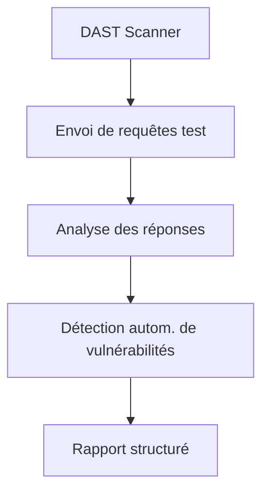
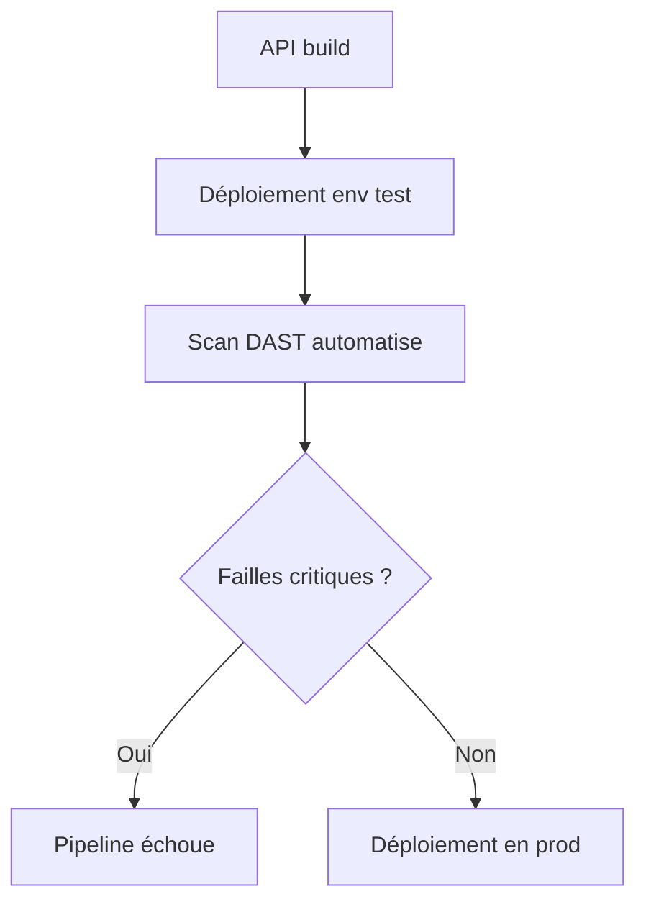

# **10.3 — Intégration DAST dans un pipeline**

Le **DAST** (Dynamic Application Security Testing) analyse **une application en cours d’exécution**, comme le ferait un attaquant.
Contrairement au SAST :

* le SAST lit le code,
* le **DAST attaque l’application** pendant qu’elle tourne.

Ce chapitre explique simplement :

* ce qu’est le DAST,
* comment il fonctionne,
* ce qu’il détecte,
* comment l’intégrer dans une CI/CD,
* ses limites,
* son rôle dans la sécurisation des APIs.

---

# **10.3.1 — Qu’est-ce qu’un DAST ?**

Le DAST teste l’API **de l’extérieur**, comme un utilisateur (ou un attaquant).
Il envoie des requêtes variées, observe les réponses, et cherche :

* les comportements anormaux,
* les messages d’erreur,
* les fuites d’informations,
* les failles d’injection,
* les anomalies logiques,
* les mauvaises configurations.

Il n’a pas accès au code → il se base uniquement sur ce que l’API expose.

---

# **10.3.2 — Ce que détecte le DAST**

### ✔ Injections (API8)

* SQL
* NoSQL
* XSS
* Template Injection
* Command Injection

### ✔ Mauvaises configurations (API7)

* CORS permissif
* headers manquants
* informations serveur exposées

### ✔ Endpoints non protégés

* routes accessibles sans authentification
* endpoints admin oubliés

### ✔ Problèmes de logique simple

* variations anormales dans les codes HTTP
* taille de réponse révélatrice d’accès non autorisé

### ✔ Erreurs internes (500)

→ fuites de logs, stack traces, infos internes

---

# **10.3.3 — Schéma simple du fonctionnement du DAST**



---

# **10.3.4 — Outils DAST courants**

### ✔ OWASP ZAP (le plus populaire)

* open-source
* scripting possible
* intégration CI facile via Docker
* très adapté aux APIs REST

### ✔ Burp Suite Pro

* scanner automatisé très puissant
* version payante

### ✔ Autres outils

* Nikto (basique)
* Arachni (puissant mais plus maintenu)
* AppScan (commercial)

---

# **10.3.5 — Intégration DAST dans une CI/CD : principe**

Le pipeline :

1. Déploie temporairement l’API dans un environnement de test
2. Lance un scan DAST automatisé
3. Analyse les résultats
4. Échoue le pipeline en cas de vulnérabilité critique
5. Détruit l’environnement de test



---

# **10.3.6 — Exemple conceptuel d'intégration dans GitHub Actions**

(Conceptualisé sans code réel)

```
- name: Lancer OWASP ZAP
  run: zap-baseline.py -t https://staging.api.com -r report.html
```

Le pipeline génère alors un rapport :

* SQL injection → HIGH
* CORS permissif → MEDIUM
* Missing headers → LOW

Vous pouvez ensuite définir :

* pipeline fail pour HIGH
* warnings pour MEDIUM/LOW

---

# **10.3.7 — Découverte automatique d’endpoints**

Les scanners DAST essaient d’identifier :

* endpoints connus
* endpoints exposés dans les réponses
* endpoints détectés via OpenAPI
* endpoints liés dans les erreurs
* endpoints révélés par les codes HTTP

Cela permet d’augmenter la couverture du test.

---

# **10.3.8 — DAST vs SAST : pourquoi les deux ?**

| SAST                                     | DAST                                       |
| ---------------------------------------- | ------------------------------------------ |
| Analyse du code                          | Analyse de l’application en fonctionnement |
| Détecte erreurs internes                 | Détecte erreurs visibles                   |
| Trouve les failles logiques dans le code | Trouve les failles exposées                |
| Ne comprend pas l’environnement          | Comprend les réponses serveur              |
| Prévention                               | Détection runtime                          |

Les deux ensembles fournissent une **défense beaucoup plus solide**.

---

# **10.3.9 — Ce que le DAST ne détectera pas**

### ❌ Les failles d’autorisation complexes (BOLA)

Le DAST n’a pas la logique métier.
Il ne peut pas savoir si l’utilisateur 5 n’a pas le droit d’accéder à `/orders/7`.

### ❌ Les erreurs internes non exposées

Si l’API cache bien ses erreurs, le DAST ne voit rien.

### ❌ Les vulnérabilités uniquement visibles dans le code

Du type : mauvaise utilisation d’une clé HMAC.

### ❌ La qualité du modèle Zero Trust

Il ne peut pas déduire l’intention du développeur.

---

# **10.3.10 — Pourquoi le DAST est indispensable pour les API ?**

Parce qu’il permet de détecter :

* anomalies HTTP
* comportements irréguliers
* erreurs d’implémentation
* réponses différentes selon les inputs
* fuites de données
* mauvais headers
* absence de limites (rate limit)
* patterns de vulnérabilités connues

Le DAST simule **exactement ce que ferait un attaquant automatisé**.

---

# **10.3.11 — Stratégie de seuils dans un pipeline**

Bonne pratique : définir des seuils clairs.

| Niveau vulnérabilité | Action CI     |
| -------------------- | ------------- |
| Critical             | Pipeline FAIL |
| High                 | Pipeline FAIL |
| Medium               | Warn + ticket |
| Low                  | Warn          |
| Info                 | Ignoré        |

Cela évite les faux positifs catastrophiques pour le workflow.

---

# **10.3.12 — Bonnes pratiques pour un DAST efficace**

* ✔ Utiliser un environnement dédié (staging)
* ✔ Nettoyer la base après le scan (le DAST peut créer des données bizarres)
* ✔ Activer le fuzzing agressif uniquement en staging
* ✔ Fournir au DAST un token spécial pour explorer les routes authentifiées
* ✔ Intégrer OpenAPI pour meilleure découverte
* ✔ Analyser chaque rapport avec un œil humain
* ✔ Coupler DAST avec SAST et logs pour meilleure couverture

---

# **10.3.13 — Résumé du sous-chapitre**

* Le DAST teste l’API en fonctionnement, comme un attaquant.
* Il détecte les injections, les erreurs serveur, les fuites, les mauvaises configurations.
* Il s’intègre dans un pipeline CI/CD via ZAP ou Burp Pro.
* Il nécessite un environnement dédié.
* Il ne remplace pas les tests manuels ni SAST.
* Il est indispensable pour attraper les failles runtime.
