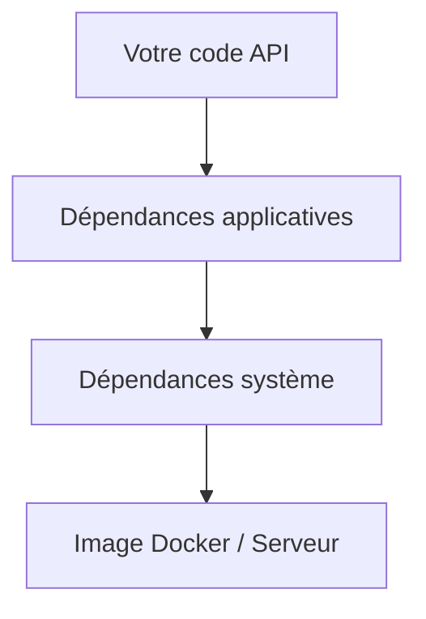
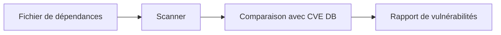
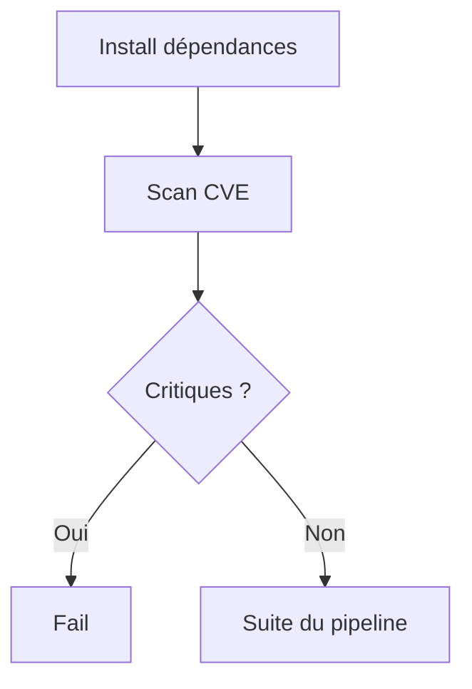

# **10.4 — Scanning de dépendances**

Les APIs modernes reposent sur des dizaines, parfois des centaines de **dépendances externes** : bibliothèques, frameworks, modules, plugins, containers…
Chacune de ces dépendances est un **risque potentiel**, car si l’une d’elles contient une vulnérabilité, votre API peut être compromise même si *votre propre code est parfait*.

Le **scanning de dépendances** permet de vérifier automatiquement si vos bibliothèques ou composants contiennent des CVE connues.
C’est un pilier essentiel du DevSecOps et du Shift Left.

Ce chapitre explique :

* pourquoi c’est critique,
* comment fonctionnent les scanners,
* comment les intégrer dans un pipeline,
* exemples d’attaques réelles,
* bonnes pratiques.

---

# **10.4.1 — Pourquoi scanner les dépendances ?**

Parce que les dépendances :

* représentent 60 à 90% du code final d'une application,
* sont la source d’une majorité des CVE modernes,
* peuvent être compromettantes même si *votre code est sécurisé*,
* évoluent constamment,
* peuvent être ajoutées par des développeurs sans revue.

Exemple réel :
**Equifax (2017)** → fuite de données de 147 millions de personnes
Cause : une bibliothèque Apache Struts non mise à jour.
→ Un simple composant vulnérable a compromis une entreprise entière.

---

# **10.4.2 — Quels types de dépendances doivent être scannés ?**

### ✔ Dépendances applicatives

* npm (Node.js)
* pip / poetry (Python)
* maven / gradle (Java)
* composer (PHP)
* go modules (Go)

### ✔ Conteneurs

* images Docker
* base images (debian, alpine, ubuntu…)

### ✔ Outils et plugins

* reverse proxies (Nginx, Traefik)
* API Gateway
* serveurs applicatifs

### ✔ Environnements

* versions du runtime (node, python, java…)
* packages système (openssl, curl, glibc)

---

# **10.4.3 — Schéma : position des dépendances dans un projet API**



> Une vulnérabilité peut se trouver **à n’importe quel niveau**.

---

# **10.4.4 — Comment fonctionne un scanner de dépendances ?**

Le scanner :

1. Lit la liste des dépendances (ex: package.json, requirements.txt)
2. Identifie les versions exactes
3. Compare avec une base publique de CVE
4. Génère un rapport
5. Indique si un composant doit être mis à jour



---

# **10.4.5 — Outils de scanning de dépendances**

### ✔ Outils open-source

* Dependabot (GitHub intégré)
* OWASP Dependency-Check
* npm audit
* pip-audit
* Trivy (Docker)
* Grype

### ✔ Outils commerciaux

* Snyk
* WhiteSource
* Sonatype Nexus IQ
* GitLab Dependency Scanning

---

# **10.4.6 — Types de vulnérabilités trouvées dans les dépendances**

* RCE (Remote Code Execution)
* Path Traversal
* SQL Injection
* XSS
* DOS / Buffer overflow
* Secrets exposés
* Mauvaise crypto
* CORS vulnérable
* Logiciels serveurs obsolètes
* Librairies exposant des fonctionnalités dangereuses

Une seule dépendance vulnérable peut :

* ouvrir un shell sur votre serveur,
* permettre un vol de données,
* casser l’authentification,
* rendre l’API indisponible.

---

# **10.4.7 — Exemple concret**

Votre API Node.js utilise Express :

```
"express": "4.17.1"
```

Le scanner renvoie :

```
HIGH: CVE-2023-12345
Vulnerability in express <4.18.0 allows bypass of authorization checks.
Fix: upgrade to 4.18.2
```

→ En quelques secondes, vous savez qu'il faut mettre à jour.
Sans scanner → vous ne le sauriez jamais.

---

# **10.4.8 — Intégration dans une CI/CD**

Pipeline typique :

1. Checkout du code
2. Installation des dépendances
3. **Scan dépendances**
4. Résultats → si critique → pipeline FAIL
5. Déploiement si OK



---

# **10.4.9 — Pourquoi les projets n’appliquent pas les mises à jour ?**

### ❌ Peur de casser le code

Mise à jour = risque perçu

### ❌ Manque de temps

“On verra plus tard” → failles en production

### ❌ Manque d’outils

Impossible de savoir ce qui est vulnérable

### ❌ Manque de culture de scanning

On suppose que “les libs sont sûres”

Le scanning supprime ces excuses :
**le pipeline indique quoi faire et pourquoi.**

---

# **10.4.10 — Priorisation des résultats**

Tous les scanners classent les résultats :

| Niveau   | Action                |
| -------- | --------------------- |
| Critical | mise à jour immédiate |
| High     | patch dans la semaine |
| Medium   | patch planifié        |
| Low      | documentation         |
| Info     | peut être ignoré      |

Toujours corriger :

* vulnérabilités réseau,
* vulnérabilités sans authentification,
* failles exploitables facilement (exploit public),
* CVSS ≥ 8.

---

# **10.4.11 — Cas particulier : scanning des images Docker**

Les images contiennent des versions spécifiques de :

* openssl
* nginx
* bash
* glibc
* curl
* bibliothèques internes

Trivy ou Grype peuvent détecter :

```
CVE-2024-1234 affecting openssl 1.1.1
Severity: Critical
```

→ Mise à jour base image obligatoire

---

# **10.4.12 — Exemple d’attaque liée aux dépendances : log4shell**

Fin 2021 :
La faille Log4Shell dans Log4J a déclenché une **crise mondiale**.

Impact :

* centaines de millions de serveurs exposés
* exécution de code à distance
* attaque triviale à exploiter

Si vous utilisiez Log4J :

* sans scanner → vulnérable, sans le savoir
* avec scanner → alerté immédiatement

---

# **10.4.13 — Bonnes pratiques**

* ✔ Scanner à chaque commit
* ✔ Activer Dependabot ou équivalent
* ✔ Scanner les images Docker
* ✔ Supprimer régulièrement les dépendances inutiles
* ✔ Bloquer le pipeline en cas de vulnérabilités critiques
* ✔ Documenter les exceptions (rare et justifié seulement)

---

# **10.4.14 — Résumé du sous-chapitre**

Le scanning de dépendances :

* détecte les vulnérabilités dans les bibliothèques, images et packages,
* s’intègre facilement dans la CI/CD,
* prévient des attaques majeures comme Log4Shell,
* permet de maintenir un environnement API sain,
* est essentiel car la majorité des failles modernes viennent des dépendances,
* protège votre API même si votre code est impeccable.
