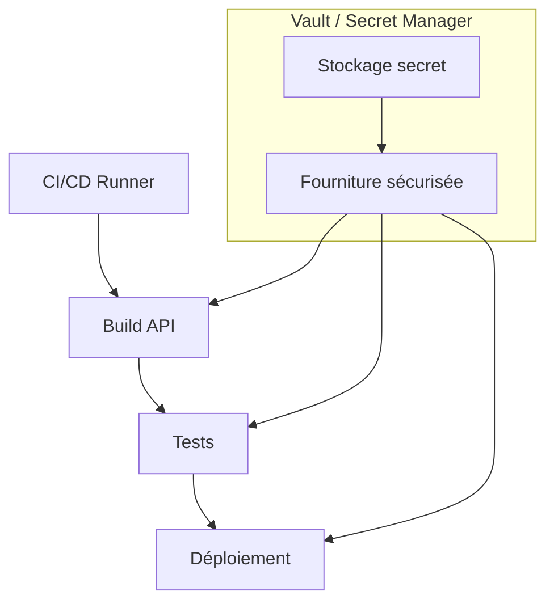
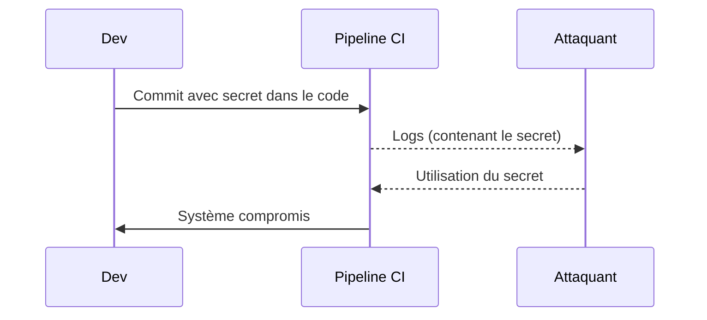

# **10.5 — Gestion des secrets dans la CI/CD**

La gestion des secrets est l’un des sujets **les plus critiques** en sécurité API.
Un secret exposé = accès total pour un attaquant.

Dans un pipeline CI/CD, les risques sont encore plus grands, car :

* les secrets sont utilisés par des scripts,
* ils transitent entre étapes,
* ils sont injectés dans des environnements,
* ils peuvent être accidentellement logués,
* ils sont parfois stockés dans du code ou dans des dépôts.

Ce chapitre explique :

* ce qu’est un secret,
* comment il doit être stocké,
* pourquoi il ne doit *jamais* être committé,
* comment le pipeline CI/CD doit les protéger,
* comment utiliser un vault,
* et quelles erreurs éviter absolument.

---

# **10.5.1 — Qu’est-ce qu’un secret ?**

Dans une API ou CI/CD, un secret est **toute donnée permettant d'accéder à un service**.

Exemples :

### ✔ Secrets typiques dans une API

* clés JWT (HS256 secret, clé privée RSA)
* mots de passe de base de données
* credentials IAM (AWS, GCP…)
* clés API externes
* tokens OAuth
* secrets HMAC
* passphrases de chiffrement

### ✔ Secrets du pipeline

* credentials Docker
* clés SSH
* tokens Git
* variables fournies au build
* informations de déploiement

**Un secret n’est jamais “innocent”.**

---

# **10.5.2 — Problème : les secrets finissent trop souvent dans le code**

Erreurs courantes :

### ❌ Hardcoding

```javascript
const dbPassword = "SuperSecret123!";
```

### ❌ Fichier `.env` committé dans Git

→ Catastrophe totale.

### ❌ Copier/coller dans une issue GitHub

### ❌ Stockage dans un tableau Notion, Google Sheets…

Les repos publics scannent régulièrement pour détecter ces secrets —
mais les attaquants aussi.

---

# **10.5.3 — Ce qui se passe quand un secret fuite**

Si une clé privée JWT fuite → un attaquant peut :

* signer ses propres tokens,
* devenir n’importe qui,
* accéder à l’intégralité de l’API.

Si une clé AWS fuite →

* destruction ou vol de votre infrastructure.

Si un mot de passe DB fuite →

* extraction complète des données.

### Un secret volé = catastrophe immédiate.

---

# **10.5.4 — Schéma : où les secrets sont utilisés dans une CI/CD ?**



Le pipeline **ne contient pas** les secrets → il les récupère **dynamiquement** au moment où il en a besoin.

---

# **10.5.5 — Comment une CI/CD doit stocker les secrets ?**

### ✔ Dans un gestionnaire de secrets dédié :

* HashiCorp Vault
* AWS Secrets Manager
* GCP Secret Manager
* Azure Key Vault

### ✔ Dans les variables chiffrées du provider CI/CD :

* GitHub Actions → Secrets
* GitLab CI → Variables protected & masked
* Jenkins → Credentials store

### ❌ Jamais dans :

* code source
* logs
* artifacts
* fichiers commités
* .env en clair dans le repo

---

# **10.5.6 — Pourquoi utiliser un Vault ?**

Un vault (coffre à secrets) permet :

* stockage chiffré
* rotation automatique des secrets
* accès contrôlé (RBAC)
* audit trail complet
* génération dynamique de credentials
* expiration automatique

Exemple :
Au lieu de stocker un utilisateur DB, le vault génère un **identifiant temporaire valable 30 minutes**, utilisé pour un job CI.

---

# **10.5.7 — Injection des secrets dans le pipeline**

Les secrets sont injectés dans l’environnement :

* via variables d’environnement,
* via fichiers éphémères,
* via appels API au vault,
* avec limitations strictes :

    * durées courtes
    * accès restreints
    * logs interdits

Exemple (conceptuel GitHub Actions) :

```
DB_PASSWORD: ${{ secrets.DB_PASSWORD }}
```

---

# **10.5.8 — Ne jamais loguer un secret**

Erreur classique :

```
echo $DB_PASSWORD
```

→ Le secret apparaît dans les logs du pipeline → fuite immédiate
→ Capture quasi certaine si logs exposés ou mal protégés

Les CI/CD modernes masquent automatiquement certaines valeurs, mais **pas toutes**.

---

# **10.5.9 — Rotation des secrets**

Un secret ne doit jamais être :

* permanent,
* réutilisé pendant des années,
* partagé entre plusieurs services.

Rotation recommandée :

* clés JWT → toutes les semaines / mois
* mots de passe DB → tous les mois
* tokens API externes → selon politique du fournisseur
* clés CI/CD → souvent à chaque changement de personnel

### Pourquoi ?

Parce que même un secret volé devient *inutilisable* après rotation.

---

# **10.5.10 — Scénario visuel : fuite d'un secret dans une CI/CD**



La plupart des incidents de production viennent de ce scénario.

---

# **10.5.11 — Bonnes pratiques de gestion des secrets dans la CI/CD**

### ✔ Toujours stocker dans un vault

### ✔ Utiliser les fonctionnalités « secrets » du CI/CD

### ✔ Ne jamais écrire de secret dans les logs

### ✔ Générer des credentials temporaires

### ✔ Rotation régulière

### ✔ Limiter les permissions (principle of least privilege)

### ✔ Interdire les secrets dans le code (pré-commit hook + SAST)

### ✔ Scanner régulièrement les repos Git pour les secrets

---

# **10.5.12 — Outils pour éviter les fuites de secrets**

### ✔ Prévention dans Git :

* **git-secrets**
* **pre-commit hooks**
* **detect-secrets (IBM)**
* **Gitleaks** (scan des repos)
* **TruffleHog**

### ✔ Dans la CI/CD :

* dépend du provider → masquage automatique
* alertes si une variable sensible apparaît dans les logs

### ✔ Dans les éditeurs de code :

* plugins VS Code qui détectent des secrets en temps réel
* alertes sur copies accidentelles

---

# **10.5.13 — Exemple concret : Gitleaks détecte un secret dans Git**

Le scanner affiche :

```
Rule: Generic API Key
File: src/config.js
Line: 12
Severity: HIGH
```

→ Action immédiate :

1. Révoquer le secret
2. Supprimer (hard reset ou purge) de l’historique Git
3. Régénérer un secret propre
4. Ajouter un scanner en pre-commit

---

# **10.5.14 — Résumé du sous-chapitre**

La gestion des secrets dans la CI/CD est cruciale :

* un secret exposé entraîne un contrôle total pour un attaquant
* les secrets ne doivent jamais être commités
* utiliser un vault pour stocker et gérer les secrets
* injecter les secrets à l’exécution, jamais dans le code
* ne jamais loguer les secrets
* rotation régulière indispensable
* utiliser des scanners pour éviter les fuites
* appliquer le principe du moindre privilège
* auditer régulièrement votre pipeline
